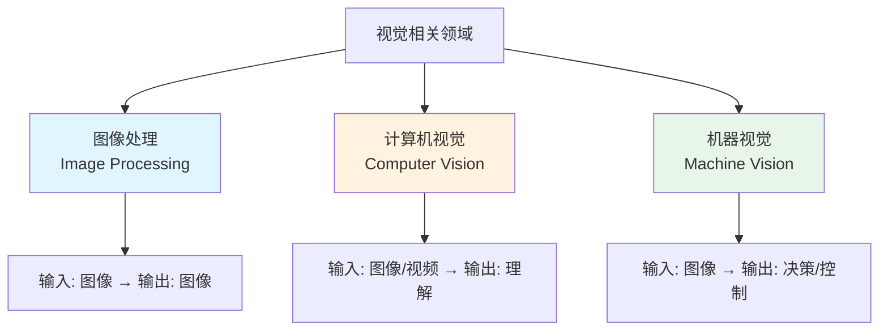
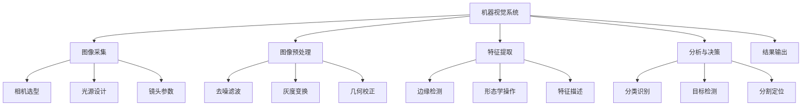

# Lecture 1 - 机器视觉概述

## 什么是机器视觉？

> [!definition] 定义
> 机器视觉（Machine Vision）是指用计算机和摄影设备模拟人类视觉系统的科学，使机器能够"看懂"图像和视频，并从中提取有用的信息。

机器视觉是 [[机器视觉]] 领域的核心课程，主要研究如何让机器具备**看**和**理解**的能力。

---

## 相关概念区分

### 机器视觉 vs 计算机视觉 vs 图像处理



| 领域 | 输入 | 输出 | 目标 | 典型应用 |
|------|------|------|------|----------|
| **图像处理** | 图像 | 图像 | 改善图像质量 | 滤镜、去噪、锐化 |
| **计算机视觉** | 图像/视频 | 语义理解 | 理解内容 | 人脸识别、目标检测 |
| **机器视觉** | 图像 | 决策/控制 | 工业检测与控制 | 缺陷检测、定位引导 |

> [!tip] 关系
> 三个领域相互关联：图像处理是基础 → 计算机视觉提供理解能力 → 机器视觉落地应用

---

## 发展历史

### 时间线


| 时期 | 里程碑事件 |
|------|------------|
| **1960s** | 视觉感知研究开始，MIT 成立 AI 实验室 |
| **1980s** | 边缘检测、纹理分析等理论成熟 |
| **2000s** | SIFT、HOG 等特征描述子出现 |
| **2012** | AlexNet 开启深度学习时代 |
| **2015** | ResNet 突破人脸识别精度 |
| **2020s** | Vision Transformer (ViT)、CLIP 等多模态模型 |

---

## 应用领域

### 工业应用

> [!example] 典型场景
> - **缺陷检测**：检测产品表面的划痕、污点、裂纹
> - **定位引导**：引导机械臂抓取、装配
> - **尺寸测量**：非接触式精密测量
> - **条码/字符识别**：OCR、二维码读取

### 其他领域

- 🏥 **医疗影像**：CT、MRI 分析，病变检测
- 🚗 **自动驾驶**：道路识别、行人检测、交通标志识别
- 🛒 **智能零售**：商品识别、客流分析
- 📱 **移动应用**：AR 滤镜、人像美化
- 🐔 **农业**：病虫害检测、果实分拣

---

## 核心技术模块



> [!info] 后续课程
> 我们将逐一学习以上各模块，敬请期待 [[Lecture 2 - 图像基础]]

---

## 学习路线

### 推荐学习路径

```
第一阶段：基础
├── 数学基础（线性代数、概率统计、微积分）
├── Python 编程
└── OpenCV 入门
    ↓
第二阶段：核心算法
├── 图像处理（滤波、边缘、形态学）
├── 特征提取（SIFT、HOG、LBP）
└── 机器学习基础
    ↓
第三阶段：深度学习
├── CNN 原理与实践
├── 目标检测（YOLO、Faster R-CNN）
└── 语义分割（U-Net、Mask R-CNN）
    ↓
第四阶段：进阶应用
├── 3D 视觉
├── 深度估计
└── 模型部署与优化
```

---

## 相关资源

### 经典书籍

- 📚 *Computer Vision: Algorithms and Applications* - Richard Szeliski
- 📚 *Learning OpenCV* - Gary Bradski
- 📚 *深度学习：核心技术与案例分析*

### 在线课程

- Stanford CS231n (Convolutional Neural Networks for Visual Recognition)
- OpenCV 官方教程

### 常用工具库

| 库/框架 | 用途 | 语言 |
|---------|------|------|
| **OpenCV** | 图像处理基础 | C++/Python |
| **NumPy** | 数组运算 | Python |
| **PyTorch** | 深度学习 | Python |
| **TensorFlow** | 深度学习部署 | Python |

---

> [!question] 思考题
> 机器视觉和人类视觉相比有哪些优势和局限性？

---

*本笔记由 Claudian 生成 | [[机器视觉]] 系列课程笔记*
