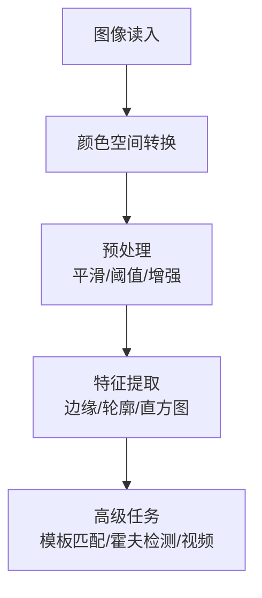

# OpenCV 学习笔记

> [!info] 定位
> OpenCV（Open Source Computer Vision Library）是开源的计算机视觉与图像处理库，广泛应用于图像处理、视频分析、目标检测、轮廓提取、颜色识别等任务。
> 在 Python 中，OpenCV 通常与 [[numpy学习笔记|NumPy]] 配合使用，因为图像本质上就是 NumPy 数组。

---

## 1. OpenCV 基础认识

### 1.1 图像在 OpenCV 中是什么

OpenCV 中图像以 **NumPy 数组** 形式存储：
- 灰度图：二维数组
- 彩色图：三维数组
- 典型形状：`(高度, 宽度, 通道数)`

### 1.2 常用导入方式

```python
import cv2
import numpy as np
import matplotlib.pyplot as plt
```

Jupyter 中常见显示函数：

```python
def show(img, title="image"):
    plt.figure(figsize=(6, 4))
    if len(img.shape) == 3:
        plt.imshow(cv2.cvtColor(img, cv2.COLOR_BGR2RGB))
    else:
        plt.imshow(img, cmap="gray")
    plt.title(title)
    plt.axis("off")
    plt.show()
```

> [!warning] 常见坑
> OpenCV 默认使用 **BGR**，而 Matplotlib 默认按 **RGB** 显示，所以直接显示彩色图时通常需要先做颜色转换。

---

## 2. 图像读写与基础信息

### 2.1 读取与保存图像

```python
img = cv2.imread("test.jpg", cv2.IMREAD_COLOR)
cv2.imwrite("output.jpg", img)
```

常见读取模式：
- `cv2.IMREAD_COLOR = 1`：彩色图
- `cv2.IMREAD_GRAYSCALE = 0`：灰度图
- `cv2.IMREAD_UNCHANGED = -1`：原样读取（包括 Alpha 通道）

### 2.2 获取图像信息

```python
print(img.shape)   # (高, 宽, 通道数)
print(img.dtype)   # 数据类型
print(img.size)    # 总元素个数
```

---

## 3. 颜色空间与通道

### 3.1 常见颜色空间

- **BGR**：OpenCV 默认格式
- **RGB**：标准显示格式
- **GRAY**：灰度图
- **HSV**：适合颜色检测
- **LAB**：一种更接近人眼感知的颜色空间

### 3.2 颜色空间转换

```python
rgb_img = cv2.cvtColor(img, cv2.COLOR_BGR2RGB)
gray = cv2.cvtColor(img, cv2.COLOR_BGR2GRAY)
hsv = cv2.cvtColor(img, cv2.COLOR_BGR2HSV)
lab = cv2.cvtColor(img, cv2.COLOR_BGR2LAB)
```

### 3.3 通道分离与合并

```python
b, g, r = cv2.split(img)
merged = cv2.merge([b, g, r])
```

> [!tip] 理解
> 一个彩色像素通常由多个通道组成，对单独通道进行处理，是很多颜色分析任务的基础。

---

## 4. 几何变换

### 4.1 缩放（resize）

```python
resized = cv2.resize(img, (800, 600))
resized2 = cv2.resize(img, None, fx=0.5, fy=0.5, interpolation=cv2.INTER_LINEAR)
small = cv2.resize(img, (400, 300), interpolation=cv2.INTER_AREA)
large = cv2.resize(img, (1600, 1200), interpolation=cv2.INTER_CUBIC)
```

### 常见插值方法

| 方法 | 说明 |
|------|------|
| `INTER_LINEAR` | 双线性插值，默认，常用 |
| `INTER_CUBIC` | 双立方插值，质量较高 |
| `INTER_NEAREST` | 最近邻，最快但效果粗糙 |
| `INTER_LANCZOS4` | 高质量插值 |
| `INTER_AREA` | 缩小时效果较好 |

### 4.2 平移

```python
M = np.float32([[1, 0, 100], [0, 1, 50]])
translated = cv2.warpAffine(img, M, (cols, rows))
```

### 4.3 旋转

```python
M = cv2.getRotationMatrix2D((cols/2, rows/2), 45, 1)
rotated = cv2.warpAffine(img, M, (cols, rows))
```

### 4.4 仿射变换

```python
M = cv2.getAffineTransform(pts1, pts2)
affine = cv2.warpAffine(img, M, (cols, rows))
```

### 4.5 透视变换

```python
M = cv2.getPerspectiveTransform(pts1, pts2)
perspective = cv2.warpPerspective(img, M, (300, 300))
```

> [!summary] 几何变换层级
> - 平移 / 旋转 / 缩放：基础变换
> - 仿射变换：保持平行线平行
> - 透视变换：可以模拟视角变化，常用于文档矫正

---

## 5. 阈值处理

### 5.1 简单阈值

```python
ret, thresh1 = cv2.threshold(img, 127, 255, cv2.THRESH_BINARY)
```

常见类型：
- `THRESH_BINARY`
- `THRESH_BINARY_INV`
- `THRESH_TRUNC`
- `THRESH_TOZERO`
- `THRESH_TOZERO_INV`

### 5.2 自适应阈值

```python
thresh_mean = cv2.adaptiveThreshold(
    img, 255, cv2.ADAPTIVE_THRESH_MEAN_C,
    cv2.THRESH_BINARY, 11, 2
)

thresh_gaussian = cv2.adaptiveThreshold(
    img, 255, cv2.ADAPTIVE_THRESH_GAUSSIAN_C,
    cv2.THRESH_BINARY, 11, 2
)
```

> [!tip] 适用场景
> 光照不均匀时，固定阈值往往不好用，这时自适应阈值通常更有效。

---

## 6. 图像模糊与平滑

### 6.1 平均模糊

```python
blur = cv2.blur(img, (5, 5))
```

### 6.2 高斯模糊

```python
gaussian = cv2.GaussianBlur(img, (5, 5), 0)
```

### 6.3 中值模糊

```python
median = cv2.medianBlur(img, 5)
```

### 6.4 双边滤波

```python
bilateral = cv2.bilateralFilter(img, 9, 75, 75)
```

### 平滑方法对比

| 方法 | 特点 | 适用场景 |
|------|------|---------|
| 平均模糊 | 简单快速，但边缘易模糊 | 普通平滑 |
| 高斯模糊 | 更自然，常用于预处理 | 去噪、边缘检测前 |
| 中值模糊 | 对椒盐噪声效果好 | 去离散噪点 |
| 双边滤波 | 平滑同时保边缘 | 保边缘去噪 |

---

## 7. 形态学操作

形态学操作主要基于图像的形状结构，常用于二值图像。

### 7.1 基本操作

```python
kernel = np.ones((5, 5), np.uint8)
erosion = cv2.erode(img, kernel, iterations=1)
dilation = cv2.dilate(img, kernel, iterations=1)
```

- **腐蚀**：白色区域缩小
- **膨胀**：白色区域扩大

### 7.2 组合操作

```python
opening = cv2.morphologyEx(img, cv2.MORPH_OPEN, kernel)
closing = cv2.morphologyEx(img, cv2.MORPH_CLOSE, kernel)
gradient = cv2.morphologyEx(img, cv2.MORPH_GRADIENT, kernel)
tophat = cv2.morphologyEx(img, cv2.MORPH_TOPHAT, kernel)
blackhat = cv2.morphologyEx(img, cv2.MORPH_BLACKHAT, kernel)
```

### 操作含义表

| 操作 | 含义 |
|------|------|
| 开运算 | 腐蚀 + 膨胀，去白噪点 |
| 闭运算 | 膨胀 + 腐蚀，填黑洞 |
| 梯度 | 膨胀 - 腐蚀，提轮廓 |
| 顶帽 | 原图 - 开运算 |
| 黑帽 | 闭运算 - 原图 |

---

## 8. 边缘检测与梯度

### 8.1 Sobel 算子

```python
sobelx = cv2.Sobel(img, cv2.CV_64F, 1, 0, ksize=5)
sobely = cv2.Sobel(img, cv2.CV_64F, 0, 1, ksize=5)
```

### 8.2 Laplacian 算子

```python
laplacian = cv2.Laplacian(img, cv2.CV_64F, ksize=5)
```

### 8.3 Canny 边缘检测

```python
edges = cv2.Canny(img, 50, 150)
```

> [!info] Canny 核心流程
> 1. 高斯模糊降噪
> 2. 计算梯度
> 3. 非极大值抑制
> 4. 双阈值连接边缘

### 三种边缘方法对比

| 方法 | 特点 |
|------|------|
| Sobel | 一阶导数，方向性强 |
| Laplacian | 二阶导数，对噪声更敏感 |
| Canny | 多阶段检测，效果通常最好 |

---

## 9. 轮廓处理

### 9.1 查找轮廓

```python
contours, hierarchy = cv2.findContours(edges, cv2.RETR_TREE, cv2.CHAIN_APPROX_SIMPLE)
```

常见检索模式：
- `RETR_EXTERNAL`：只找最外层轮廓
- `RETR_LIST`：找所有轮廓，不建立层级
- `RETR_TREE`：找所有轮廓并建立层级关系

### 9.2 绘制轮廓

```python
cv2.drawContours(contour_img, contours, -1, (0, 255, 0), 2)
```

### 9.3 轮廓特征

```python
area = cv2.contourArea(cnt)
perimeter = cv2.arcLength(cnt, True)
x, y, w, h = cv2.boundingRect(cnt)
rect = cv2.minAreaRect(cnt)
(x, y), radius = cv2.minEnclosingCircle(cnt)
```

### 常见轮廓特征表

| 函数 | 含义 |
|------|------|
| `contourArea()` | 面积 |
| `arcLength()` | 周长 |
| `boundingRect()` | 外接矩形 |
| `minAreaRect()` | 最小外接旋转矩形 |
| `minEnclosingCircle()` | 最小外接圆 |
| `fitEllipse()` | 椭圆拟合 |
| `fitLine()` | 直线拟合 |

---

## 10. 直方图处理

### 10.1 计算直方图

```python
hist = cv2.calcHist([gray], [0], None, [256], [0, 256])
```

### 10.2 直方图均衡化

```python
equ = cv2.equalizeHist(img)
```

### 10.3 CLAHE

```python
clahe = cv2.createCLAHE(clipLimit=2.0, tileGridSize=(8, 8))
clahe_img = clahe.apply(img)
```

> [!tip] 理解
> - `equalizeHist()`：全局增强对比度
> - `CLAHE`：局部自适应增强，对复杂光照更友好

---

## 11. 频域与霍夫变换

### 11.1 傅里叶变换

```python
dft = cv2.dft(np.float32(img), flags=cv2.DFT_COMPLEX_OUTPUT)
dft_shift = np.fft.fftshift(dft)
```

频率含义：
- 低频：平滑区域
- 高频：边缘和噪声

### 11.2 霍夫直线检测

```python
lines = cv2.HoughLines(edges, 1, np.pi/180, 200)
```

### 11.3 概率霍夫直线检测

```python
lines = cv2.HoughLinesP(edges, 1, np.pi/180, 100, minLineLength=100, maxLineGap=10)
```

### 11.4 霍夫圆检测

```python
circles = cv2.HoughCircles(gray, cv2.HOUGH_GRADIENT, 1, 50,
                           param1=50, param2=30,
                           minRadius=0, maxRadius=0)
```

---

## 12. 模板匹配

模板匹配用于在大图中寻找模板图像的位置。

```python
result = cv2.matchTemplate(gray, template, cv2.TM_CCOEFF_NORMED)
min_val, max_val, min_loc, max_loc = cv2.minMaxLoc(result)
```

常见匹配方法：
- `TM_CCOEFF`
- `TM_CCOEFF_NORMED`
- `TM_CCORR`
- `TM_CCORR_NORMED`
- `TM_SQDIFF`
- `TM_SQDIFF_NORMED`

> [!tip] 一般规律
> 使用 `*_NORMED` 的归一化方法，结果通常更稳定；其中 `TM_CCOEFF_NORMED` 是常用选择。

---

## 13. 图像修复与去噪

### 13.1 非局部均值去噪

```python
denoised = cv2.fastNlMeansDenoisingColored(img, None, 10, 10, 7, 21)
denoised_gray = cv2.fastNlMeansDenoising(gray, None, 10, 7, 21)
```

### 13.2 图像修复

```python
result = cv2.inpaint(img, mask, 3, cv2.INPAINT_TELEA)
```

可选方法：
- `INPAINT_TELEA`
- `INPAINT_NS`

---

## 14. 其他几何与基础操作

### 14.1 裁剪

```python
cropped = img[100:400, 200:500]
```

### 14.2 翻转

```python
cv2.flip(img, 1)   # 水平翻转
cv2.flip(img, 0)   # 垂直翻转
cv2.flip(img, -1)  # 同时翻转
```

### 14.3 快速旋转

```python
cv2.rotate(img, cv2.ROTATE_90_CLOCKWISE)
cv2.rotate(img, cv2.ROTATE_90_COUNTERCLOCKWISE)
cv2.rotate(img, cv2.ROTATE_180)
```

> [!tip]
> 图像裁剪本质上就是 NumPy 切片，因此这里和 [[numpy学习笔记#5. 索引、切片与取值]] 是连通的。

---

## 15. 颜色检测与追踪

在 HSV 空间中做颜色检测通常更稳定。

```python
hsv = cv2.cvtColor(img, cv2.COLOR_BGR2HSV)
lower_blue = np.array([100, 50, 50])
upper_blue = np.array([130, 255, 255])
mask = cv2.inRange(hsv, lower_blue, upper_blue)
result = cv2.bitwise_and(img, img, mask=mask)
```

### 常见颜色范围（参考）

| 颜色 | HSV 范围概念 |
|------|-------------|
| 白色 | S 低，V 高 |
| 黑色 | V 低 |
| 红色 | H 常分两段 |
| 绿色 | H 大致 35~85 |
| 蓝色 | H 大致 90~130 |
| 黄色 | H 大致 15~35 |

---

## 16. 视频处理基础

### 16.1 读取视频 / 摄像头

```python
cap = cv2.VideoCapture("video.mp4")
ret, frame = cap.read()
cap.release()
```

### 16.2 保存视频

```python
fourcc = cv2.VideoWriter_fourcc(*"XVID")
out = cv2.VideoWriter("output.avi", fourcc, 20.0, (640, 480))
```

> [!warning] 使用注意
> 视频处理结束后一定要 `release()`，并在窗口模式下配合 `cv2.destroyAllWindows()` 释放资源。

---

## 17. 绘图功能

```python
cv2.line(img, (0, 0), (511, 511), (255, 0, 0), 5)
cv2.rectangle(img, (384, 0), (510, 128), (0, 255, 0), 3)
cv2.circle(img, (447, 63), 63, (0, 0, 255), -1)
cv2.ellipse(img, (256, 256), (100, 50), 0, 0, 180, (255, 255, 0), 3)
cv2.putText(img, "OpenCV", (10, 500), font, 2, (255, 255, 255), 2, cv2.LINE_AA)
```

常见函数：
- `line()`
- `rectangle()`
- `circle()`
- `ellipse()`
- `putText()`

---

## 18. 图像拼接、混合与掩膜

### 18.1 图像加法

```python
added_cv = cv2.add(img1, img2)
added_np = img1 + img2
```

> [!warning] 重要区别
> - `cv2.add()`：饱和运算，超过 255 会截断为 255
> - `+`：NumPy 模运算，可能发生回绕

### 18.2 图像混合

```python
blended = cv2.addWeighted(img1, 0.7, img2, 0.3, 0)
```

### 18.3 图像拼接

```python
horizontal = cv2.hconcat([img1, img2])
vertical = cv2.vconcat([img1, img2])
```

### 18.4 掩膜操作

```python
masked = cv2.bitwise_and(img, img, mask=mask)
```

常见位运算：
- `bitwise_and()`
- `bitwise_or()`
- `bitwise_xor()`
- `bitwise_not()`

---

## 19. 常用功能汇总表

| 功能类别 | 函数 | 说明 |
|---------|------|------|
| 图像读写 | `cv2.imread()` | 读取图像 |
|  | `cv2.imwrite()` | 保存图像 |
| 颜色转换 | `cv2.cvtColor()` | 颜色空间转换 |
|  | `cv2.split()` / `cv2.merge()` | 通道拆分 / 合并 |
| 几何变换 | `cv2.resize()` | 缩放 |
|  | `cv2.warpAffine()` | 仿射变换 |
|  | `cv2.warpPerspective()` | 透视变换 |
| 平滑滤波 | `cv2.blur()` | 平均模糊 |
|  | `cv2.GaussianBlur()` | 高斯模糊 |
|  | `cv2.medianBlur()` | 中值模糊 |
|  | `cv2.bilateralFilter()` | 双边滤波 |
| 阈值处理 | `cv2.threshold()` | 固定阈值 |
|  | `cv2.adaptiveThreshold()` | 自适应阈值 |
| 形态学 | `cv2.erode()` | 腐蚀 |
|  | `cv2.dilate()` | 膨胀 |
|  | `cv2.morphologyEx()` | 组合形态学 |
| 边缘检测 | `cv2.Sobel()` | Sobel |
|  | `cv2.Laplacian()` | Laplacian |
|  | `cv2.Canny()` | Canny |
| 轮廓 | `cv2.findContours()` | 查找轮廓 |
|  | `cv2.drawContours()` | 绘制轮廓 |
| 直方图 | `cv2.calcHist()` | 计算直方图 |
|  | `cv2.equalizeHist()` | 直方图均衡化 |
|  | `cv2.createCLAHE()` | CLAHE |
| 检测 | `cv2.HoughLines()` | 霍夫直线 |
|  | `cv2.HoughCircles()` | 霍夫圆 |
| 匹配 | `cv2.matchTemplate()` | 模板匹配 |
| 修复 | `cv2.inpaint()` | 图像修复 |
| 绘图 | `cv2.line()` | 画线 |
|  | `cv2.rectangle()` | 画矩形 |
|  | `cv2.circle()` | 画圆 |
| 位运算 | `cv2.bitwise_and()` | 与操作 |

---

## 20. 学习路线建议

> [!note] 推荐学习顺序
> 1. 图像读写与显示
> 2. 颜色空间转换
> 3. 几何变换（缩放/旋转/裁剪）
> 4. 图像平滑与阈值分割
> 5. 边缘检测与轮廓提取
> 6. 直方图与增强
> 7. 模板匹配 / 霍夫变换 / 视频处理

### 推荐理解主线



---

## 21. 与 NumPy 的关系

OpenCV 的很多操作都依赖 NumPy：
- 图像是 `ndarray`
- 图像裁剪依赖切片
- 掩膜、混合、通道处理依赖数组运算
- 颜色阈值范围通常用 `np.array()` 定义

建议结合阅读：[[numpy学习笔记]]

---

## 22. 一句话总结

> [!quote]
> OpenCV 的核心就是：**把图像当作数组，用成熟的视觉算法对其进行读取、变换、增强、分割、检测和分析。**

---

*整理来源：opencv学习笔记.ipynb | 由 Claudian 整理为 Obsidian 笔记*