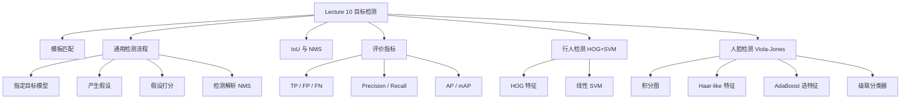

# Lecture 10 - 目标检测

> [!info] 课程概要
> 本讲在 [[Lecture 9 - 图像识别]] 的"特征 → 分类器 → 输出"框架基础上，进一步扩展到"不仅判断类别，还要定位目标位置"的目标检测任务。主线可以概括为：**目标检测基础 → 模板匹配 → 通用检测流程 → IoU/NMS → 评价指标（TP/FP/FN、Precision/Recall、AP/mAP）→ 行人检测（HOG+SVM）→ 人脸检测（Viola-Jones：积分图+Haar+AdaBoost+级联分类器）**。其中 HOG 特征思想与 [[Lecture 4 - 特征提取]] 中的梯度、边缘方向直接相关，积分图与 [[Lecture 3 - 图像处理]] 中的滤波思想一脉相承。

## 1. 目标检测在课程中的位置

### 1.1 什么是目标检测？

> [!definition] 目标检测
> 目标检测（Object Detection）的任务是：在图像中找到目标物体实例，并给出它们的边界框。输出通常包括 **类别 + 边界框 + 置信度**。

边界框一般表示为：

$$
(x,y,w,h)
$$

其中：

- $(x,y)$：边界框位置；
- $w$：宽度；
- $h$：高度。

### 1.2 图像分类 vs 目标检测

| 任务 | 输入 | 输出 | 是否关心空间位置 |
|---|---|---|---|
| 图像分类 | 图像 | 类别标签 | 否 |
| 目标检测 | 图像 | 类别 + 边界框 + 置信度 | 是 |

> [!note] 核心区别
> 图像分类关注"是什么"，目标检测关注"是什么 + 在哪里"。因此 Bag of Features 在分类中可用，但在检测中会丢失空间布局信息——参见 [[Lecture 9 - 图像识别#6. Bag-of-Features（视觉词袋）|Lecture 9 的 BoF 部分]]。

---

## 2. 本讲整体框架



---

## 3. 模板匹配

### 3.1 基本思想

模板匹配（Template Matching）是最基础的目标检测方法：

> 给定一个目标模板，在图像中不断移动模板，计算模板和图像局部区域的相似度。

### 3.2 流程

1. **Align 空间对齐**：选择位置、尺度、方向。
2. **Compare 计算相似性**：比较候选区域和模板是否相似。

### 3.3 问题

- 物体可能出现在不同位置；
- 物体可能有不同尺度；
- 物体可能旋转；
- 物体外观可能变化。

> [!warning] 局限性
> 模板匹配是目标检测的最简单思想，但实际应用中受限于位置、尺度、旋转和外观变化，需要进一步改进。

---

## 4. 目标检测的一般流程

### 4.1 四步流程

$$
\text{Specify Object Model}
\rightarrow
\text{Generate Hypotheses}
\rightarrow
\text{Score Hypotheses}
\rightarrow
\text{Resolve Detections}
$$

中文对应：

1. **指定目标模型**
2. **产生假设**
3. **假设打分**
4. **检测解析**

> [!note] 一句话理解
> 先定义目标长什么样，再提出一堆候选框，然后判断每个候选框像不像目标，最后去掉重复框。

### 4.2 指定目标模型

目标模型即"用什么方式表示目标物体"。PPT 讲了四种：

#### 统计模板模型（Statistical Template）

目标用一个边界框 $(x,y,w,h)$ 表示，在框内提取 SIFT、HOG 等特征。适合形状较固定的目标（人脸、汽车、行人）。

#### 关节部件模型（Articulated Parts Model）

目标由多个部件组成：

$$
\text{object} = \text{parts} + \text{spatial configuration}
$$

例如人体可分成头、躯干、手臂、腿。适合有变形的目标。

#### 混合模板/部件模型（Hybrid Template/Parts Model）

结合整体模板和局部部件：粗尺度上看整体，细尺度上看局部部件。既保留整体结构，又允许局部变化。

#### 可形变三维模型（Deformable 3D Model）

用三维形状、姿态和变形参数来表示目标（如 SMPL 人体模型）。能描述 3D 姿态和人体形变。

### 4.3 产生假设

提出图像中可能包含目标的候选区域。PPT 讲了两种方法：

#### 滑动窗口（Sliding Window）

用一个固定大小的窗口，在图像上从左到右、从上到下滑动，每个位置都判断一次。如果目标大小不同，就用**图像金字塔**（多尺度图像上滑动窗口）。

| 方面 | 说明 |
|---|---|
| 优点 | 思路简单，不容易漏掉位置 |
| 缺点 | 计算量大，候选窗口非常多 |

#### 区域提议（Region Proposal）

不是暴力遍历所有窗口，而是根据图像内容提出候选区域。PPT 讲的是 **Selective Search by Hierarchical Grouping**：

1. 先把图像分割成很多小区域；
2. 根据颜色、纹理、大小等相似性进行合并；
3. 产生不同尺度的候选框。

> [!tip] 区域提议 vs 滑动窗口
> 区域提议比滑动窗口更有针对性，候选区域更少，与 [[Lecture 10 - 目标检测讲解|后续现代检测器（R-CNN 系列）]] 中的 Region Proposal 思想直接衔接。

### 4.4 假设打分

对每个候选区域判断它是不是目标。一般流程：

1. 对候选区域提取特征；
2. 输入分类器；
3. 得到一个分数。

例如：

$$
score = w^T x + b
$$

其中 $x$ 为候选区域特征，$w,b$ 为分类器参数。

### 4.5 检测解析

主要解决一个问题：同一个目标可能被多个候选框同时检测出来。所以需要 **NMS（非最大值抑制）**。

---

## 5. IoU 与 NMS

### 5.1 IoU 交并比

> [!definition] IoU（Intersection over Union）
>
> $$
> IoU = \frac{\text{预测框与真实框的交集面积}}{\text{预测框与真实框的并集面积}}
> $$
>
> 即：
>
> $$
> IoU = \frac{Area(B_p \cap B_{gt})}{Area(B_p \cup B_{gt})}
> $$

其中 $B_p$ 为预测框，$B_{gt}$ 为真实框。IoU 越大，说明预测框和真实框重合越好。

### 5.2 NMS 非最大值抑制

NMS（Non-Maximum Suppression）用来删除重复检测框。

**步骤**：

1. 按置信度从高到低排序；
2. 选择分数最高的框；
3. 删除与它 IoU 大于阈值的其他框；
4. 对剩下的框重复这个过程。

> [!note] NMS 的作用
> 保留最可靠的检测框，删除重复框。

---

## 6. 检测结果评价

### 6.1 TP、FP、FN

| 概念 | 含义 | 条件 |
|---|---|---|
| **TP**（True Positive，真阳性） | 预测有目标，且预测正确 | $IoU \geq t$（如 $t=0.5$） |
| **FP**（False Positive，假阳性） | 预测有目标，但预测错误 | 框不准 / 背景误检 / 重复检测 |
| **FN**（False Negative，假阴性） | 真实有目标，但未检测出来 | 即漏检 |

### 6.2 Precision 精确率

> Precision 回答的问题：模型预测出来的目标中，有多少是真的？

$$
Precision = \frac{TP}{TP+FP}
$$

Precision 高，说明误检少。

### 6.3 Recall 召回率

> Recall 回答的问题：真实存在的目标中，有多少被检测出来了？

$$
Recall = \frac{TP}{TP+FN}
$$

Recall 高，说明漏检少。

> [!note] 与 Lecture 9 的联系
> Precision、Recall 与 [[Lecture 9 - 图像识别#5. 分类性能评价指标|Lecture 9 的分类评价指标]] 中定义的是一致的，区别在于检测中 TP/FP/FN 的判断加入了一个额外的 IoU 条件。

---

## 7. AP 和 mAP

### 7.1 AP 是什么

> [!definition] AP（Average Precision）
> AP 是在固定类别、固定 IoU 阈值下，改变分类置信度阈值，得到一系列 Precision-Recall 点后，对不同 Recall 水平下 Precision 的加权平均。

记成：

$$
AP_{c,\tau}
$$

表示类别 $c$、IoU 阈值为 $\tau$ 时的 AP。

公式可写成：

$$
AP = \sum_n (R_n - R_{n-1})P_n
$$

其中 $R_n$ 为第 $n$ 个点的 Recall，$P_n$ 为对应的 Precision，$R_n - R_{n-1}$ 为 Recall 增量。

### 7.2 AP 和 AUC 的区别

| 指标 | 含义 |
|---|---|
| AUC | 曲线下面积 |
| AP | 不同 Recall 水平下 Precision 的加权平均 |
| PR-AUC | PR 曲线下面积 |
| ROC-AUC | ROC 曲线下面积 |

> [!warning] 易混点
> AUC 强调"面积"，AP 强调"平均 Precision"。AP 和 PR 曲线有关，但不要简单写成"AP 就是曲线下面积"。

### 7.3 mAP 是什么

mAP（mean Average Precision）：如果只看一个类别、一个 IoU 阈值，就是 AP。如果考虑多个 IoU 阈值（如 $0.5, 0.55, 0.6, \dots, 0.95$），则对这些 IoU 阈值下的 AP 取平均：

$$
mAP_c = \frac{1}{T}\sum_{\tau} AP_{c,\tau}
$$

如果是多类别检测，还要对类别再平均：

$$
mAP = \frac{1}{C}\sum_{c=1}^{C}mAP_c
$$

展开即：

$$
mAP =
\frac{1}{C \times T}
\sum_{c=1}^{C}
\sum_{\tau} AP_{c,\tau}
$$

> [!summary] AP vs mAP
> AP 是固定类别、固定 IoU 下算出来的平均精度；mAP 是多个类别、多个 IoU 阈值下 AP 的平均。

---

## 8. 行人检测：Dalal-Triggs 方法

### 8.1 方法概述

经典行人检测方法：

$$
HOG + Linear\ SVM
$$

论文：Dalal and Triggs, *Histograms of Oriented Gradients for Human Detection*, CVPR 2005.

### 8.2 检测流程

1. 在每个位置和尺度提取固定大小窗口；
2. 在窗口内计算 HOG 特征；
3. 用线性 SVM 给窗口打分；
4. 用 NMS 删除重复检测框。

经典检测窗口大小：

$$
64 \times 128
$$

因为行人通常是竖直的，宽高比接近 $1:2$。

### 8.3 预处理

输入可以是 RGB、LAB 或 Grayscale，颜色空间对结果影响不大。还可以做 Gamma Normalization（如 square root、log），作用是减弱光照变化的影响。

---

## 9. HOG 特征

### 9.1 核心思想

> [!definition] HOG（Histogram of Oriented Gradients，方向梯度直方图）
> 用局部区域中的梯度方向分布描述物体形状。

行人的头、肩、腿等轮廓会产生稳定的边缘方向，因此 HOG 适合行人检测。这与 [[Lecture 4 - 特征提取]] 中的梯度、边缘方向概念直接相关。

### 9.2 第一步：计算梯度

对图像求水平和竖直方向梯度 $G_x, G_y$：

$$
m = \sqrt{G_x^2 + G_y^2}
\qquad
\theta = \arctan \frac{G_y}{G_x}
$$

其中 $m$ 为边缘强度，$\theta$ 为边缘方向。

### 9.3 第二步：划分 cell

经典设置：

- 检测窗口：$64 \times 128$
- cell 大小：$8 \times 8$

cell 数量：水平方向 $64 / 8 = 8$，竖直方向 $128 / 8 = 16$，总 cell 数 $8 \times 16$。每个 cell 统计一个方向直方图。如果方向 bin 数为 9，则每个 cell 是 9 维特征。

### 9.4 第三步：方向直方图

每个像素根据自己的梯度方向投票到对应方向 bin，投票权重通常是梯度幅值。例如 9 个方向 bin 可表示 $0^\circ, 20^\circ, 40^\circ, \dots, 160^\circ$。

### 9.5 第四步：block 归一化

为了减小光照影响，需要对局部 block 进行归一化。

- block 大小：$16 \times 16$
- cell 大小：$8 \times 8$
- 一个 block 包含 $2 \times 2 = 4$ 个 cell
- 每个 cell 是 9 维，所以一个 block 是 $4 \times 9 = 36$ 维

> [!note] 归一化作用
> 让 HOG 特征对亮度和对比度变化不敏感。

### 9.6 HOG 特征维度计算（重点）

已知检测窗口 $64 \times 128$，cell $8 \times 8$，cell 数 $8 \times 16$，block $2 \times 2$ cells。block 采用重叠滑动，步长是一个 cell。

- 水平方向 block 数：$8 - 2 + 1 = 7$
- 竖直方向 block 数：$16 - 2 + 1 = 15$
- 总 block 数：$7 \times 15$
- 每个 block 维度：$2 \times 2 \times 9 = 36$

整个窗口 HOG 特征维度：

$$
7 \times 15 \times 36 = 3780
$$

即：

$$
7 \times 15 \times 9 \times 4 = 3780
$$

> [!tip] 必记
> $7 \times 15 \times 9 \times 4 = 3780$ 是本章最高频的考点。

---

## 10. HOG + SVM 分类

### 10.1 分类流程

HOG 提取完后，一个 $64 \times 128$ 的窗口会变成一个 3780 维特征向量。然后输入线性 SVM：

$$
f(x) = w^T x + b
$$

- 若 $f(x) > 0$，判断为行人。
- 若 $f(x) < 0$，判断为非行人。

线性 SVM 的作用：学习一个超平面，把行人窗口和非行人窗口分开。

### 10.2 统计模板方法优缺点

| 方面 | 说明 |
|---|---|
| 优点 | 对非变形物体效果好；适合固定姿态目标（人脸、汽车、行人）；检测速度较快 |
| 缺点 | 不适合高度可变形物体；对遮挡不鲁棒；需要大量训练数据 |

---

## 11. 人脸检测

### 11.1 人脸检测的挑战

基本任务：把滑动窗口分类为 face 或 not face。

一张百万像素图像，可能有接近 $10^6$ 个候选位置，但真实人脸通常 $0\sim10$ 个。

所以核心问题：

1. 非人脸窗口极多；
2. 必须尽快排除非人脸窗口；
3. 假阳性率必须非常低。

> [!warning] 关键数据
> 如果一张图有 $10^6$ 个候选窗口，为了避免每张图都有误检，假阳性率需要小于 $10^{-6}$。

---

## 12. Viola-Jones 人脸检测器

Viola-Jones 是经典实时人脸检测方法。

> [!note] 特点
> 训练慢，但检测非常快。

核心思想有三个：

| 核心思想 | 作用 |
|---|---|
| **Integral Images 积分图** | 快速计算矩形特征 |
| **Boosting 特征选择** | 从大量特征中选择少量有效特征 |
| **Attentional Cascade 级联分类器** | 快速拒绝大量非人脸窗口 |

---

## 13. 积分图

### 13.1 定义

> [!definition] 积分图（Integral Image）
> 积分图中每个位置 $(x,y)$ 的值表示原图中该点左上方所有像素的灰度和，记作 $ii(x,y)$。

### 13.2 计算公式

先计算行累计和：

$$
s(x,y) = s(x-1,y) + i(x,y)
$$

再计算积分图：

$$
ii(x,y) = ii(x,y-1) + s(x,y)
$$

其中 $i(x,y)$ 为原图像素值，$s(x,y)$ 为当前行的累计和，$ii(x,y)$ 为积分图值。

> [!note] 本质
> 积分图就是二维前缀和。

### 13.3 用积分图计算矩形区域和

设矩形四个角的积分图值为 A（右下角）、B（右上角）、C（左下角）、D（左上角），则矩形区域像素和为：

$$
sum = A - B - C + D
$$

> [!tip] 关键
> 任意大小的矩形区域，只需要三次加减运算。这就是积分图快的原因。

---

## 14. Haar-like 特征

### 14.1 基本形式

$$
feature = \sum \text{white area} - \sum \text{black area}
$$

即比较相邻矩形区域的灰度差异。可以捕捉人脸中的明暗结构：眼睛通常比脸颊暗、鼻梁和两侧有亮暗差异、嘴部区域有明显边缘。

由于 Haar 特征都是矩形区域灰度和的差，所以可以用积分图快速计算。

### 14.2 特征数量问题

对于一个 $24 \times 24$ 的检测窗口，可能的矩形特征数量大约有 **160000** 个。测试时不可能全部计算，所以需要从大量特征中选出少量最有用的特征——这就引出 Boosting。

---

## 15. Boosting 特征选择

### 15.1 AdaBoost 基本思想

AdaBoost 用多个弱分类器组合成强分类器。

> 弱分类器：只根据一个 Haar 特征和一个阈值判断是不是人脸。

最终强分类器：

$$
f(x)=\sum_{m=1}^{M}\alpha_m G_m(x)
$$

其中 $G_m(x)$ 为第 $m$ 个弱分类器，$\alpha_m$ 为弱分类器权重。

> [!warning] 注意
> 标准 AdaBoost 中，弱分类器精度越高（错误率越低），$\alpha_m$ 越大。最终分类器由多个弱分类器加权组合而成，分类能力更强的弱分类器权重更大。

### 15.2 样本权重初始化

初始时，所有样本权重相同：

$$
w_{1i} = \frac{1}{N}
$$

其中 $N$ 为训练样本总数，$w_{ki}$ 为第 $k$ 轮中第 $i$ 个样本的权重。

### 15.3 每轮过程

每一轮：

1. 根据当前样本权重训练一个弱分类器；
2. 选择加权错误率最小的特征和阈值；
3. 提高被错分样本的权重；
4. 下一轮更关注难分类样本。

> [!note] 核心理解
> AdaBoost 会把注意力逐渐集中到之前分错的样本上。

### 15.4 Boosting 为什么能选特征

在 Viola-Jones 中，每个弱分类器对应「一个 Haar 特征 + 一个阈值」。AdaBoost 每一轮都从大量 Haar 特征中选择一个当前最有用的特征。所以它同时完成：**分类器训练 + 特征选择**。

---

## 16. 级联分类器

### 16.1 为什么需要级联

大多数滑动窗口都是非人脸。如果每个窗口都用复杂分类器，会非常慢。所以 Viola-Jones 使用级联结构：

$$
Classifier_1
\rightarrow
Classifier_2
\rightarrow
Classifier_3
\rightarrow
\dots
$$

一个窗口必须通过所有分类器，才被认为是人脸。只要在某一级被判断为非人脸，就**立即丢弃**。

### 16.2 级联特点

| 层级 | 特点 |
|---|---|
| 前面的分类器 | 简单、计算快、快速排除大量非人脸 |
| 后面的分类器 | 更复杂、判断更精细、只有少量候选窗口进入 |

> [!summary] 一句话
> 级联分类器用简单分类器先筛掉大量负样本，把计算量留给少数可疑窗口。

### 16.3 关键数据

- 38 个级联阶段；
- 总共使用 6061 个特征；
- 候选特征约 180K；
- 测试时每个窗口平均只评估约 10 个特征；
- 训练样本包括 4916 个正样本；
- 每阶段收集 10000 个负样本；
- 尺度步长为 1.25；
- 对重叠框做 NMS。

> [!tip] 核心结论
> 候选特征很多，但实际检测时平均只用很少特征，所以检测很快。

---

## 17. 方法对比

| 方法 | 特征 | 分类器 | 加速策略 | 典型场景 |
|---|---|---|---|---|
| Dalal-Triggs 行人检测 | HOG（3780 维） | 线性 SVM | 滑动窗口 + 图像金字塔 | 行人检测 |
| Viola-Jones 人脸检测 | Haar-like | AdaBoost 级联 | 积分图 + 级联快速拒绝 | 实时人脸检测 |

---

## 18. 本章核心流程总结

### 18.1 目标检测通用流程

$$
\text{目标模型}
\rightarrow
\text{产生候选区域}
\rightarrow
\text{候选区域打分}
\rightarrow
\text{NMS解析检测结果}
$$

### 18.2 Dalal-Triggs 行人检测流程

$$
64 \times 128\ \text{窗口}
\rightarrow
HOG（7 \times 15 \times 9 \times 4 = 3780）
\rightarrow
Linear\ SVM
\rightarrow
NMS
$$

### 18.3 Viola-Jones 人脸检测流程

$$
\text{滑动窗口}
\rightarrow
\text{Haar特征}
\rightarrow
\text{积分图快速计算}
\rightarrow
\text{AdaBoost选特征}
\rightarrow
\text{级联分类器快速拒绝非人脸}
$$

---

## 19. 必会公式汇总

| 公式名 | 公式 |
|---|---|
| **IoU** | $IoU = \dfrac{Area(B_p \cap B_{gt})}{Area(B_p \cup B_{gt})}$ |
| **Precision** | $Precision = \dfrac{TP}{TP+FP}$ |
| **Recall** | $Recall = \dfrac{TP}{TP+FN}$ |
| **AP** | $AP = \sum_n (R_n - R_{n-1})P_n$ |
| **mAP** | $mAP = \dfrac{1}{C \times T} \sum_{c=1}^{C} \sum_{\tau} AP_{c,\tau}$ |
| **HOG 维度** | $7 \times 15 \times 9 \times 4 = 3780$ |
| **积分图行累计和** | $s(x,y) = s(x-1,y) + i(x,y)$ |
| **积分图** | $ii(x,y) = ii(x,y-1) + s(x,y)$ |
| **矩形区域和** | $sum = A - B - C + D$ |

---

## 20. 易混点辨析

### 20.1 AP 不是简单等于 AUC

> [!warning] 正确理解
> AP 是 Precision 在不同 Recall 水平下的加权平均。AUC 才是严格的曲线下面积。

### 20.2 AP 和 mAP 的区别

$AP_{c,\tau}$ 表示某一类别、某一 IoU 阈值下的 AP。mAP 是多个 AP 的平均：可以对多个 IoU 阈值平均，也可以对多个类别平均。

### 20.3 HOG 中 cell 和 block 不一样

- cell 是统计梯度方向直方图的基本单位（$8 \times 8$）
- block 是多个 cell 组成的归一化区域（$2 \times 2$ cells）

### 20.4 Boosting 和 Cascade 作用不同

| 概念 | 作用 |
|---|---|
| Boosting | 从大量 Haar 特征中选出少量有用特征，并组合弱分类器 |
| Cascade | 快速排除大量非人脸窗口，提高检测速度 |

---

## 21. 学习路线

```text
第一步：先抓住"检测与分类的核心区别"
├── 分类只判断类别，检测还要输出位置和框
└── 理解为什么 BoF 在检测中会丢失空间信息
    ↓
第二步：掌握通用检测流程
├── 指定模型 → 产生候选 → 打分 → NMS 解析
└── 把四步流程和具体方法（滑动窗口 vs 区域提议）对应起来
    ↓
第三步：学会算评价指标
├── IoU → TP/FP/FN → Precision/Recall → AP → mAP
└── 区分 AP（单一条件）和 mAP（多条件平均）
    ↓
第四步：深入经典方法
├── 行人检测：HOG 特征是重点，3780 维必会算
├── 人脸检测：积分图 → Haar → AdaBoost → Cascade
└── 搞清楚 Boosting 选特征 vs Cascade 加速的区别
    ↓
第五步：为后续学习做准备
└── 传统方法 → 现代 CNN 检测器（衔接 [[Lecture 11 - 深度学习与CNN]]）
```

---

## 22. 相关资源

| 工具 / 函数 | 用途 | 说明 |
|---|---|---|
| `cv2.HOGDescriptor()` | HOG 特征提取 | OpenCV 内置的 HOG 行人检测 |
| `cv2.CascadeClassifier()` | 级联人脸检测 | 基于 Haar/LBP 特征 |
| `cv2.integral()` | 积分图计算 | 用于快速区域求和 |
| `sklearn.svm.SVC` | SVM 分类器 | 与 HOG 特征配合 |
| `cv2.dnn.NMSBoxes()` | NMS 实现 | 深度学习框的 NMS |

> [!tip] 复习建议
> 如果只准备考试，优先记住：
> 1. 目标检测四步流程（模型 → 候选 → 打分 → NMS）；
> 2. IoU、Precision/Recall、AP/mAP 的定义和区别；
> 3. HOG 维度计算 $7 \times 15 \times 9 \times 4 = 3780$；
> 4. Viola-Jones 三大核心：积分图、AdaBoost 选特征、级联分类器加速；
> 5. Boosting 和 Cascade 各做什么、区别在哪。

---

> [!question] 思考题
> 1. 为什么目标检测中 Bag of Features 不太适合，而 HOG 却可以有效工作？
> 2. NMS 的 IoU 阈值设得太高或太低分别会带来什么问题？
> 3. 如果要检测不同尺度的目标，滑动窗口方法和区域提议方法分别如何处理？
> 4. 级联分类器中，如果某一级误把正样本拒绝掉，这个样本还有机会被纠正吗？这对训练有何影响？

---

> [!summary] 一句话总结
> Lecture 10 的核心逻辑是：**目标检测先产生候选框，再对候选框分类打分，最后用 NMS 去重；行人检测的经典方法是 HOG + SVM，人脸检测的经典方法是 Viola-Jones，其中 Viola-Jones 依靠积分图快速计算 Haar 特征，用 AdaBoost 选择特征，并通过级联分类器快速排除非人脸窗口。**

---

*本笔记由 Claudian 整理 | [[Lecture 9 - 图像识别]] → [[Lecture 10 - 目标检测讲解|Lecture 10 - 目标检测]] → [[Lecture 11 - 深度学习与CNN|Lecture 11 - 深度学习与CNN]]*
