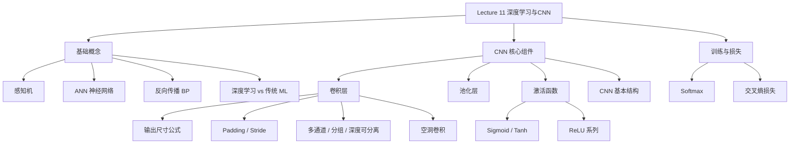

# Lecture 11 - 深度学习与CNN

> [!info] 课程概要
> 本讲标志着课程从传统视觉方法向深度学习的范式转变。前几讲 [[Lecture 10 - 目标检测讲解|Lecture 10]] 中介绍的 HOG + SVM、Viola-Jones 等方法都依赖人工设计特征，而本讲的核心主张是：**让网络自动学习特征**。主线可以概括为：**传统方法回顾 → 感知机与神经网络 → 反向传播 → CNN 卷积层（参数、输出尺寸、变体）→ 池化层 → 激活函数 → Softmax 与交叉熵损失**。CNN 是后续所有现代视觉任务（检测、分割、识别）的基础，也是从 [[Lecture 9 - 图像识别]] 的经典框架进入深度学习的桥梁。

## 1. 深度学习在课程中的位置

### 1.1 传统视觉方法回顾

传统机器视觉的基本流程：

$$
图像 \rightarrow 人工设计特征 \rightarrow 机器学习分类器 \rightarrow 识别结果
$$

典型特点：

1. **特征由人工设计**：梯度特征、直方图特征、多尺度特征、部件模型特征
2. **分类器由机器学习训练**：SVM、线性分类器、非线性核方法

> [!note] 传统方法的核心
> 人先设计特征，机器只负责分类。参见 [[Lecture 10 - 目标检测讲解|Lecture 10 的 HOG 特征设计]] 和 [[Lecture 9 - 图像识别|Lecture 9 的 BoF 视觉词袋]]。

### 1.2 传统方法的问题

1. 人工特征有信息损失
2. 特征量化有信息损失
3. 分类器不一定足够强
4. **特征和分类器是分开优化的**

### 1.3 深度学习的范式转变

传统方法：

$$
图像 \rightarrow 人工设计特征 \rightarrow 分类器 \rightarrow 输出
$$

深度学习方法：

$$
图像 \rightarrow 网络自动学习特征 \rightarrow 分类输出
$$

> [!definition] 深度学习的核心改进
> 把特征提取和分类器放在一个网络里**端到端联合训练**。

---

## 2. 本讲整体框架



---

## 3. 深度学习基础

### 3.1 感知机模型

感知机（Perceptron）是最简单的神经元模型。

输入 $X_1, X_2, X_3$，加权求和：

$$
S = w_1X_1 + w_2X_2 + w_3X_3 - t
$$

经过符号函数输出：

$$
Y = sign(S)
$$

其中：

$$
sign(x)=
\begin{cases}
1, & x \ge 0 \\
-1, & x < 0
\end{cases}
$$

> [!note] 感知机本质
> 感知机本质上是一个**线性分类器**。二维情况下决策边界为直线 $w_0 + w_1x_1 + w_2x_2 = 0$，高维情况下为超平面。

> [!warning] 局限性
> 单个感知机只能解决线性可分问题。

### 3.2 人工神经网络

人工神经网络（ANN）由多个神经元组成，一般包括**输入层、隐藏层、输出层**。

单个神经元计算过程：

$$
S_i = w_{i1}I_1 + w_{i2}I_2 + w_{i3}I_3 + \cdots
$$

$$
O_i = g(S_i)
$$

其中 $I$ 为输入，$w$ 为权重，$g(\cdot)$ 为激活函数，$O_i$ 为输出。

> [!definition] 训练的本质
> **Training ANN means learning the weights of the neurons.**
> 训练神经网络 = 学习每个神经元的权重。

### 3.3 反向传播

多层神经网络通过 **BP（Back Propagation，反向传播）** 学习参数。

**训练过程**：

1. **前向传播**：输入图像 → 网络输出预测结果 → 计算预测值和真实标签之间的 loss。
2. **反向传播**：计算 loss 对每个参数的梯度 → 根据梯度更新参数。

参数更新公式：

$$
w_j^{new} = w_j^{old} - \lambda \frac{\partial Loss}{\partial w_j}
$$

其中 $w_j$ 为第 $j$ 个参数，$\lambda$ 为学习率，$\frac{\partial Loss}{\partial w_j}$ 为损失函数对参数的梯度。

> [!note] 梯度下降的直觉
> 如果某个参数让 loss 变大，就沿着相反方向更新它。目标是让 Loss 不断减小。

### 3.4 什么是深度学习？

普通神经网络可能只有少量隐藏层。深度神经网络（DNN）有很多隐藏层。

> [!definition] 深度学习
> 用多层神经网络自动学习多层特征表示。

图像分类中，不同层学习不同级别的特征：

| 层次 | 可能学习到的内容 |
|---|---|
| 浅层 | 边缘、角点、纹理 |
| 中层 | 局部结构、部件 |
| 深层 | 物体语义类别 |

即：

$$
边缘 \rightarrow 纹理 \rightarrow 局部部件 \rightarrow 整体物体
$$

### 3.5 深度学习三位奠基人

| 人物 | 贡献 |
|---|---|
| **Geoffrey Hinton** | 反向传播、深度学习重要推动者 |
| **Yann LeCun** | 卷积神经网络 CNN，手写数字识别 |
| **Yoshua Bengio** | 神经网络与概率模型、序列模型 |

他们共同获得 **2018 年图灵奖**。

> [!tip] 重点记
> LeCun 和 CNN 关系最密切。

### 3.6 深度学习 vs 传统机器学习

| 维度 | 传统机器学习 | 深度学习 |
|---|---|---|
| 特征 | 人工设计 | 自动学习 |
| 特征与分类器 | 分开优化 | 端到端联合训练 |
| 层次 | 浅层特征 | 多层特征表示 |
| 数据需求 | 较少 | 需要大规模数据 |
| 算力需求 | 低 | 高（GPU/TPU） |

> [!summary] 核心区别
> 传统机器学习依赖人工特征，深度学习自动学习特征。

---

## 4. 深度学习成功案例

### 4.1 AlphaGo

AlphaGo 中使用深度 CNN：

- **Policy Network（策略网络）**：预测下一步动作概率。
- **Value Network（价值网络）**：评估当前局面胜率。

说明深度网络不仅可以做图像，也可以做复杂决策。

### 4.2 AlexNet

AlexNet 是深度学习在计算机视觉中爆发的标志。

> [!note] 重要信息
> - 2012 年 ImageNet 挑战赛冠军
> - 使用深度卷积神经网络
> - 用大规模标注图像训练
> - 使用 GPU 加速训练
> - 显著降低 ImageNet top-5 error

AlexNet 证明了深度 CNN 在大规模图像分类中的强大能力。

### 4.3 深度学习成功原因

$$
\text{数据} + \text{算力} + \text{深层网络}
$$

即：

1. **大规模标注数据集**（如 ImageNet）
2. **计算设备**（GPU / TPU）
3. **深层网络**自动提取特征

---

## 5. 深度神经网络类型

### 5.1 RNN 循环神经网络

适合序列数据（文本、语音、时间序列）。特点：数据可以按序列方向传播。

### 5.2 CNN 卷积神经网络

主要用于视觉任务：图像分类、目标检测、图像分割、图像识别。CNN 也可以用于语音识别。

---

## 6. 卷积层

### 6.1 卷积层的作用

> [!definition] 卷积层
> 通过卷积核（kernel/filter）提取图像特征。

卷积核是一个小矩阵（如 $3 \times 3$），在图像上滑动，每次和局部图像区域做乘加运算，得到输出特征图。

### 6.2 卷积的特点

#### 共享权重

同一个卷积核在整张图像上重复使用。

| 优点 | 说明 |
|---|---|
| 参数量少 | 不再每个位置都有一组独立参数 |
| 平移等变性 | 能检测图像不同位置上的相同特征 |

#### 位移不变性

如果某个特征移动到图像另一个位置，卷积核仍然可能检测到它。CNN 对局部平移具有一定鲁棒性。

### 6.3 卷积计算公式

$$
h[m,n] = \sum_{u=-k}^{k}\sum_{v=-k}^{k} f[u,v]\cdot I[m+u,n+v]
$$

其中 $I$ 为输入图像，$f$ 为卷积核，$h$ 为输出图像，$(m,n)$ 为输出位置。

> [!note] 一句话理解
> 卷积就是局部区域和卷积核逐元素相乘，再求和。

### 6.4 卷积例子

#### 均值滤波

$$
\frac{1}{9}
\begin{bmatrix}
1 & 1 & 1\\
1 & 1 & 1\\
1 & 1 & 1
\end{bmatrix}
$$

作用：平滑图像、去除噪声、使图像变模糊。

#### Sobel 边缘检测

$$
\begin{bmatrix}
1 & 0 & -1\\
2 & 0 & -2\\
1 & 0 & -1
\end{bmatrix}
$$

作用：检测灰度变化剧烈的位置，提取边缘信息。与 [[Lecture 4 - 特征提取]] 中的边缘检测思想一致。

> [!tip] 传统卷积 vs CNN 卷积
> 传统图像处理中的卷积核是人工设计的，CNN 中的卷积核是**自动学习**的。CNN 可以自动学到类似边缘、纹理、形状的特征。

---

## 7. 卷积层重要参数

### 7.1 输出尺寸公式

$$
W' = \frac{W - F + 2P}{S} + 1
$$

| 符号 | 含义 |
|---|---|
| $W$ | 输入尺寸 |
| $F$ | 卷积核尺寸 |
| $P$ | padding 填充 |
| $S$ | stride 步长 |
| $W'$ | 输出尺寸 |

> [!tip] 计算题核心
> 二维图像宽高分别套公式即可。这是本章最常考的计算题。

### 7.2 Padding 填充模式

| 模式 | 特点 | 示例 |
|---|---|---|
| **Valid** | $P=0$，不填充 | 输入 $5\times5$，核 $3\times3$，$S=1$ → 输出 $3\times3$ |
| **Same** | 输出与输入尺寸相同 | 输入 $5\times5$，核 $3\times3$，$S=1$，$P=1$ → 输出 $5\times5$ |
| **Full** | 填充更多，输出变大 | 输入 $5\times5$，核 $3\times3$，$S=1$，$P=2$ → 输出 $7\times7$ |

### 7.3 填充方式

| 填充方式 | 含义 |
|---|---|
| Zero padding | 边界补 0（最常见） |
| Reflective padding | 镜像反射填充 |
| Replication padding | 复制边缘像素填充 |

### 7.4 Stride 步长

步长表示卷积核每次移动多少像素。

- $S=1$：每次移动 1 个像素
- $S=2$：每次移动 2 个像素

> [!note] 步长的影响
> 步长越大，输出特征图越小，计算量越低，但空间细节损失更多。

示例：$W=5, F=3, P=1, S=2$

$$
W' = \frac{5-3+2}{2}+1 = 3
$$

输出尺寸 $3 \times 3$。

### 7.5 空洞卷积

空洞卷积（Dilated Convolution）在卷积核元素之间插入间隔。

空洞率记作 $r$：

- $r=1$：普通卷积
- $r>1$：空洞卷积

> [!note] 作用
> 在参数量不变的情况下扩大感受野。适合需要大范围上下文的任务，如图像分割。

### 7.6 多通道卷积

如果输入是 RGB 图像（$C_{in}=3$），卷积核大小 $K \times K$，输出 $F$ 个特征图，则需要 $F$ 个卷积核。每个卷积核大小：$K \times K \times 3$。

参数量：

$$
K \times K \times C_{in} \times C_{out}
$$

如果考虑 bias，则还要加 $C_{out}$。

### 7.7 分组卷积

分组卷积（Grouped Convolution）把输入通道分成 $G$ 组，每一组分别卷积，然后把结果拼接起来。

作用：

- 减少参数量（大约减少为原来的 $1/G$）
- 减少计算量

> [!note] 历史背景
> AlexNet 使用分组卷积，是因为当时 GPU 显存有限，把通道分到两个 GPU 上。

### 7.8 深度可分离卷积

这是分组卷积的特殊情况：$G = C_{in}$（每个输入通道单独卷积）。

通常分两步：

1. **Depthwise convolution**：每个通道独立做 $K \times K$ 卷积
2. **Pointwise convolution**：用 $1 \times 1$ 卷积融合通道信息

参数量对比（假设输入输出通道数都是 $C$，卷积核 $K \times K$）：

| 类型 | 参数量 |
|---|---|
| 普通卷积 | $K \times K \times C \times C$ |
| 深度可分离卷积 | $K \times K \times C + C \times C$ |

> [!tip] 优点
> 大幅减少参数量，常用于轻量级 CNN。

### 7.9 卷积层参数总结

卷积层常见参数：

1. 输入通道数 $C_{in}$
2. 输出通道数 $C_{out}$
3. 卷积核大小 $K$
4. 填充大小 $P$
5. 步长 $S$
6. 空洞率 dilation
7. 分组数 groups

PyTorch 示例：

```python
nn.Conv2d(
    in_channels=Cin,
    out_channels=Cout,
    kernel_size=K,
    stride=S,
    padding=P,
    dilation=D,
    groups=G
)
```

---

## 8. 池化层

### 8.1 池化层作用

池化层用于降低特征图空间分辨率。

例如 $32 \times 32 \times 64$ 经过 $2 \times 2$ 池化（步长 2）后变成 $16 \times 16 \times 64$。

> [!warning] 注意
> 池化层只改变宽高，**不改变通道数**。

### 8.2 最大池化

在局部窗口中取最大值。作用：保留最强响应，常用于突出显著特征。

### 8.3 平均池化

在局部窗口中取平均值。作用：平滑局部特征，保留整体趋势。

### 8.4 池化层特点

| 特点 | 说明 |
|---|---|
| 无学习参数 | 没有需要学习的参数 |
| 降低尺寸 | 降低特征图大小 |
| 减少计算 | 减少后续层计算量 |
| 平移鲁棒性 | 增强一定的平移鲁棒性 |
| 通道不变 | 不改变通道数量 |

---

## 9. CNN 基本结构

CNN 通常由以下层组合：

$$
卷积层 \rightarrow 激活函数 \rightarrow 池化层 \rightarrow 全连接层
$$

常见结构：

$$
Conv + ReLU + Pooling
$$

重复多次，然后接：

$$
Fully\ Connected + Softmax
$$

完整图像分类流程：

$$
输入图像 \rightarrow 卷积提特征 \rightarrow 池化降采样 \rightarrow 全连接分类 \rightarrow 输出类别
$$

---

## 10. 激活函数

### 10.1 激活函数的作用

激活函数通常记作 $\sigma(\cdot)$。

> [!definition] 核心作用
> 引入非线性映射。

如果没有激活函数，多层线性变换叠加后仍然是线性变换：

$$
W_3(W_2(W_1x)) = Wx
$$

所以没有激活函数，深层网络就没有意义。

### 10.2 常见激活函数

#### Identity

$$
y=x
$$

线性函数，不能提供非线性表达能力。

#### Sigmoid

$$
y = \frac{1}{1+e^{-x}}
$$

输出范围 $(0,1)$。

> [!warning] 问题
> 输入过大或过小时容易饱和，梯度接近 0，容易导致**梯度消失**。深层网络中训练慢，不太适合作为隐藏层激活函数。

#### Tanh

$$
y = \frac{e^{2x}-1}{e^{2x}+1}
$$

输出范围 $(-1,1)$。也可能存在饱和和梯度消失问题。

#### ReLU

> [!definition] ReLU（Rectified Linear Unit）
>
> $$
> ReLU(x)=\max(0,x)=
> \begin{cases}
> x, & x>0 \\
> 0, & x\le 0
> \end{cases}
> $$

| 方面 | 说明 |
|---|---|
| 优点 | 计算简单、收敛快、正半轴不饱和、可缓解梯度消失 |
| 缺点 | **Dying ReLU problem**：神经元长期输出 0，梯度也为 0，导致神经元"死掉" |

#### Leaky ReLU

$$
f(x)=
\begin{cases}
x, & x>0 \\
\alpha x, & x\le 0
\end{cases}
$$

其中 $\alpha$ 是一个很小的正数。作用：缓解 Dying ReLU 问题。

#### Parametric ReLU

PReLU 和 Leaky ReLU 类似，区别是：

- Leaky ReLU 的负半轴斜率是人为指定
- PReLU 的负半轴斜率是**网络学习得到**的

### 10.3 激活函数对比

| 激活函数 | 公式 | 输出范围 | 主要问题 |
|---|---|---|---|
| Sigmoid | $y = \frac{1}{1+e^{-x}}$ | $(0,1)$ | 梯度消失 |
| Tanh | $y = \frac{e^{2x}-1}{e^{2x}+1}$ | $(-1,1)$ | 梯度消失 |
| ReLU | $y = \max(0,x)$ | $[0,+\infty)$ | Dying ReLU |
| Leaky ReLU | $y = \max(\alpha x, x)$ | $(-\infty,+\infty)$ | 较 ReLU 好 |

---

## 11. Softmax 与损失函数

### 11.1 神经网络输出的是分数

分类网络最后一层通常输出每个类别的分数，这些分数**不是概率**。概率需要满足：每个值 $\ge 0$，所有值之和为 1。所以需要 Softmax。

### 11.2 Softmax 分类器

$$
P(Y=k|X=x_i)=\frac{e^{s_k}}{\sum_j e^{s_j}}
$$

其中 $s_k$ 为第 $k$ 类的原始分数，$e^{s_k}$ 保证值为正，分母用于归一化。

**例子**：

| 类别 | 原始分数 | $e^{s_k}$ | Softmax 概率 |
|---|---|---|---|
| cat | 3.2 | 24.5 | 0.13 |
| dog | 5.1 | 164.0 | 0.87 |
| frog | -1.7 | 0.18 | 0.00 |

所以模型认为 dog 概率最大。

### 11.3 交叉熵损失

对于单个样本：

$$
L_i = -\log P(Y=y_i|X=x_i)
$$

含义：真实类别的预测概率越大，loss 越小；真实类别的预测概率越小，loss 越大。

### 11.4 多分类交叉熵

$$
L_i = -\sum_{j=1}^{K} y_j \log p_j
$$

其中 $K$ 为类别数，$y_j$ 为真实标签的 one-hot 编码，$p_j$ 为预测为第 $j$ 类的概率。

> [!note] 本质
> 多分类交叉熵**只惩罚真实类别对应的概率**。

### 11.5 二分类交叉熵

$$
L_i = -y\log p_1 - (1-y)\log(1-p_1)
$$

其中 $y \in \{0,1\}$，$p_1$ 为预测为类别 1 的概率。

### 11.6 Log Loss 与最大似然估计

$$
Log\ loss = Maximum\ Likelihood\ Estimation
$$

用交叉熵训练分类模型，本质是让模型最大化真实类别出现的概率：

$$
最大化真实类别概率 \Leftrightarrow 最小化交叉熵损失
$$

### 11.7 Softmax 和交叉熵为什么一起用？

完整流程：

$$
图像 \rightarrow CNN \rightarrow 类别分数 \rightarrow Softmax概率 \rightarrow 交叉熵损失
$$

训练目标：**提高真实类别的预测概率，降低交叉熵损失**。

---

## 12. 高频考点

### 12.1 概念题

#### 深度学习和传统机器学习的区别

传统机器学习需要人工设计特征，再训练分类器；深度学习通过多层神经网络自动学习多层特征表示，并将特征提取和分类器端到端联合训练。

#### CNN 为什么适合图像？

CNN 利用局部连接和权重共享，能够高效提取图像局部特征；多层卷积可以从低级边缘纹理逐渐学习到高级语义特征；相比传统人工特征，CNN 可以自动学习特征并端到端优化分类性能。

#### 池化层有什么作用？

池化层用于降低特征图空间分辨率，减少计算量和参数规模，增强一定的平移鲁棒性。池化层只改变宽高，不改变通道数，并且没有需要学习的参数。

#### ReLU 为什么常用？

ReLU 计算简单，正半轴不饱和，可以缓解梯度消失问题，加快训练收敛。但 ReLU 可能出现 dying ReLU 问题。

### 12.2 计算题

#### 卷积输出尺寸

公式：

$$
W' = \frac{W-F+2P}{S}+1
$$

例：输入 $5\times5$，卷积核 $3\times3$，padding=1，stride=2：

$$
W' = \frac{5-3+2}{2}+1=3
$$

输出 $3\times3$。

#### 卷积参数量

| 类型 | 参数量 |
|---|---|
| 普通卷积（无 bias） | $K \times K \times C_{in} \times C_{out}$ |
| 普通卷积（有 bias） | $K \times K \times C_{in} \times C_{out} + C_{out}$ |
| 深度可分离卷积 | $K \times K \times C + C \times C$ |

#### Softmax

$$
p_k = \frac{e^{s_k}}{\sum_j e^{s_j}}
$$

#### 交叉熵

多分类：

$$
L_i = -\sum_{j=1}^{K} y_j\log p_j
$$

二分类：

$$
L_i = -y\log p_1 - (1-y)\log(1-p_1)
$$

---

## 13. 学习路线

```text
第一步：先搞清楚"为什么需要深度学习"
├── 传统方法：人工特征 + 分类器（分开优化）
├── 深度学习：自动学习特征 + 分类（端到端）
└── 核心改变：从"人设计特征"到"网络学特征"
    ↓
第二步：掌握神经网络基础
├── 感知机 → 线性分类器（只能分线性可分问题）
├── ANN → 多层神经元，学习权重
└── 反向传播 → 梯度下降更新参数
    ↓
第三步：深入 CNN 卷积层
├── 卷积公式 → 输出尺寸计算（W' = (W-F+2P)/S + 1）
├── 参数含义 → Padding / Stride / 多通道 / 空洞卷积
└── 卷积变体 → 分组卷积 / 深度可分离卷积
    ↓
第四步：理解池化层和激活函数
├── 池化：降采样，不改变通道数
├── ReLU 系列：引入非线性，缓解梯度消失
└── Sigmoid/Tanh：有梯度消失问题，较少用于深层网络
    ↓
第五步：掌握训练与损失
├── Softmax：将分数转为概率
├── 交叉熵：惩罚真实类别概率低的情况
└── 完整流程：图像 → CNN → Softmax → 交叉熵
    ↓
第六步：衔接后续课程
└── CNN 是目标检测、分割、识别等所有现代视觉任务的基础
```

---

## 14. 相关资源

| 工具 / 函数 | 用途 | 说明 |
|---|---|---|
| `torch.nn.Conv2d()` | 二维卷积层 | PyTorch 中的卷积实现 |
| `torch.nn.MaxPool2d()` | 最大池化 | 降采样保留最强响应 |
| `torch.nn.AvgPool2d()` | 平均池化 | 平滑降采样 |
| `torch.nn.ReLU()` | ReLU 激活 | 最常用的激活函数 |
| `torch.nn.Softmax()` | Softmax | 分数转概率 |
| `torch.nn.CrossEntropyLoss()` | 交叉熵损失 | 内置 Softmax + NLLLoss |
| `torch.nn.Linear()` | 全连接层 | 分类头 |

> [!tip] 复习建议
> 如果只准备考试，优先记住：
> 1. 传统 ML vs 深度学习的核心区别（人工特征 vs 自动学习）；
> 2. 卷积输出尺寸公式 $W' = (W-F+2P)/S + 1$；
> 3. 卷积参数量计算（普通 / 深度可分离）；
> 4. CNN 基本结构：Conv + ReLU + Pooling → FC + Softmax；
> 5. 各激活函数的特点和问题（Sigmoid 梯度消失、ReLU Dying）；
> 6. Softmax + 交叉熵的完整训练流程。

---

> [!question] 思考题
> 1. 为什么没有激活函数的多层网络等价于单层线性变换？
> 2. Sigmoid 的梯度消失问题在什么情况下最严重？为什么 ReLU 能缓解这个问题？
> 3. 分组卷积和深度可分离卷积分别减少了多少参数量？试推导公式。
> 4. 如果输入尺寸为 $32\times32$，经过两个 $3\times3$ 卷积（stride=1, padding=1）和一个 $2\times2$ 池化（stride=2），输出尺寸是多少？
> 5. 交叉熵损失中，如果模型对真实类别的预测概率趋近于 0，loss 会怎样变化？

---

> [!summary] 一句话总结
> Lecture 11 的核心逻辑是：**传统视觉依赖人工设计特征，而深度学习通过多层神经网络自动学习特征；CNN 是图像任务中最重要的深度学习模型，它通过卷积层提取局部特征，通过激活函数引入非线性，通过池化层降低分辨率，最后用 Softmax 输出类别概率，并用交叉熵损失进行训练。**

---

*本笔记由 Claudian 整理 | [[Lecture 9 - 图像识别]] → [[Lecture 10 - 目标检测讲解|Lecture 10 - 目标检测]] → [[Lecture 11 - 深度学习与CNN|Lecture 11 - 深度学习与CNN]]*
