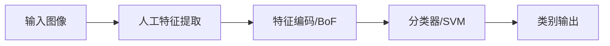
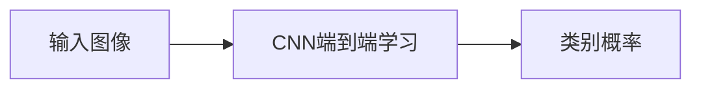
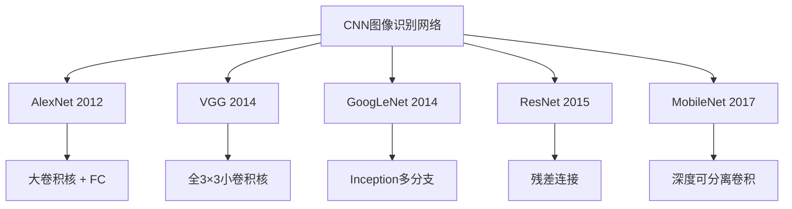

# Lecture 12 - CNN图像识别

> [!info] 课程概要
> 本讲从 [[Lecture 9 - 图像识别|经典图像识别]] 的监督学习框架和特征工程思路出发，正式进入深度学习时代的图像分类。在经典框架中，特征提取依赖人工设计的 SIFT、BoF 等方法，而 CNN 则让网络自动学习特征。本讲主线为：**CNN基础组件 → Softmax + 交叉熵损失 → 经典网络架构（AlexNet → VGG → GoogLeNet → ResNet → MobileNet）→ CNN特征可解释性 → 显著性分析**。本章为后续 [[Lecture 13 - CNN目标检测]] 和 [[Lecture 14 - CNN图像分割]] 提供卷积神经网络的基础知识支撑。

## 1. CNN图像识别在课程中的位置

### 1.1 从经典识别到深度学习

在 [[Lecture 9 - 图像识别]] 中，图像识别的框架是：



而 CNN 时代，这一流程变为：



> [!definition] CNN图像识别
> 卷积神经网络（CNN）用于图像识别时，通过卷积层自动学习图像特征，替代人工设计的 Sobel、SIFT 等固定特征，实现端到端的分类。

### 1.2 CNN的特点

| 特点 | 说明 |
|---|---|
| 自动特征学习 | 卷积层通过训练自动学习图像特征，无需人工设计 |
| 端到端训练 | 从原始像素直接到类别输出 |
| 主要应用领域 | 计算机视觉（也可用于语音识别等任务） |

---

## 2. CNN图像分类基本流程

### 2.1 整体流程

CNN 用于图像识别时，整体流程为：

$$
\text{输入图像} \rightarrow \text{卷积特征提取} \rightarrow \text{分类器} \rightarrow \text{类别概率}
$$

典型结构模块：

$$
\text{Convolution} + \text{BatchNorm} + \text{Activation}
$$

重复多次后，再经过池化、全连接层或全局平均池化，最后输出类别分数。

---

## 3. 卷积层基础知识

### 3.1 卷积层常见参数

| 参数 | 含义 |
|---|---|
| input channel（$C_{in}$） | 输入通道数，如 RGB 图像为 3 |
| output channel（$C_{out}$） | 输出通道数，即卷积核个数 |
| kernel size（$F$） | 卷积核大小，如 $3 \times 3$、$5 \times 5$ |
| padding（$P$） | 边缘填充 |
| stride（$S$） | 步长 |
| dilation rate | 空洞卷积膨胀率 |
| group number | 分组卷积组数 |

### 3.2 卷积输出尺寸公式

$$
W'=\frac{W-F+2P}{S}+1
$$

其中：

- $W$：输入尺寸
- $F$：卷积核大小
- $P$：padding
- $S$：stride

若输入为 $W \times W \times C_{in}$，卷积核个数为 $C_{out}$，则输出尺寸为：

$$
W' \times W' \times C_{out}
$$

### 3.3 卷积层参数量

普通卷积参数量（不含 bias）：

$$
F \times F \times C_{in} \times C_{out}
$$

若含 bias，则再加 $C_{out}$。一般计算时可忽略 bias。

> [!tip] 考试重点
> 卷积输出尺寸公式和参数量公式是最常考的计算题，务必熟练掌握。

---

## 4. Softmax 与交叉熵损失

### 4.1 从 Logits 到概率：Softmax

CNN 最后一层输出的是每个类别的原始分数（logits），例如：

$$
s=[3.2,\ 5.1,\ -1.7]
$$

这些分数不一定为正，也不要求和为 1，不能直接视为概率。

> [!definition] Softmax
> Softmax 将 logits 转换为概率分布：
> $$
> P(Y=k|X=x_i)=\frac{e^{s_k}}{\sum_j e^{s_j}}
> $$

特点：

- 每个概率都大于 0
- 所有类别概率之和为 1
- 适合**类别互斥**的单标签分类任务

例如 $[3.2,\ 5.1,\ -1.7]$ 经过 Softmax 后可能变为 $[0.13,\ 0.87,\ 0.00]$，说明模型认为第二类概率最大。

### 4.2 交叉熵损失

单个样本损失（one-hot 标签形式）：

$$
L_i=-\sum_j y_j \log p_j
$$

其中：

- $y_j$：真实标签的 one-hot 编码
- $p_j$：Softmax 输出的类别概率

如果真实类别概率为 0.13，则：

$$
L_i=-\log(0.13)=2.04
$$

> [!note] 核心理解
> 真实类别概率越大，损失越小；真实类别概率越小，损失越大。

### 4.3 使用场景对比

| 任务类型 | 激活函数 | 损失函数 |
|---|---|---|
| 单标签分类（类别互斥） | Softmax | Cross Entropy |
| 多标签分类（类别不互斥） | Sigmoid | Binary Cross Entropy |

---

## 5. 经典 CNN 网络架构演进



ImageNet 竞赛推动了 CNN 的发展，AlexNet 是第一个基于 CNN 的 ImageNet 获胜模型，之后网络逐渐变深，错误率快速下降。

---

### 5.1 AlexNet

#### 5.1.1 基本结构

AlexNet 是 2012 年 ImageNet 分类冠军，共 8 层：

$$
\text{CONV1} \rightarrow \text{POOL1} \rightarrow \text{NORM1}
\rightarrow \text{CONV2} \rightarrow \text{POOL2} \rightarrow \text{NORM2}
\rightarrow \text{CONV3} \rightarrow \text{CONV4} \rightarrow \text{CONV5}
\rightarrow \text{POOL3} \rightarrow \text{FC6} \rightarrow \text{FC7} \rightarrow \text{FC8}
$$

输入图像尺寸：$227 \times 227 \times 3$

#### 5.1.2 第一层输出尺寸计算

CONV1 参数：

- 输入：$227 \times 227 \times 3$
- 卷积核：$11 \times 11$，共 96 个
- stride = 4，padding = 0

输出空间尺寸：

$$
W'=\frac{227-11+2\times0}{4}+1=55
$$

输出为：$55 \times 55 \times 96$

#### 5.1.3 第一层参数量

$$
11 \times 11 \times 3 \times 96=34848 \approx 35K
$$

#### 5.1.4 Pooling 层

POOL1：

- 输入：$55 \times 55 \times 96$
- 池化核：$3 \times 3$，stride = 2

输出尺寸：

$$
\frac{55-3}{2}+1=27
$$

输出为：$27 \times 27 \times 96$

> [!note] 关键结论
> Pooling 层不需要学习参数，参数量为 **0**。

#### 5.1.5 完整结构表

| 层 | 输出尺寸 |
|---|---|
| INPUT | $227 \times 227 \times 3$ |
| CONV1 | $55 \times 55 \times 96$ |
| MAX POOL1 | $27 \times 27 \times 96$ |
| CONV2 | $27 \times 27 \times 256$ |
| MAX POOL2 | $13 \times 13 \times 256$ |
| CONV3 | $13 \times 13 \times 384$ |
| CONV4 | $13 \times 13 \times 384$ |
| CONV5 | $13 \times 13 \times 256$ |
| MAX POOL3 | $6 \times 6 \times 256$ |
| FC6 | 4096 |
| FC7 | 4096 |
| FC8 | 1000 |

> [!warning] AlexNet 重要结论
> 参数主要分布在**全连接层**，卷积层参数相对较少。例如 FC7 参数量为 $4096 \times 4096 = 16.8M$，而 CONV1 仅约 35K 参数。全连接层参数过多是早期 CNN 的主要问题，容易导致过拟合。

---

### 5.2 VGG

#### 5.2.1 核心思想

> [!definition] VGG 的设计理念
> 使用小卷积核（$3 \times 3$），构建更深的网络。

#### 5.2.2 特点

- 所有卷积层使用 $3 \times 3$ 卷积核
- 网络分为 5 个 block
- 每个 block 中有 1 到 4 个卷积层
- 每个 block 后接 max pooling
- 常见版本有 VGG16、VGG19

#### 5.2.3 为什么用 $3 \times 3$ 小卷积核？

三个 $3 \times 3$ 卷积层堆叠，具有和一个 $7 \times 7$ 卷积层相同的有效感受野：

$$
3 \times 3 \rightarrow 5 \times 5 \rightarrow 7 \times 7
$$

#### 5.2.4 参数量对比

设每层通道数均为 $C$：

- 一个 $7 \times 7$ 卷积参数量：$7^2C^2=49C^2$
- 三个 $3 \times 3$ 卷积参数量：$3 \times 3^2C^2=27C^2$

> [!tip] 小卷积核的优势
> 1. 参数更少
> 2. 网络更深
> 3. 中间有更多 ReLU，非线性表达能力更强
> 4. 感受野可以等效扩大

---

### 5.3 GoogLeNet

#### 5.3.1 概况

- 22 层深网络
- 核心为 **Inception 模块**
- 属于 "Network in Network" 思想
- 通过堆叠局部优秀模块构成整体网络

#### 5.3.2 Naive Inception 模块

朴素 Inception 对同一输入并行执行：

- $1 \times 1$ 卷积
- $3 \times 3$ 卷积
- $5 \times 5$ 卷积
- $3 \times 3$ pooling

然后将所有输出在通道维度拼接。

> 作用：并行分支可以提取**多尺度特征**。
> 问题：计算复杂度高。

#### 5.3.3 $1 \times 1$ Bottleneck 降维

为解决计算量问题，在 $3 \times 3$、$5 \times 5$ 卷积前加入 $1 \times 1$ 卷积。

> [!note] $1 \times 1$ 卷积作用
> 1. 压缩通道数（降维）
> 2. 减少参数量和计算量
> 3. 增加非线性表达

流程：

$$
\text{输入通道多} \rightarrow 1 \times 1\ \text{降维} \rightarrow 3 \times 3 / 5 \times 5\ \text{卷积}
$$

#### 5.3.4 全局平均池化

若特征图为 $H \times W \times C$，全局平均池化后变为 $1 \times 1 \times C$。

作用：

- 对每个通道的空间位置求平均
- 替代多个昂贵的全连接层
- 减少参数，降低过拟合风险

#### 5.3.5 辅助分类器

GoogLeNet 在中间层加入辅助分类输出：

> 给浅层网络注入额外梯度，加快浅层参数更新，缓解深层网络训练困难。

训练时有辅助作用，测试时主要使用最终分类器输出。

---

### 5.4 ResNet 残差网络

#### 5.4.1 核心思想

普通网络希望直接学习 $H(x)$，ResNet 改为学习残差：

$$
F(x)=H(x)-x
$$

因此输出为：

$$
H(x)=F(x)+x
$$

即残差块的运算：

$$
x \rightarrow F(x) \rightarrow F(x)+x
$$

其中 $x$ 通过 shortcut connection 直接加到输出上。

> [!definition] 残差连接
> ResNet 通过学习残差 $F(x)=H(x)-x$，使得网络可以训练得非常深（如 152 层），而不会出现性能退化。

#### 5.4.2 残差连接的作用

1. 加快信号反向传播
2. 缓解梯度消失
3. 加快网络收敛
4. 让深层网络更容易训练
5. 解决网络加深后的退化问题

如果某些层暂时没有学到有用特征，可令 $F(x)=0$，则输出 $F(x)+x=x$，相当于保留原输入，不会因网络太深而被破坏特征。

#### 5.4.3 ResNet 结构特点

- 堆叠残差模块
- 每个模块有两个卷积层
- 相邻 stage 通道数 ×2，空间分辨率 ÷2
- 使用全局平均池化
- 最后只接一个 FC 输出 1000 类

---

### 5.5 MobileNet

#### 5.5.1 核心思想

MobileNet 面向移动端和嵌入式设备，核心是**深度可分离卷积（Depthwise Separable Convolution）**。

#### 5.5.2 标准卷积 vs 深度可分离卷积

| 类型 | 操作 | 参数量 |
|---|---|---|
| 标准卷积 | 空间特征提取 + 通道信息混合 | $K^2 C_{in} C_{out}$ |
| Depthwise | 每个输入通道单独做卷积 | $K^2 C_{in}$ |
| Pointwise | $1 \times 1$ 卷积混合通道 | $C_{in}C_{out}$ |
| **深度可分离总计** | 两步分离 | $K^2C_{in}+C_{in}C_{out}$ |

#### 5.5.3 参数减少对比

标准卷积参数量：

$$
K^2C_{in}C_{out}
$$

深度可分离卷积参数量：

$$
K^2C_{in}+C_{in}C_{out}
$$

参数和计算量明显减少。

> [!summary] MobileNet 结论
> MobileNet 使用深度可分离卷积（depthwise + pointwise）大幅减少模型参数和计算量，适合移动端、嵌入式和实时视觉任务。

---

## 6. 经典网络对比总表

| 网络 | 核心思想 | 主要优点 | 主要问题/特点 |
|---|---|---|---|
| AlexNet | 大卷积核 + 多层 CNN + FC 分类 | 首个 CNN ImageNet 突破 | 全连接层参数多 |
| VGG | 全部用 $3 \times 3$ 小卷积 | 结构简单，表达能力强 | 参数和计算量大 |
| GoogLeNet | Inception 多分支 + $1 \times 1$ 降维 | 多尺度特征，参数少 | 结构复杂 |
| ResNet | 残差连接 $F(x)+x$ | 可训练超深网络，精度高 | 结构更深 |
| MobileNet | 深度可分离卷积 | 参数少，计算量低 | 适合移动端，精度可能略低 |

对比记忆：

| 维度 | 结论 |
|---|---|
| 参数最多 | VGG |
| 效率最高 | GoogLeNet |
| 精度与深度兼顾 | ResNet |
| 轻量化 | MobileNet |

---

## 7. CNN 特征可解释性

### 7.1 第一层卷积核可视化

第一层 filters 通常学习到：

- 边缘
- 颜色对比
- 方向纹理
- 简单局部模式

> [!note] 与传统方法的关系
> CNN 浅层特征类似 [[Lecture 4 - 特征提取]] 中传统图像处理人工设计的边缘检测器，但 CNN 的滤波器是通过训练自动学习出来的。

### 7.2 不同层级的特征

> 浅层学习通用低级模式（边缘），深层学习与物体相关的高级模式（语义）。

| 网络层级 | 学到的内容 |
|---|---|
| 浅层 | 边缘、颜色、纹理 |
| 中层 | 局部形状、部件 |
| 深层 | 物体语义、高级类别特征 |

### 7.3 特征空间最近邻

| 比较方式 | 特点 |
|---|---|
| 像素空间最近邻 | 直接比较 RGB 值，易受光照、背景、位置影响 |
| CNN 特征空间最近邻 | 比较深层语义特征，更能反映图像内容相似性 |

### 7.4 可视化激活图

若某一层 feature map 为 $128 \times 13 \times 13$，可看作 128 张 $13 \times 13$ 的灰度图：

- 亮的地方：该特征被强烈激活
- 暗的地方：该特征响应弱

### 7.5 最大激活图像块

方法：

1. 选定某一层某一个通道
2. 输入大量图像
3. 记录该通道响应最大的区域
4. 可视化这些图像 patch

> 作用：判断某个通道到底在检测什么模式（例如某通道总被"狗脸"区域激活，说明该通道对狗脸结构敏感）。

---

## 8. Saliency 显著性分析

显著性分析研究的问题是：

> 图像中哪些像素或区域对分类结果最重要？

### 8.1 Occlusion 遮挡法

方法：

1. 输入原图，得到类别概率
2. 用小方块遮挡图像某一区域
3. 再输入网络，观察目标类别概率下降多少

若遮挡某一区域后类别概率明显下降，说明该区域对分类很重要。

| 优点 | 缺点 |
|---|---|
| 直观，容易理解 | 计算慢，需要多次前向传播 |

### 8.2 Backprop 反向传播法

方法：

1. 前向传播得到类别分数
2. 选择某个类别
3. 计算该类别分数对输入像素的梯度：

$$
\frac{\partial s_c}{\partial I}
$$

4. 梯度绝对值越大，说明该像素对分类影响越大

得到的图称为 **saliency map**。

### 8.3 Saliency Map 用于弱监督分割

分类网络虽然只学习图像级类别，但内部仍可能学到物体大致位置。可以用 saliency map 结合 GrabCut 进行弱监督分割，与 [[Lecture 7 - 图像分割（1）]] 中的分割方法形成互补。

---

## 9. 本章公式汇总

| 公式 | 用途 |
|---|---|
| $W'=\frac{W-F+2P}{S}+1$ | 卷积输出尺寸 |
| $F \times F \times C_{in} \times C_{out}$ | 卷积参数量 |
| $P(Y=k\mid X=x_i)=\frac{e^{s_k}}{\sum_j e^{s_j}}$ | Softmax 概率转换 |
| $L_i=-\sum_j y_j\log p_j$ | 交叉熵损失 |
| $H(x)=F(x)+x$ | ResNet 残差连接 |
| $K^2C_{in}C_{out}$ | 标准卷积参数量 |
| $K^2C_{in}+C_{in}C_{out}$ | 深度可分离卷积参数量 |

---

## 10. 学习路线

```text
第一步：掌握 CNN 基础
├── 卷积层参数（kernel, stride, padding, channel）
├── 卷积输出尺寸公式 W' = (W-F+2P)/S + 1
└── 卷积参数量公式 F²·Cin·Cout
    ↓
第二步：理解分类输出层
├── Softmax：logits → 概率分布
├── 交叉熵损失：惩罚错误预测
└── Softmax vs Sigmoid 的场景选择
    ↓
第三步：经典网络演进
├── AlexNet：CNN 突破起点，大卷积核 + FC
├── VGG：全 3×3 小卷积核，堆深度
├── GoogLeNet：Inception 多分支 + 1×1 降维
├── ResNet：残差连接 F(x)+x，可训练 152 层
└── MobileNet：深度可分离卷积，轻量化
    ↓
第四步：特征理解与分析
├── 浅层学边缘纹理，深层学语义
├── 激活图可视化
└── Saliency 显著性分析（Occlusion / Backprop）
    ↓
第五步：衔接下一讲
└── CNN 基础 → [[Lecture 13 - CNN目标检测]]
```

---

## 11. 相关资源

| 工具 / 库 | 用途 | 说明 |
|---|---|---|
| `torch.nn.Conv2d` | 卷积层 | PyTorch 卷积实现 |
| `torch.nn.Linear` | 全连接层 | 分类头 |
| `torch.nn.CrossEntropyLoss` | 交叉熵损失 | 内含 Softmax |
| `torch.nn.BCEWithLogitsLoss` | 二分类交叉熵 | 含 Sigmoid，多标签分类 |
| `torchvision.models` | 预训练模型 | resnet50, vgg16, mobilenet 等 |
| `torch.nn.GlobalAvgPool2d` | 全局平均池化 | GoogLeNet / ResNet 风格 |

> [!tip] 复习建议
> 若只做考试复习，优先掌握：
> 1. 卷积输出尺寸和参数量公式（必考计算题）；
> 2. Softmax + 交叉熵损失的意义和使用场景；
> 3. AlexNet 第一层完整计算（输入 227→输出 55→参数 35K）；
> 4. VGG 用小卷积核的理由（3个 3×3 = 1个 7×7）；
> 5. ResNet 残差连接公式 $H(x)=F(x)+x$ 及其意义；
> 6. 五大网络的核心思想对比（各一句话）；
> 7. 深度可分离卷积的参数量公式；
> 8. CNN 浅层 vs 深层的特征差异。

---

> [!question] 思考题
> 1. 为什么 VGG 用三个 $3 \times 3$ 卷积替代一个 $7 \times 7$ 卷积可以减少参数？
> 2. GoogLeNet 中的 $1 \times 1$ 卷积有哪几个作用？
> 3. ResNet 的残差连接为什么能解决深层网络退化问题？
> 4. MobileNet 的深度可分离卷积分为哪两步？各自负责什么？
> 5. Softmax 和 Sigmoid 分别适用于什么场景？为什么多标签分类不能直接用 Softmax？
> 6. Occlusion 法和 Backprop 法各自如何判断像素的重要性？两者有何优缺点？

---

> [!summary] 一句话总结
> Lecture 12 的核心逻辑是：**从 CNN 基础组件（卷积/Softmax/交叉熵）出发，理解经典网络架构如何通过小卷积核、Inception 多分支、残差连接和深度可分离卷积逐步解决参数量、深度训练和计算效率问题，最终实现端到端的图像特征学习与分类。**

---

*本笔记由 Claudian 整理 | [[Lecture 9 - 图像识别]] → [[Lecture 12 - CNN图像识别]] → [[Lecture 13 - CNN目标检测]]*
