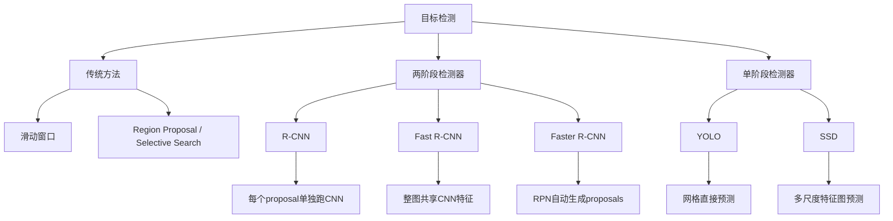

# Lecture 13 - CNN目标检测

> [!info] 课程概要
> 本讲将 [[Lecture 12 - CNN图像识别|CNN图像识别]] 从"图像级分类"推进到"目标级检测"。核心问题从"整张图是什么"变为"图中有哪些物体，每个物体是什么，在哪里"。本讲主线为：**滑动窗口 → Region Proposal → R-CNN → Fast R-CNN → Faster R-CNN/RPN/Anchor → 单阶段检测器 YOLO/SSD**。其中 ROI Pool/Align、Anchor 机制、两阶段与单阶段的对比是本章的核心考点。本讲也为 [[Lecture 14 - CNN图像分割]] 中更精细的像素级任务打下基础。

## 1. 目标检测在视觉任务中的位置

### 1.1 图像理解的四层任务

| 任务 | 输出 | 特点 |
|---|---|---|
| 分类 Classification | 整张图一个类别 | 没有空间位置信息 |
| 语义分割 Semantic Segmentation | 每个像素的类别 | 不区分同类不同个体 |
| 目标检测 Object Detection | 类别 + 边界框 | 能检测多个物体 |
| 实例分割 Instance Segmentation | 类别 + 每个实例的像素区域 | 检测 + 精细分割 |

### 1.2 目标检测的精确定义

> [!definition] 目标检测
> 目标检测 = **分类 Classification + 定位 Localization**。输出为：类别标签 + 边界框坐标 $(x, y, w, h)$，其中 $(x,y)$ 为框位置，$(w,h)$ 为框的宽和高。

分类只回答：图里是什么？
目标检测要回答：**图里有哪些物体？每个物体是什么？在哪里？**

---

## 2. 本章方法演进总览



> [!note] 主线总结
> 方法演进的核心驱动力是**速度与精度的权衡**：从枚举所有窗口，到先找候选区域再分类，再到让网络自己生成候选框，最后一步到位直接预测。

---

## 3. 单目标检测：分类 + 边框回归

### 3.1 基本结构

若图像中只有一个目标，CNN 可同时输出两部分：

- **类别分数**：如 `Cat:0.9, Dog:0.05, Car:0.01`
- **边界框坐标**：$(x,y,w,h)$

### 3.2 训练损失

训练时总损失为：

$$
L = L_{cls} + L_{bbox}
$$

| 损失项 | 作用 |
|---|---|
| 分类损失 $L_{cls}$ | 判断类别对不对 |
| 边框回归损失 $L_{bbox}$ | 判断预测框位置准不准 |

> [!note] 关键理解
> 将定位问题视作**回归问题**，这与纯分类任务形成本质区别。

---

## 4. 多目标检测的核心难点

> 每张图中的物体数量**不固定**。

例如一张图有 3 个目标，另一张图有 7 个目标。如果直接用固定数量的全连接节点输出，很难处理数量变化。

因此目标检测不能简单设计成固定输出，而需要：

1. 生成一批候选框
2. 判断每个候选框里有没有物体
3. 对含物体的框进一步分类和位置精修

---

## 5. 滑动窗口

### 5.1 方法

最朴素的检测方法：

1. 在图像上裁剪很多窗口
2. 每个窗口送入 CNN
3. 判断每个窗口是某类别还是背景

### 5.2 优缺点

| 优点 | 缺点 |
|---|---|
| 思路简单直观 | 计算量巨大 |

> [!warning] 为什么慢？
> 需要遍历大量**位置、尺度、长宽比**的组合，窗口数量极为庞大，每个窗口都跑一次 CNN，计算代价非常高。

---

## 6. Region Proposal 区域提议

### 6.1 核心思想

> 不再枚举所有窗口，而是先找出一批"**可能包含物体**"的候选区域。

### 6.2 常见方法

| 方法 | 含义 |
|---|---|
| SLIC Super-pixel | 先把图像分成超像素 |
| Selective Search | 通过分层聚类合并区域，产生不同尺度的候选框（约 2000 个） |

Selective Search 可在 CPU 上较快产生约 2000 个候选区域。

---

## 7. R-CNN

### 7.1 流程

1. 输入图像
2. Selective Search 得到约 2000 个候选区域
3. 每个候选区域 resize 到固定大小（如 $224 \times 224$）
4. 每个区域**单独送入 CNN** 提取特征
5. SVM 分类
6. Bounding Box Regression 修正边界框

### 7.2 优缺点

| 优点 | 缺点 |
|---|---|
| CNN 特征比传统人工特征强，检测精度提高 | 非常慢：每张图约 2000 个 RoI，CNN 重复计算严重 |

> [!summary] R-CNN 公式记忆
> **R-CNN = Region Proposal + CNN 特征提取 + SVM 分类 + BBox 回归**

---

## 8. Fast R-CNN

### 8.1 核心改进

> [!definition] Fast R-CNN 的关键创新
> 先对整张图跑一次 CNN，再在特征图上裁剪 RoI，**避免每个候选框重复跑 CNN**。

### 8.2 流程

1. 输入整张图
2. Backbone CNN 提取整图特征图
3. 将 proposal 映射到 feature map 上
4. ROI Pool 得到固定大小的区域特征
5. 分类分支 + 边框回归分支

### 8.3 与 R-CNN 的核心差异

| 方法 | CNN 计算方式 | 速度 |
|---|---|---|
| R-CNN | 每个候选框单独跑 CNN | 慢 |
| Fast R-CNN | 整张图只跑一次 CNN | 快很多 |

---

## 9. ROI Pool 与 ROI Align

### 9.1 ROI Pool

> 作用：把任意大小的 RoI 区域变成固定大小的特征表示。

步骤：

1. 把原图 proposal 映射到 feature map
2. 坐标取整
3. 分成固定网格（如 $7 \times 7$）
4. 每个小格做 max pooling
5. 得到固定大小特征

> [!warning] 问题
> 坐标取整会导致**空间错位**。

### 9.2 ROI Align

改进：

- **不进行坐标取整**
- 使用**双线性插值**
- 保持更准确的空间对齐关系

| 方法 | 坐标处理 | 问题/优点 |
|---|---|---|
| ROI Pool | 坐标取整 | 可能错位 |
| ROI Align | 不取整，双线性插值 | 空间对齐更好 |

---

## 10. Fast R-CNN 的瓶颈

Fast R-CNN 虽然减少了 CNN 重复计算，但仍有瓶颈：

> Region Proposal 仍然由 Selective Search（CPU 算法）生成，耗时较大。

因此 Faster R-CNN 的核心突破在于：

> **让 CNN 自己生成候选框。**

---

## 11. Faster R-CNN

### 11.1 RPN 区域提议网络

> [!definition] RPN（Region Proposal Network）
> 在 CNN 的 feature map 上直接预测候选框，替代 CPU 端的 Selective Search。

### 11.2 整体流程

1. 输入图像
2. CNN backbone 提取 feature map
3. **RPN** 在 feature map 上生成 proposals
4. ROI Pool / ROI Align 处理 proposals
5. 分类 + 边框回归

### 11.3 两阶段检测器

Faster R-CNN 是典型的 **two-stage detector**：

| 阶段 | 作用 |
|---|---|
| 第一阶段 RPN | 生成候选框 |
| 第二阶段检测头 | 对候选框分类，并精修边界框 |

---

## 12. Anchor 机制

### 12.1 什么是 Anchor？

> [!definition] Anchor Box
> 在 feature map 的每个位置上预设若干个候选框，每个 anchor 有不同的**尺度**和**长宽比**，作为边界框回归的初始参考。

### 12.2 RPN 对每个 Anchor 的预测

对于每个 anchor，RPN 预测两件事：

1. **Objectness 分数**：这个 anchor 里有没有物体（二分类）
2. **边框修正量**：anchor 应如何调整才能更接近真实框

### 12.3 输出维度

若每个位置有 $K$ 个 anchor，feature map 大小为 $20 \times 15$：

| 输出 | 大小 |
|---|---|
| objectness 分数 | $K \times 20 \times 15$ |
| 边框修正量 | $4K \times 20 \times 15$ |

然后按 objectness 分数排序，选取前约 300 个作为 proposals。

---

## 13. Faster R-CNN 的四个损失

Faster R-CNN 需要联合训练 4 个损失：

| 损失 | 含义 | 类型 |
|---|---|---|
| $L_{rpn\_cls}$ | anchor 是物体还是背景 | 二分类 |
| $L_{rpn\_bbox}$ | anchor 到真实框的偏移 | 回归 |
| $L_{final\_cls}$ | proposal 属于哪个类别 | 多分类 |
| $L_{final\_bbox}$ | 进一步修正检测框 | 回归 |

总损失：

$$
L = L_{rpn\_cls} + L_{rpn\_bbox} + L_{final\_cls} + L_{final\_bbox}
$$

---

## 14. 两阶段检测 vs 单阶段检测

| 维度 | 两阶段检测 | 单阶段检测 |
|---|---|---|
| 代表方法 | R-CNN、Fast R-CNN、Faster R-CNN | YOLO、SSD、RetinaNet |
| 思路 | 先生成候选框，再分类回归 | 直接预测类别和边界框 |
| 精度 | 高 | 适中 |
| 速度 | 慢 | 快，适合实时检测 |

> [!note] 核心权衡
> 两阶段精度高但慢，单阶段速度快但精度可能略低。实际应用中根据场景选择。

---

## 15. YOLO

### 15.1 核心思想

> [!definition] YOLO（You Only Look Once）
> 把图像划分成网格（grid），每个网格直接预测边界框和类别，一步到位。

### 15.2 输出维度

以 $S \times S$ 网格为例，每个 grid cell 预测：

1. $B$ 个边界框，每框 5 个数：$(dx, dy, dh, dw, confidence)$
2. $C$ 个类别分数

每个 grid cell 的输出维度：

$$
5B + C
$$

整张图输出：

$$
S \times S \times (5B + C)
$$

### 15.3 PPT 典型例子

$$
S=7,\ B=2,\ C=20
$$

每个格子输出维度：

$$
5 \times 2 + 20 = 30
$$

整张图输出：

$$
7 \times 7 \times 30
$$

> [!warning] 易错点
> PPT 中写"最终输出维度为 30"，更准确的表述是：**每个网格单元的输出维度为 30**。整张图的完整输出是 $7 \times 7 \times 30$。

### 15.4 YOLO 版本发展

| 版本 | 主要改进 |
|---|---|
| YOLOv3 | Darknet-53 骨干网络，多尺度预测，对不同尺度目标更友好 |
| YOLOv8 | C2f 新骨干、解耦头（分类与定位分开）、TaskAlignedAssigner 正样本分配、Distribution Focal Loss |

> [!tip] 不需要死记版本细节
> 知道发展方向即可：**更快、更准、更适合多尺度目标检测**。

---

## 16. SSD

### 16.1 全称与定位

**SSD = Single-Shot MultiBox Detector**，单阶段检测器。

### 16.2 核心特点

1. **单阶段检测**：不单独生成 proposals
2. **多尺度预测**：在不同层 feature map 上检测不同大小的目标
   - 浅层大特征图检测小目标
   - 深层小特征图检测大目标
3. **默认框**：在固定长宽比的预设框基础上预测偏移量

### 16.3 性能

SSD 在 Pascal VOC2007 test 上 mAP 可达 80% 以上，并可实时检测。

---

## 17. 本章方法对比总表

| 方法 | 核心思想 | 优点 | 缺点 |
|---|---|---|---|
| 滑动窗口 | 枚举窗口并分类 | 简单直接 | 计算量巨大 |
| Region Proposal | 先找可能有物体的区域 | 减少无效窗口 | 仍依赖传统 CPU 算法 |
| R-CNN | proposal 单独跑 CNN | 精度提升 | 非常慢（2000 次 CNN） |
| Fast R-CNN | 整图跑一次 CNN，共享特征 | 减少重复计算 | Selective Search 仍慢 |
| Faster R-CNN | RPN 在特征图上生成 proposals | 精度高，近端到端 | 两阶段，速度相对慢 |
| YOLO | 网格直接预测框和类别 | 速度快 | 小目标和密集目标较难 |
| SSD | 多尺度特征图预测默认框偏移 | 速度快，兼顾多尺度 | 依赖默认框设计 |

### R-CNN 系列演进总结

| 方法 | 关键改进 |
|---|---|
| R-CNN | 引入 CNN + Region Proposal |
| Fast R-CNN | **整图共享卷积特征**（关键突破） |
| Faster R-CNN | **RPN 替代 Selective Search**（端到端） |

---

## 18. 考点汇总

### 18.1 目标检测与分类的区别

- 分类：只输出类别
- 目标检测：输出类别 + 边界框 $(x,y,w,h)$

### 18.2 目标检测损失函数

$$
L = L_{cls} + L_{bbox}
$$

### 18.3 滑动窗口为什么慢

需要遍历大量位置、尺度、长宽比，每个窗口都要跑 CNN。

### 18.4 R-CNN / Fast R-CNN / Faster R-CNN 核心区别

| 方法 | CNN 计算 | Proposal 来源 |
|---|---|---|
| R-CNN | 每个 proposal 单独跑 | Selective Search |
| Fast R-CNN | 整图一次 | Selective Search |
| Faster R-CNN | 整图一次 | RPN 生成 |

### 18.5 ROI Pool vs ROI Align

| 方法 | 处理方式 | 问题 |
|---|---|---|
| ROI Pool | 坐标取整 | 可能空间错位 |
| ROI Align | 双线性插值，不取整 | 空间对齐更准 |

### 18.6 Anchor 是什么

Feature map 每个位置上的预设框（含尺度和长宽比），作为边界框回归的初始参考。

### 18.7 YOLO 输出维度公式

$$
S \times S \times (5B + C)
$$

PPT 例子：$S=7,\ B=2,\ C=20 \Rightarrow 7 \times 7 \times 30$

### 18.8 两阶段 vs 单阶段

- 两阶段：精度高但慢（R-CNN 系列）
- 单阶段：速度快，适合实时（YOLO、SSD）

---

## 19. 学习路线

```text
第一步：理解任务层次
├── 分类 → 检测 → 分割（任务复杂度递增）
├── 检测 = 分类 + 定位
└── 输出 = 类别 + (x, y, w, h)
    ↓
第二步：从朴素方法开始
├── 滑动窗口：为什么简单但不可行？
├── Region Proposal：减少搜索空间
└── Selective Search：CPU 端约 2000 个候选框
    ↓
第三步：R-CNN 系列演进
├── R-CNN：proposal × CNN（极慢）
├── Fast R-CN：整图共享 CNN（快了很多）
├── Faster R-CNN：RPN 替代 Selective Search（端到端）
└── 理解 ROI Pool 的取整问题 → ROI Align 的改进
    ↓
第四步：Anchor 和 RPN
├── Anchor：预设框（尺度 + 长宽比）
├── RPN 对每个 anchor 预测：objectness + 边框修正
└── Faster R-CNN 四个损失的联合训练
    ↓
第五步：单阶段检测器
├── YOLO：网格直接预测（S×S×(5B+C) 必考）
├── SSD：多尺度特征图 + 默认框
└── 两阶段 vs 单阶段的核心权衡
    ↓
第六步：衔接后续课程
└── 目标检测 → [[Lecture 14 - CNN图像分割]]（像素级任务）
```

---

## 20. 相关资源

| 工具 / 库 | 用途 | 说明 |
|---|---|---|
| `torchvision.models.detection` | 目标检测模型 | Faster R-CNN, SSD, RetinaNet 等 |
| `torchvision.ops.roi_pool` | ROI Pool 操作 | Fast/Faster R-CNN 核心操作 |
| `torchvision.ops.roi_align` | ROI Align 操作 | 改进的空间对齐 |
| `ultralytics` | YOLO 实现 | YOLOv3/v5/v8 训练与推理 |
| `mmdetection` | 检测框架 | 综合性的目标检测工具箱 |
| `cv2.selectiveSearch` | Selective Search | OpenCV 中的候选区域生成 |

> [!tip] 复习建议
> 如果只准备考试，优先记住：
> 1. 目标检测 = 分类 + 定位，损失 = L_cls + L_bbox；
> 2. R-CNN → Fast R-CNN → Faster R-CNN 每一步的改进点；
> 3. ROI Pool 坐标取整的定位误差风险，ROI Align 如何解决；
> 4. Anchor 的定义和作用；
> 5. YOLO 输出维度公式 $S \times S \times (5B + C)$（必考计算题）；
> 6. 两阶段和单阶段的代表方法及其优缺点对比。

---

> [!question] 思考题
> 1. 滑动窗口检测方法为什么在实际中不可行？主要瓶颈在哪里？
> 2. R-CNN 中每个候选区域单独跑 CNN 导致了什么浪费？Fast R-CNN 如何解决？
> 3. ROI Pool 的"坐标取整"为什么会导致空间错位？ROI Align 的双线性插值如何改进？
> 4. Anchor 机制的本质是什么？如果没有 anchor，RPN 还能工作吗？
> 5. 给定 $S=13, B=5, C=80$，请计算 YOLO 的完整输出维度。
> 6. 为什么两阶段检测器通常精度更高但速度更慢？单阶段检测器在什么场景下更合适？

---

> [!summary] 一句话总结
> Lecture 13 的核心逻辑是：**目标检测在分类基础上增加空间定位，从滑动窗口的暴力枚举，到 R-CNN 系列的候选区分类，再到 YOLO/SSD 的一步到位直接预测，核心是在速度与精度之间寻找最优平衡。**

---

*本笔记由 Claudian 整理 | [[Lecture 12 - CNN图像识别]] → [[Lecture 13 - CNN目标检测]] → [[Lecture 14 - CNN图像分割]]*
