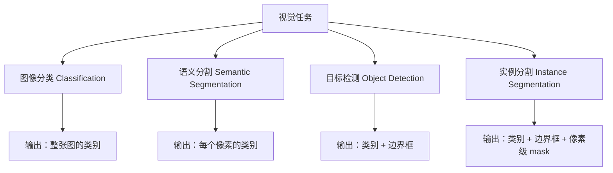
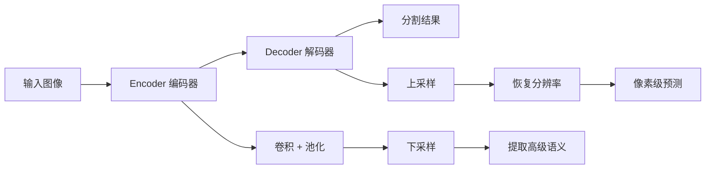
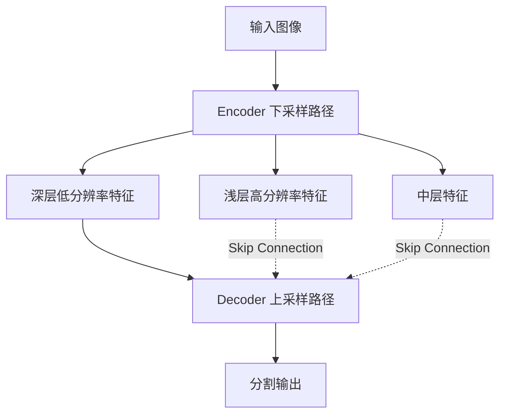
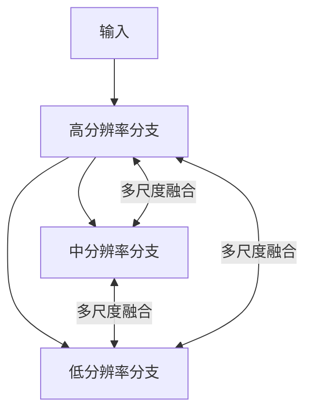
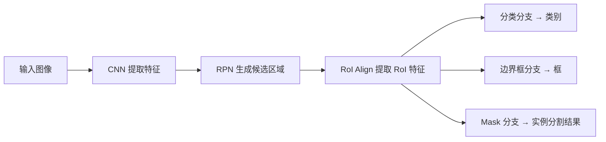

# Lecture 14 - CNN图像分割

> [!info] 课程概要
> 本讲将 [[Lecture 7 - 图像分割（1）]] 和 [[Lecture 8 - 图像分割（2）|Lecture 8 - 图像分割（2）]] 中的经典分割方法推进到深度学习时代，核心主线为：**语义分割（FCN → U-Net → HRNet → DeepLab）→ 实例分割（Mask R-CNN）→ 迁移学习**。其中 CNN 基础来自 [[Lecture 11 - 深度学习_CNN]]，目标检测与 RPN 前置知识来自 [[Lecture 13 - CNN目标检测]]，识别的评价思维则承接 [[Lecture 9 - 图像识别]]。

## 1. 常见视觉任务回顾

### 1.1 四类任务的对比



| 任务 | 输出粒度 | 是否区分个体 | 典型模型 |
|---|---|---|---|
| 图像分类 | 图像级 | 不适用 | ResNet、VGG |
| 语义分割 | 像素级 | 否 | FCN、U-Net、DeepLab |
| 目标检测 | 目标级 | 是 | Faster R-CNN、YOLO |
| 实例分割 | 像素级 | 是 | Mask R-CNN |

### 1.2 各任务的定义

> [!definition] 图像分类（Classification）
> 输入一张图像，输出整张图像的类别标签。只判断"是什么"，不关心物体位置和空间范围。

> [!definition] 语义分割（Semantic Segmentation）
> 对图像中**每个像素**进行类别预测。输出一张像素级类别图，但不区分同一类别中的不同个体。

> [!definition] 目标检测（Object Detection）
> 检测图像中物体的位置和类别。输出类别标签和边界框（bounding box），可检测多个物体。

> [!definition] 实例分割（Instance Segmentation）
> 目标检测 + 像素级分割。既要知道像素类别，还要区分同一类别的不同个体。例如两只狗分别标记为 dog1 和 dog2。

---

## 2. 语义分割基础

### 2.1 语义分割的基本任务

语义分割的目标是：**对图像中的每一个像素预测类别**。

训练数据需要：
- 原始图像
- 每个像素的类别标签（pixel-level annotation）

测试时，输入一张新图像，模型输出每个像素的类别。

### 2.2 最朴素的 CNN 分割方法

最直接的做法：对每个像素周围截取一个 patch，用 CNN 分类中心像素。

> [!warning] 问题：非常低效
> 相邻像素的局部区域高度重叠，如果每个像素都单独跑一次 CNN，会重复计算大量卷积特征。

### 2.3 从图像分类到图像分割

传统 CNN 分类网络结构：

```text
输入图像 → 卷积层/池化层 → 全连接层 → 输出类别
```

分割任务需要输出像素级类别图，思路变为：

```text
输入图像 → 卷积特征提取 → 输出低分辨率类别得分图 → 上采样 → 像素级分割结果
```

---

## 3. FCN：全卷积网络

### 3.1 FCN 的基本思想

> [!definition] FCN（Fully Convolutional Network）
> 将分类网络中的全连接层替换为卷积层，使网络能够输出空间结构，而非单一类别向量。

输入为 $3 \times H \times W$，经过卷积和池化后得到 $C \times H/8 \times W/8$（其中 $C$ 为类别数），再经过 softmax + argmax + upsample，得到与原图对应的像素级分割结果。

### 3.2 FCN 的优点

- 整张图只需前向传播一次
- 共享卷积特征，避免逐像素重复计算
- 可以端到端训练
- 实现了 CNN 从图像分类到像素分类的转变

### 3.3 FCN 的局限

> [!warning] 分割结果不够精细
> 多次池化和下采样导致特征图分辨率降低，空间细节丢失，边界容易模糊，小目标和细结构分割效果差。

后续方法主要围绕一个问题改进：**如何恢复更高分辨率、更精细的分割结果？**

---

## 4. 下采样与上采样

### 4.1 编码器-解码器结构



| 组件 | 作用 | 特点 |
|---|---|---|
| 编码器 Encoder | 卷积、池化、下采样，提取高级语义特征 | 分辨率降低，感受野变大，语义信息增强，空间细节减少 |
| 解码器 Decoder | 上采样、反卷积，恢复空间分辨率，输出像素级预测 | 分辨率逐渐恢复，输出分割图 |

### 4.2 普通上采样（最近邻插值）

例如将 $2 \times 2$ 上采样为 $4 \times 4$：

```text
原矩阵:        上采样后:
1 2            1 1 2 2
3 4            1 1 2 2
               3 3 4 4
               3 3 4 4
```

特点：简单，不需要学习参数，但结果可能较粗糙。

### 4.3 Max Unpooling

Max Pooling 时记录最大值的位置，Max Unpooling 时将池化后的值放回原来最大值的位置，其余位置补 0。

优点：利用池化时保存的位置信息，比简单插值更有空间恢复能力。  
缺点：仍不是完全可学习的上采样。

### 4.4 反卷积 / 转置卷积

> [!definition] 转置卷积（Transpose Convolution）
> 不是真正数学意义上的卷积逆运算，而是一种**可学习的上采样操作**。

- 普通 stride=2 卷积：可学习的下采样
- 转置卷积 stride=2：可学习的上采样

特点：
- 可以扩大特征图尺寸
- 卷积核参数可以训练
- 常用于分割网络的解码器部分

---

## 5. U-Net

### 5.1 U-Net 结构

U-Net 是经典的编码器-解码器分割网络，结构呈 U 形：



### 5.2 编码器 Encoding Path

编码器部分：卷积 → ReLU → 池化 → 下采样，作用为**提取高级语义特征**。

### 5.3 解码器 Decoding Path

解码器部分：上采样 → 反卷积 → 特征融合 → 恢复图像分辨率，作用为**得到高分辨率的分割结果**。

### 5.4 跳跃连接 Skip Connection

> [!tip] U-Net 的核心创新
> 将编码器中浅层的高分辨率特征直接连接到解码器对应层，融合浅层细节和深层语义。

作用：
- 保留空间细节
- 改善边界定位
- 改善梯度反向传播
- 深层特征知道"是什么"，浅层特征知道"在哪里"

### 5.5 U-Net 的特点

| 方面 | 说明 |
|---|---|
| 优点 | 适合小数据集；分割边界较精细；医学图像分割中非常常用；结构清晰 |
| 局限 | 相对简单的特征融合方式；感受野受限于下采样深度 |

---

## 6. HRNet

### 6.1 HRNet 的基本思想

> [!definition] HRNet（High-Resolution Network）
> 始终保持高分辨率特征图，防止空间细节丢失。

普通 CNN 路径：高分辨率 → 中分辨率 → 低分辨率 → 再恢复分辨率。  
HRNet 路径：**同时维护多个不同分辨率的分支**，不断进行多尺度特征融合。

### 6.2 HRNet 的结构特点



### 6.3 HRNet 的适用场景

适合需要精确空间定位的任务：
- 语义分割
- 姿态估计
- 关键点检测

> [!note] 核心优势
> 高分辨率特征一直存在，因此空间细节保留更好。

---

## 7. DeepLab

### 7.1 为什么需要 DeepLab？

普通 CNN 多次下采样导致：
- 分辨率下降
- 细节丢失
- 边界不精确

但如果不下采样，感受野又不够大。

DeepLab 要解决的问题：**如何在保持较高分辨率的同时扩大感受野？**

### 7.2 空洞卷积 Atrous Convolution

> [!definition] 空洞卷积（Atrous / Dilated Convolution）
> 在卷积核元素之间插入空洞（0），从而在不增加参数量的前提下扩大感受野。

优点：
- 不明显增加参数量
- 不一定需要降低分辨率
- 可以获得更大感受野
- 适合语义分割

### 7.3 ASPP

> [!definition] ASPP（Atrous Spatial Pyramid Pooling）
> 使用多个并行的空洞卷积分支，每个分支采用不同的空洞率（dilation rate），融合多尺度特征。

| 空洞率 | 关注范围 |
|---|---|
| 小空洞率 | 关注局部细节 |
| 大空洞率 | 关注更大范围上下文 |

作用：**融合多尺度特征，提高分割效果**。

### 7.4 DeepLab-v3

DeepLab-v3 进一步强调：
- 多次下采样会造成分辨率丢失
- 使用空洞卷积可以保持较高分辨率
- 不同空洞率可以获得不同尺度信息

> [!summary] DeepLab 核心总结
> 通过空洞卷积获得高分辨率、大感受野的特征，通过 ASPP 融合多尺度上下文。

---

## 8. 实例分割与 Mask R-CNN

### 8.1 语义分割与实例分割的区别

| 维度 | 语义分割 | 实例分割 |
|---|---|---|
| 是否像素级分类 | 是 | 是 |
| 是否区分个体 | 否（所有人的像素都标为 person） | 是（person1、person2、person3） |
| 本质 | 像素级分类 | 像素级分类 + 个体区分 |

### 8.2 从 Faster R-CNN 到 Mask R-CNN

Faster R-CNN 有两个主要输出：
1. 分类结果
2. 边界框回归结果

Mask R-CNN 在此基础上增加了第三个输出：
3. **Mask Prediction 分支**

```text
Faster R-CNN = 分类 + 框
Mask R-CNN  = 分类 + 框 + mask
```

### 8.3 Mask R-CNN 的核心流程



最终输出：**类别 + 边界框 + mask**。

### 8.4 Mask 分支

Mask 分支在每个 RoI 上预测一个小尺寸 mask（如 $28 \times 28$）。对于 $C$ 个类别，输出 $C \times 28 \times 28$，每个类别对应一个 mask。推理时，分类分支判断该 RoI 属于哪一类，就选择对应类别的 mask。

### 8.5 Mask R-CNN 的特点

| 方面 | 说明 |
|---|---|
| 优点 | 同时完成检测和分割；分割效果较好；可扩展到姿态估计；实例分割经典方法 |
| 前置依赖 | 需要理解 Faster R-CNN 和 RPN 机制（见 [[Lecture 13 - CNN目标检测]]） |

---

## 9. 迁移学习 Transfer Learning

### 9.1 为什么需要迁移学习？

深度学习模型通常需要大量数据，但实际应用（尤其医学图像）常只有小数据集。从头训练容易过拟合、收敛困难、泛化能力差。

> [!definition] 迁移学习
> 将在**大数据集上学到的知识**迁移到**小数据集任务**上。

### 9.2 CNN 为什么可以迁移？

CNN 不同层学习的特征不同：

| 层级 | 学习内容 | 通用性 |
|---|---|---|
| 浅层 | 边缘、角点、纹理、颜色变化 | **更通用** |
| 深层 | 物体部件、类别语义、任务特异模式 | **更任务特异** |

> [!note] 关键结论
> 浅层特征更通用，深层特征更任务特异。因此迁移时通常冻结浅层、微调深层。

### 9.3 三种迁移学习策略

| 策略 | 做法 | 适用场景 |
|---|---|---|
| 方法一：冻结前面层 | 保留卷积层参数，冻结前面层，重新初始化最后 FC 层，只训练分类层 | 新数据集很小，新任务与原任务相似 |
| 方法二：微调部分高层 | 冻结浅层，微调后面几层，重新训练分类层 | 数据量中等，新任务与原任务相似 |
| 方法三：微调更多层 | 解冻更多层，用较小学习率整体微调 | 数据量较多，新任务与原任务差异大 |

### 9.4 如何决定微调策略？

| 数据情况 | 数据集相似 | 数据集差异大 |
|---|---|---|
| 数据很少 | 只训练最后分类层 | 很困难，建议数据增强或收集更多数据 |
| 数据较多 | 微调后面几层 | 微调更多层 |

> [!tip] 微调学习率建议
> 通常使用较小学习率，建议从原学习率的 $1/10$ 开始。

### 9.5 迁移学习应用示例：肺部 CT 分类

PPT 中以肺部组织分类为例（healthy、emphysema、ground glass、fibrosis、micronodules、consolidation）。由于医学图像数据集小，适合迁移学习。

CT 是灰度图，可将不同 CT 窗口映射为多通道输入（如 lung window、high-attenuation range、low-attenuation range），适配预训练 RGB 模型。

> [!note] 
> 从 ImageNet 预训练模型微调，比随机初始化训练效果更好。

### 9.6 迁移学习的其他应用

迁移学习不仅用于分类，还可用于：目标检测、图像描述、图像分割、医学图像分析等。只要任务需要视觉特征，就可以借用预训练模型。

---

## 10. 方法对比

### 10.1 FCN、U-Net、HRNet、DeepLab 对比

| 方法 | 核心思想 | 解决问题 |
|---|---|---|
| FCN | 全卷积网络，输出像素级类别图 | 从分类网络转向分割 |
| U-Net | 编码器-解码器 + 跳跃连接 | 恢复细节，提高边界精度 |
| HRNet | 始终保持高分辨率分支 | 防止空间细节丢失 |
| DeepLab | 空洞卷积 + ASPP | 高分辨率、大感受野、多尺度特征 |

### 10.2 语义分割与实例分割对比

| 任务 | 是否像素级分类 | 是否区分个体 |
|---|---|---|
| 语义分割 | 是 | 否 |
| 实例分割 | 是 | 是 |

### 10.3 Faster R-CNN 与 Mask R-CNN 对比

| 方法 | 输出 |
|---|---|
| Faster R-CNN | 类别 + 边界框 |
| Mask R-CNN | 类别 + 边界框 + 实例 mask |

---

## 11. 学习路线

```text
第一步：理解视觉任务全景
├── 分类、语义分割、目标检测、实例分割的区别
└── 明确本讲聚焦"像素级分割"
    ↓
第二步：从最朴素方法出发
├── 逐像素 patch CNN → 为什么低效
└── FCN 如何通过全卷积实现端到端像素分类
    ↓
第三步：解决 FCN 的精度问题
├── U-Net：跳跃连接恢复细节
├── HRNet：保持高分辨率减少细节丢失
└── DeepLab：空洞卷积 + ASPP 融合多尺度
    ↓
第四步：从语义分割到实例分割
├── 语义 vs 实例的本质区别
└── Mask R-CNN = Faster R-CNN + Mask 分支
    ↓
第五步：解决数据不足问题
└── 迁移学习的三种策略与适用条件
```

---

## 12. 相关资源

| 工具 / 框架 / 函数 | 用途 | 说明 |
|---|---|---|
| `torchvision.models.segmentation` | 语义分割模型 | PyTorch 内置 FCN、DeepLabV3 等 |
| `segmentation_models_pytorch` | 分割模型库 | 含 U-Net、FPN 等多种架构 |
| `detectron2` | 检测与分割框架 | Facebook 出品，含 Mask R-CNN |
| `nn.ConvTranspose2d` | 转置卷积 | PyTorch 中的可学习上采样 |
| `nn.Conv2d(dilation=n)` | 空洞卷积 | 通过 dilation 参数控制空洞率 |
| `timm` | 预训练模型库 | 提供大量 ImageNet 预训练权重用于迁移学习 |

---

> [!tip] 复习建议
> 如果只准备考试，优先记住：
> 1. 语义分割 vs 实例分割的核心区别（是否区分个体）；
> 2. FCN → U-Net（跳跃连接）→ HRNet（高分辨率保持）→ DeepLab（空洞卷积+ASPP）的演进主线；
> 3. Mask R-CNN = Faster R-CNN + Mask 分支；
> 4. 迁移学习的三种策略及选择依据；
> 5. 浅层特征更通用、深层特征更任务特异这一关键结论。

---

> [!question] 思考题
> 1. 为什么逐像素 patch CNN 分割效率低？FCN 是如何解决的？
> 2. U-Net 中的跳跃连接为什么能改善边界精度？
> 3. HRNet 和 DeepLab 分别从什么角度解决空间细节丢失的问题？
> 4. Mask R-CNN 相比 Faster R-CNN 增加了什么？它与语义分割的本质区别是什么？
> 5. 为什么"浅层特征更通用、深层特征更任务特异"是迁移学习的理论基础？

---

## 13. PPT 最后一页题目答案

> [!question] 题目 1：关于反卷积说法正确的是？
> A. 可用于特征图的下采样  
> B. 其输入通道和输出通道数量保持一致  
> C. 输入的步长小于输出的步长  
> D. 在 FCN 中用于图像分割任务  
>
> **答案：D** — 反卷积（转置卷积）主要用于上采样，而非下采样。在 FCN 中用于恢复空间分辨率以完成分割。

> [!question] 题目 2："Mask R-CNN 既可以得到检测结果，又可以得到分割结果"是否正确？
>
> **答案：正确** — Mask R-CNN 输出类别 + 边界框 + mask，同时完成检测和实例分割。

> [!question] 题目 3："CNN 中越深的层学到的特征更加通用"是否正确？
>
> **答案：错误** — 正确说法是**浅层特征更通用（边缘、纹理），深层特征更任务特异（类别语义）**。

---

> [!summary] 一句话总结
> 深度学习分割从 FCN 开始实现像素级分类，U-Net 通过跳跃连接恢复细节，HRNet 通过保持高分辨率减少空间信息丢失，DeepLab 通过空洞卷积和 ASPP 获得大感受野和多尺度特征；实例分割中 Mask R-CNN 在 Faster R-CNN 基础上增加 mask 分支；迁移学习则利用大数据集预训练模型解决小数据任务训练困难的问题。

---

*本笔记由 Claudian 整理 | [[Lecture 7 - 图像分割（1）]] → [[Lecture 8 - 图像分割（2）|Lecture 8 - 图像分割（2）]] → [[Lecture 11 - 深度学习_CNN]] → [[Lecture 13 - CNN目标检测]] → [[Lecture 14 - CNN图像分割|Lecture 14 - CNN图像分割]] → [[Lecture 15 - 视觉基础模型|Lecture 15 - 视觉基础模型]]*
