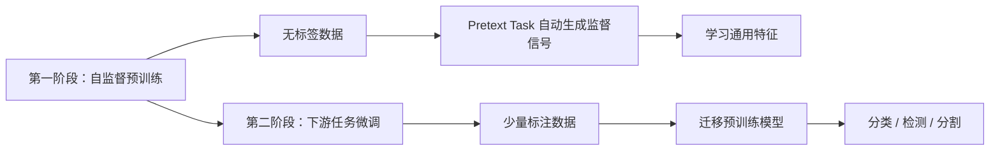
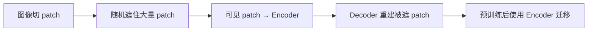
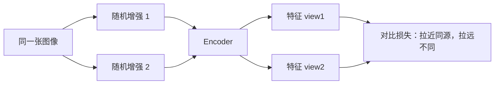
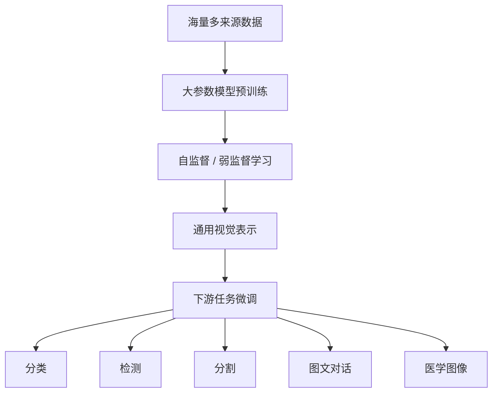
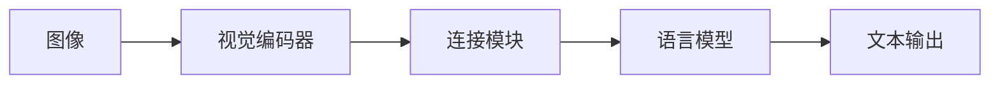

# Lecture 15 - 视觉基础模型

> [!info] 课程概要
> 本讲将课程主线从 [[Lecture 14 - CNN图像分割]] 中的 CNN 架构进一步推进到**当代视觉模型的新范式**。核心主线可概括为：**CNN 局部建模的局限 → Transformer 全局建模 → 自监督预训练减少标注依赖 → 视觉基础模型实现通用表示**。其中 CNN 基础来自 [[Lecture 11 - 深度学习_CNN]]，分类与识别的评价思维来自 [[Lecture 9 - 图像识别]]，分割与检测的应用场景则承接 [[Lecture 14 - CNN图像分割]] 和 [[Lecture 13 - CNN目标检测]]。

## 1. 知识回顾：为什么需要预训练与基础模型

### 1.1 传统 CNN 的局限

| 方面 | 说明 |
|---|---|
| 优点 | 擅长提取局部特征（边缘、纹理、局部形状） |
| 缺点 | 对长距离依赖关系表达能力较差 |
| 预训练问题 | ImageNet 预训练需要大量人工标注；预训练特征偏向图像分类，对分割、检测、医学图像等任务未必最优 |

### 1.2 本讲的两个方向

1. **Transformer**：增强全局建模能力，弥补 CNN 在长距离依赖上的不足
2. **自监督预训练**：减少对人工标注的依赖，利用海量无标注数据学习通用表示

---

## 2. Transformer 与 Vision Transformer

### 2.1 Vision Transformer（ViT）

> [!definition] Vision Transformer（ViT）
> 不再主要依赖卷积，而是把图像切成多个 patch，像处理文本 token 一样处理图像 patch，利用自注意力机制建模全局依赖关系。


ViT 的基本流程：
1. 将图像划分为小块，称为 **patch**
2. 对每个 patch 提取特征，称为 **patch embedding**
3. 将所有 patch embedding 输入 Transformer Encoder
4. 利用多头自注意力机制学习所有 patch 之间的全局依赖关系

> [!note] CNN vs ViT 的直观对比
> CNN 是局部卷积逐层扩大感受野；ViT 是一开始就让所有 patch 之间互相看见。

### 2.2 多头自注意力 MHSA

Self-Attention 中有三个核心量：

- $Q$（Query）：查询
- $K$（Key）：键
- $V$（Value）：值

注意力计算公式：

$$
\text{Attention}(Q,K,V) = \text{softmax}\left(\frac{QK^T}{\sqrt{d_k}}\right)V
$$

各部分的含义：

| 步骤 | 含义 |
|---|---|
| $QK^T$ | 计算不同 patch 之间的相关性 |
| softmax | 把相关性转换为权重 |
| 乘以 $V$ | 根据权重汇总其他 patch 的信息 |

> [!definition] 多头自注意力（MHSA）
> 把通道分成多组，每一组分别做 self-attention，让模型从多个角度学习 patch 之间的关系。例如有的 head 关注颜色，有的关注形状，有的关注空间结构。

### 2.3 Transformer 的优缺点

| 方面 | 说明 |
|---|---|
| 优点 | 能捕获**长距离依赖关系**；在大规模数据训练下性能强；全局建模能力比普通 CNN 更直接 |
| 缺点 | 计算量大，尤其图像大、patch 小时；模型参数量大（含大量 MLP 层）；patch embedding 会损失部分细节，对精细边界、分割任务可能不利 |

> [!summary]
> Transformer 用自注意力解决 CNN 全局建模弱的问题，但代价是计算量和参数量更大。

---

## 3. 自监督学习

### 3.1 自监督学习的定义

> [!definition] 自监督学习（Self-Supervised Learning）
> 通过设计一个"借口任务"（pretext task），在不需要人工标签的情况下自动生成监督信号来学习特征表示。学到的特征可以迁移到下游任务。

**两阶段流程**：



### 3.2 自监督学习与生成模型的区别

| 维度 | 生成模型 | 自监督学习 |
|---|---|---|
| 目标 | 学习数据分布 $P_{\text{data}}(x)$，生成真实图像 | 学习好的特征表示，便于迁移到下游任务 |
| 关注点 | "生成得像不像" | "特征好不好用" |
| 共同点 | 都可以利用无标注数据 | 都可以利用无标注数据 |

---

## 4. 典型自监督任务

### 4.1 三类自监督任务概览

| 类型 | 典型任务 | 学到什么 |
|---|---|---|
| 图像分类类任务 | 旋转角度预测、图像块顺序分类 | 图像结构、方向、上下文 |
| 图像重建类任务 | 图像复原、去噪、掩码重建 | 图像内容、局部与全局结构 |
| 对比学习 | 正负样本对比 | 样本之间的相似性度量 |

### 4.2 Rotation Prediction：旋转预测

> [!definition] 旋转预测
> 将图像旋转 $0^\circ$、$90^\circ$、$180^\circ$、$270^\circ$，让模型预测旋转角度。

为什么有效？因为模型要判断图像是否被旋转，必须理解图像内容和结构。例如：
- 鸟的头通常在上方
- 人是站立的
- 车轮通常在下方

旋转预测迫使模型学习物体结构和语义信息。

### 4.3 Jigsaw Puzzle：拼图任务

> [!definition] 拼图任务
> 将图像切成多个 patch，打乱顺序，让模型判断正确的排列方式。

PPT 中提到可以预设 64 种 patch 排列顺序，让模型判断当前输入属于哪一种排列。

作用：
- 学习图像局部块之间的相对位置
- 增强模型对上下文结构的理解
- 不仅看局部纹理，还要理解整体布局

### 4.4 AutoEncoder：自编码器

自编码器结构：

$$
x \rightarrow \text{Encoder} \rightarrow z \rightarrow \text{Decoder} \rightarrow \hat{x}
$$

其中：
- $x$：原始图像
- $z$：低维特征表示
- $\hat{x}$：重建图像

损失函数：
$$
L = \|\hat{x} - x\|^2
$$

> [!note] 核心思想
> 通过"压缩再重建"，从无标注数据中学习低维特征表达。

### 4.5 Denoising AutoEncoder：去噪自编码器

任务：给图像加噪声，让模型恢复干净图像。

| 方面 | 说明 |
|---|---|
| 优点 | 方法简单；可以学习图像表示；同时获得去噪能力 |
| 缺点 | 训练时输入是噪声图像，测试时未必有噪声，存在 train-eval gap；任务可能太简单，模型只靠低级纹理和平滑就能完成，不一定学到高级语义 |

### 4.6 Context Encoder：上下文编码器

任务：遮住图像中间一块，让模型根据周围区域补全缺失部分。

比普通去噪更难，因为模型需要理解物体是什么。

| 方面 | 说明 |
|---|---|
| 优点 | 需要保留细粒度信息；能促使模型理解上下文 |
| 缺点 | 训练时有 mask，下游任务通常没有 mask，存在 train-eval gap；重建任务可能过难且有歧义；模型可能花很多精力在颜色、边界等不一定有用的细节上 |

### 4.7 MAE：Masked AutoEncoder

> [!definition] MAE（Masked AutoEncoder）
> 随机遮住大量图像 patch，只把可见 patch 输入 Encoder，Decoder 根据可见 patch 重建被遮住的 patch。预训练后主要使用 Encoder 迁移到下游任务。



MAE 的特点：
- 适合预训练大型 Transformer
- 使用非对称 Encoder-Decoder 架构（Encoder 只处理可见 patch，Decoder 轻量）
- 使用较高 mask 比例（如 **75%**）
- 下游迁移性能可以超过有监督预训练

> [!tip] 为什么高 mask 比例有效？
> 如果只遮住少量 patch，模型靠邻近像素就能猜出来；遮住很多 patch 后，模型必须理解整体语义和结构。

类比：
- **BERT**：遮住文本 token，预测词
- **MAE**：遮住图像 patch，重建图像块

### 4.8 Relative Position Prediction：相对位置预测

主要用于医学图像。

> [!definition] 相对位置预测
> 让模型预测图像 patch 之间的相对位置，或从初始位置预测到目标 landmark 的偏移量。

应用背景：landmark localization、object detection、医学图像目标定位。

为什么适合医学图像？医学图像中解剖结构位置相对稳定（器官、骨骼、血管之间有固定空间关系），学习相对位置有助于下游定位任务。

### 4.9 Image Denoising 用于医学图像分割

PPT 中以去噪作为 pretext task 辅助 COVID-19 CT 病灶分割：

1. 用无标注 CT 图像做去噪自监督预训练
2. 将预训练模型迁移到病灶分割任务
3. 用有限标注 CT 数据微调

> [!note] 意义
> 医学图像标注成本高，自监督预训练可以利用大量无标注数据，提高少样本分割效果。

---

## 5. 对比学习

### 5.1 从分类到度量学习

对比学习不一定需要分类头或重建解码器，而是**直接训练特征编码器**。

目标：让模型学会判断样本之间的相似性。
- 相似样本距离近
- 不相似样本距离远

### 5.2 正样本、负样本、Query

| 概念 | 含义 |
|---|---|
| Query（$q$） | 查询样本 |
| Positive（$p$） | 正样本（与 query 同源） |
| Negative（$n$） | 负样本（与 query 不同） |

一般做法：
- 同一张图像经过两种数据增强，得到两个 view，它们互为正样本
- 其他图像作为负样本

目标形式化：

$$
(q, p) \text{ close}, \quad (q, n) \text{ far}
$$

### 5.3 InfoNCE Loss

> [!definition] InfoNCE Loss
> 对比学习中常见的损失函数，目标是让正样本相似度变大，负样本相似度变小。

$$
\mathcal{L} = -\log \frac{\exp(\text{sim}(q,p)/\tau)}{\exp(\text{sim}(q,p)/\tau) + \sum_n \exp(\text{sim}(q,n)/\tau)}
$$

其中：
- $\text{sim}(q,p)$：query 和正样本的相似度
- $\text{sim}(q,n)$：query 和负样本的相似度
- $\tau$：温度参数（控制分布的平滑程度）

> [!tip] 记忆要点
> 不用死记公式，重点记：**InfoNCE 让正样本相似度变大，让负样本相似度变小**。

### 5.4 SimCLR

SimCLR 是典型的对比学习框架。



常见增强方式：随机裁剪、颜色扰动、翻转、模糊。

---

## 6. 视觉基础模型

### 6.1 Foundation Model 的概念

> [!definition] 基础模型（Foundation Model）
> 在海量数据和巨大算力上预训练出来的通用模型，通常作为下游专门任务模型的起点。先做"通才"，再通过微调变成"专才"。



核心作用：
- 学到通用特征
- 减少下游标注需求
- 提升下游任务性能

### 6.2 RETFound：眼底图像基础模型

PPT 中以 RETFound 为例展示了医学领域的视觉基础模型。

特点：
- 在 **1600 万张**无标注眼底图像上用 MAE 自监督训练
- 再迁移到临床诊断任务

下游任务包括：
- 眼部疾病诊断
- 眼部疾病预后预测
- 糖尿病、帕金森病等全身性疾病的诊断

> [!note] 
> 医学图像领域标注昂贵，但无标注数据多，因此非常适合自监督基础模型。

### 6.3 数字病理基础模型

PPT 中介绍了 Digital Pathological Foundation Model。

特点：
- 使用大量全切片病理图像（WSI）
- 从 WSI 中提取大量 tile
- patch-level 预训练使用 **DINO-v2**
- slide-level 预训练使用 **MAE**
- 应用于癌症分型和 pathomics 任务

> [!tip] 理解要点
> 病理图像太大（数十亿像素），通常先切成 tile 学局部结构，再聚合到整张切片级别学习全局病理模式。这是"从局部到全局"的两级预训练策略。

---

## 7. 大多模态模型 LMM

### 7.1 LMM 的定义

> [!definition] 大多模态模型（Large Multimodal Model, LMM）
> 结合图像和文本的统一模型，能够完成文生图、图生文、图文对话等跨模态任务。

### 7.2 LMM 的典型结构



三部分的作用：

| 组件 | 角色 | 说明 |
|---|---|---|
| 视觉编码器 | "看" | 负责看图，提取视觉特征 |
| 连接模块 | "翻译" | 把视觉特征转换成语言模型能理解的表示 |
| 语言模型 | "说" | 负责理解问题并生成回答 |

---

## 8. 代表性视觉基础模型

### 8.1 CLIP

> [!definition] CLIP（Contrastive Language-Image Pre-Training）
> 图文对比预训练模型。通过在 **4 亿个**图像-文本对上训练，学习将匹配的图文拉近、不匹配的图文拉远。

核心能力：**强 zero-shot 能力**。

例如分类时，无需重新训练分类器，直接比较图像特征和文本提示的相似度：
- "a photo of a dog"
- "a photo of a cat"
- "a photo of a car"

哪个文本与图像最相似，就预测为哪个类别。

### 8.2 SAM

> [!definition] SAM（Segment Anything Model）
> 通用图像分割基础模型。训练数据超过 **1100 万张**图像，超过 **10 亿个** mask。

输入提示方式：
- 点提示（point）
- 框提示（bounding box）
- mask 提示

特点：
- 对未见过的类别也有很强的分割能力
- 不再局限于固定类别分割
- 更像一个通用交互式分割工具

### 8.3 SAM 3

SAM 3 更进一步支持**基于文本概念的分割**。

例如输入文本 "yellow school bus"，模型可以找到图像中的黄色校车并分割出来。

特点：
- 基于文本提示的分割
- 结合视觉分割与语言概念
- 使用大规模 concept 标签进行预训练

---

## 9. 本章核心对比

### 9.1 核心方法对比表

| 内容 | 核心思想 | 作用 | 典型代表 |
|---|---|---|---|
| CNN | 局部卷积提取特征 | 局部视觉建模强 | ResNet 等 |
| ViT | 图像切 patch，用 self-attention 建模全局关系 | 长距离依赖建模强 | Vision Transformer |
| 自监督学习 | 自动生成标签训练 pretext task | 减少人工标注依赖 | Rotation、Jigsaw、MAE |
| MAE | 遮住大量 patch，再重建 | 适合大规模 ViT 预训练 | Masked AutoEncoder |
| 对比学习 | 正样本近，负样本远 | 学习相似性特征空间 | SimCLR、InfoNCE |
| 基础模型 | 海量数据预训练，迁移到下游任务 | 通用视觉表示 | RETFound、CLIP、SAM |
| LMM | 图像 + 文本联合建模 | 图文理解、图文对话 | CLIP、视觉语言模型 |

### 9.2 CNN vs ViT

| 维度 | CNN | ViT |
|---|---|---|
| 特征提取方式 | 局部卷积，逐层扩大感受野 | 自注意力，初期即全局建模 |
| 局部建模 | 强 | 相对弱（patch embedding 损失细节） |
| 长距离依赖 | 弱 | 强 |
| 数据需求 | 中等 | 大（需要大规模预训练） |

### 9.3 自监督 vs 有监督预训练

| 维度 | 有监督预训练（如 ImageNet） | 自监督预训练（如 MAE） |
|---|---|---|
| 是否需要标注 | 需要大量人工标注 | 不需要 |
| 特征偏向 | 偏向分类任务 | 更通用，适合多种下游任务 |
| 数据利用 | 只能用标注数据 | 可利用海量无标注数据 |

---

## 10. 学习路线

```text
第一步：理解 CNN 的局限性
├── CNN 局部建模强，但长距离依赖弱
└── ImageNet 预训练需要大量标注
    ↓
第二步：学习 Transformer / ViT
├── 自注意力机制：Q、K、V 的含义
├── ViT 流程：切 patch → embedding → Transformer Encoder
└── 优缺点：全局建模强 vs 计算量大
    ↓
第三步：掌握自监督学习
├── 定义：pretext task 自动生成监督信号
├── 两阶段：预训练 → 下游微调
└── 常见任务：旋转预测、拼图、自编码器、MAE
    ↓
第四步：理解对比学习
├── 核心思想：正样本近、负样本远
├── InfoNCE Loss 的直观含义
└── SimCLR 的基本框架
    ↓
第五步：认识视觉基础模型
├── Foundation Model 的定义与作用
├── 代表模型：CLIP（图文对比）、SAM（通用分割）、RETFound（医学眼底）
└── 大多模态模型 LMM：视觉编码器 + 语言模型
```

---

## 11. 相关资源

| 工具 / 库 / 模型 | 用途 | 说明 |
|---|---|---|
| `timm`（PyTorch Image Models） | ViT 模型库 | 提供多种 ViT 预训练权重 |
| `transformers`（HuggingFace） | Transformer 模型 | 含 ViT、CLIP 等视觉模型 |
| `segment-anything`（Meta） | SAM 分割模型 | 通用图像分割基础模型 |
| `open-clip` | CLIP 开源实现 | 图文对比预训练 |
| `lightning` | 自监督学习框架 | SimCLR、MAE 等实现 |
| `monai` | 医学图像 AI 框架 | 含自监督预训练与迁移学习工具 |

---

> [!tip] 复习建议
> 如果只准备考试，优先记住：
> 1. **ViT 流程**：图像切 patch → patch embedding → Transformer Encoder；
> 2. **MHSA 公式**：$QK^T$ 算相关性，softmax 变权重，乘 $V$ 汇总信息；
> 3. **Transformer 优缺点**：全局建模强 vs 计算量大；
> 4. **自监督学习定义与两阶段流程**；
> 5. **MAE 关键点**：高 mask 比例、非对称 encoder-decoder、适合大 ViT；
> 6. **对比学习核心**：正近负远，InfoNCE；
> 7. **Foundation Model 定义**：海量数据预训练通用模型 → 下游微调；
> 8. **CLIP vs SAM**：CLIP 做图文对比（zero-shot 分类），SAM 做通用分割（点/框/mask 提示）。

---

> [!question] 思考题
> 1. CNN 和 ViT 在建模方式上的本质区别是什么？各自适合什么场景？
> 2. 自监督学习与有监督预训练相比，核心优势是什么？
> 3. MAE 为什么使用高 mask 比例（如 75%）才有效？
> 4. 对比学习中的 InfoNCE Loss 是如何实现"正样本近、负样本远"的？
> 5. CLIP 如何实现 zero-shot 分类？SAM 的分割能力为什么对未见类别也有效？
> 6. 为什么医学图像领域特别适合自监督基础模型？

---

> [!summary] 一句话总结
> 本讲讲的是机器视觉从"CNN + 有监督 ImageNet 预训练"走向"Transformer + 自监督预训练 + 视觉基础模型"的范式转变；核心目标是利用海量无标注或弱标注数据学习通用视觉表示，再迁移到分类、检测、分割、医学图像和图文理解等下游任务中。

---

*本笔记由 Claudian 整理 | [[Lecture 11 - 深度学习_CNN]] → [[Lecture 13 - CNN目标检测]] → [[Lecture 14 - CNN图像分割|Lecture 14 - CNN图像分割]] → [[Lecture 15 - 视觉基础模型|Lecture 15 - 视觉基础模型]]*
