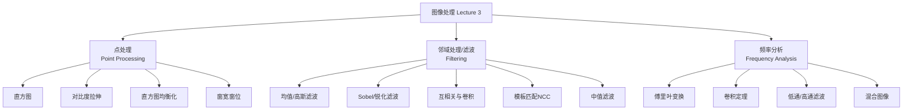
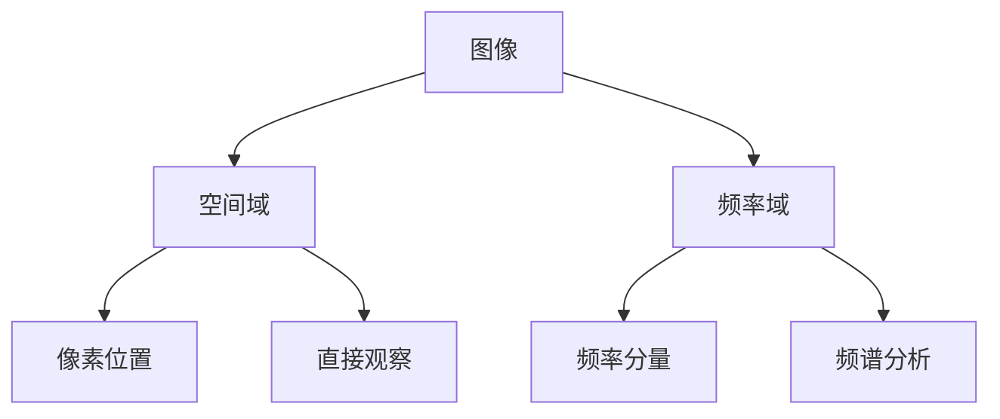

# Lecture 3 - 图像处理

> [!info] 课程概要
> 本讲涵盖图像处理的三大核心领域：**点处理**（灰度变换）、**邻域处理**（滤波）和**频率分析**（频域变换）

---

## 1. 本讲整体框架

本讲主要分为三部分：



---

## 2. 点处理（Point Processing）

### 2.1 基本思想

> [!definition] 点处理
> 点处理是对图像中每个像素**单独**进行灰度变换，不考虑邻域信息

形式上可写为：

$$
I' = t(I)
$$

其中：
- $I$：原图像像素值
- $I'$：变换后的像素值
- $t(\cdot)$：灰度变换函数

---

### 2.2 图像直方图（Histogram）

> [!definition] 直方图
> 图像直方图描述的是图像灰度值的分布情况

灰度值 $i$ 的概率：

$$
p_i=\frac{n_i}{n}
$$

其中：
- $n_i$：灰度值为 $i$ 的像素个数
- $n$：图像总像素数

#### 直方图的意义

| 分布特征 | 图像表现 |
|---------|---------|
| 偏左 | 图像偏暗 |
| 偏右 | 图像偏亮 |
| 分布集中 | 对比度低 |
| 分布分散 | 对比度高 |

> [!tip] 实践意义
> 直方图是判断图像亮度/对比度的"透视镜"

---

### 2.3 对比度拉伸（Contrast Stretching）

> [!definition] 对比度拉伸
> 将原本集中在较窄范围的灰度分布拉伸到更宽的范围

**作用：**
- 📈 提高图像对比度
- 🌫️ 改善"灰蒙蒙"的视觉效果

**核心理解：**
- 原图若"灰蒙蒙"，通常是有效灰度范围太窄
- 拉伸后亮的更亮，暗的更暗，视觉更清晰

---

### 2.4 直方图均衡化（Histogram Equalization）

> [!definition] 直方图均衡化
> 让灰度分布尽量更均匀，提高图像整体对比度

**核心思想：**
1. 📊 统计原图直方图
2. 📈 构造累积直方图
3. 🔄 通过累积概率定义灰度映射函数

常见形式：

$$
y_i=f(i)=(L-1)t(i)
$$

其中：
- $L$：灰度级数
- $t(i)$：累积直方图对应的变换

> [!example] 直观理解
> 如果很多像素都堆在中间灰度，图像会发灰；均衡化后灰度被拉开，细节更明显

---

### 2.5 窗宽窗位（Window-Level Adjustment）

> [!info] 应用场景
> 窗宽窗位调整常用于 **CT / MRI 医学图像显示**

#### 背景

原始医学图像灰度范围很大，如 $(-2000, 2000)$，而显示器只能显示有限灰度级（如 0~255）。

因此需要：
- 从大灰度范围中选一段感兴趣的区间
- 映射到显示器灰度范围中

#### 定义

| 术语 | 含义 |
|------|------|
| **窗位（Level）** | 显示灰度范围的中心 |
| **窗宽（Window）** | 显示灰度范围的宽度 |

若窗位为 $L$，窗宽为 $W$，则重点显示区间为：

$$
\left[L-\frac{W}{2},\;L+\frac{W}{2}\right]
$$

#### 显示规则

- ❌ 低于下界：显示为黑
- ❌ 高于上界：显示为白
- ✅ 在区间内：线性映射到 0~255

> [!tip] 记忆口诀
> - **窗位：看哪儿**
> - **窗宽：看多少**

#### 特点

| 调整方式 | 效果 |
|---------|------|
| 调整窗位 | 突出不同组织 |
| 调整窗宽 | 改变显示对比度 |
| 窗宽很小 | 显示更敏感 |
| 窗宽很大 | 显示范围更广但对比度更弱 |
| **窗宽为 0** | 退化成类似二值图像 |

---

## 3. 邻域处理 / 滤波（Filtering）

### 3.1 基本思想

> [!definition] 滤波
> 滤波会考虑像素周围邻域的信息，输出图像中一个像素的值来自输入图像一个局部窗口的加权运算


---

### 3.2 均值滤波（Mean Filter）

> [!definition] 均值滤波
> 均值滤波使用邻域像素的平均值替代中心像素

#### 作用

- 🧹 平滑图像
- 🔇 去除部分噪声
- 💭 让图像变得模糊

#### 缺点

- ⚠️ 会模糊边缘
- ⚠️ 会削弱细节

> [!tip] 核心理解
> 均值滤波就是"拿邻居平均一下"

---

### 3.3 线性滤波器（Linear Filter）

> [!definition] 线性滤波器
> 线性滤波器用一个核（kernel / mask / filter）与图像局部区域做线性加权求和

| 不同核   | 产生效果 |
| ----- | ---- |
| 不变核   | 保持原图 |
| 平移核   | 图像平移 |
| 边缘检测核 | 提取边缘 |
| 锐化核   | 增强细节 |
| 平滑核   | 去除噪声 |

---

### 3.4 互相关（Cross-correlation）

> [!definition] 互相关
> 输出某个像素 = 核与对应邻域做"对应相乘再求和"

课件第 27 页给出的基本形式为：

$$
h[m,n]=\sum_{k=-u}^{u}\sum_{l=-v}^{v}f[k,l]\cdot I[m+k,n+l]
$$

其中：
- $I$：输入图像
- $f$：滤波核
- $h$：输出图像
- $(m,n)$：输出图像当前位置
- $(k,l)$：核内部相对坐标

#### 计算步骤

```mermaid
graph TD
    A[将核放到输入图像<br/>位置 (m,n) 附近] --> B[核中每个位置与图像<br/>对应位置像素相乘]
    B --> C[把所有乘积相加]
    C --> D[得到 h[m,n]]
```

---

### 3.5 卷积（Convolution）

> [!warning] 关键区别
> **卷积在运算前，要将核上下左右翻转**

可写为：

$$
h[m,n]=\sum f[-k,-l]\cdot I[m+k,n+l]
$$

#### 互相关 vs 卷积

| 类型  | 核是否翻转 |
| --- | ----- |
| 互相关 | ❌ 不翻转 |
| 卷积  | ✅ 翻转  |

> [!tip] 特殊情况
> 若核中心对称，则卷积与互相关结果相同

---

### 3.6 Sobel 滤波器（边缘检测基础）

> [!example] 常见 Sobel 核

#### 检测竖直边缘（x 方向变化）

$$
\begin{bmatrix}
-1&0&1\\
-2&0&2\\
-1&0&1
\end{bmatrix}
$$

#### 检测水平边缘（y 方向变化）

$$
\begin{bmatrix}
-1&-2&-1\\
0&0&0\\
1&2&1
\end{bmatrix}
$$

**作用：**
- 对灰度变化剧烈的位置响应大
- 是边缘检测的重要基础

---

### 3.7 锐化滤波（Sharpening Filter）

> [!definition] 锐化滤波
> 锐化滤波强调图像中与邻域平均值不同的部分

#### 作用

- 🔺 突出边缘
- 🔍 增强细节
- ✨ 让图像看起来更"清楚"

#### 缺点

- ⚠️ 也可能放大噪声

> [!tip] 核心理解
> 平滑是在削弱局部差异，锐化是在增强局部差异

---

### 3.8 模板匹配与 NCC

> [!definition] 模板匹配
> 给定一张大图和一个小模板，在大图中寻找与模板最相似的位置

相关图的基本形式可表示为：

$$
h(m,n)=\sum_{u=-k}^{k}\sum_{v=-k}^{k}f[u,v]\cdot I[m+u,n+v]
$$

#### 匹配过程


#### NCC 的作用

> [!info] 归一化互相关
> 普通相关容易受到亮度变化影响，加入归一化得到 **归一化互相关 NCC**，以提高匹配鲁棒性

> [!tip] 直观理解
> 模板匹配 = 滑窗 + 每个位置打一个相似度分数

---

### 3.9 高斯滤波（Gaussian Filtering）

> [!definition] 高斯滤波
> 高斯滤波使用高斯函数作为核，对邻域像素做加权平均

**特点：**
- 🎯 中心权重大
- 📉 距中心越远权重越小

#### 作用

- 🧹 平滑图像
- 🔇 去除高频噪声
- ✨ 比均值滤波更自然

#### 三大性质

| 性质 | 说明 |
|------|------|
| **低通滤波器** | 去掉高频，保留低频，图像更平滑 |
| **高斯+高斯=高斯** | 连续多次高斯滤波等效于一次更宽的高斯滤波 |
| **高斯核可分离** | 二维高斯可拆成两个一维高斯，计算更快 |

#### 可分离性的意义

若图像为 $M\times N$，核大小为 $P\times Q$：

| 方法 | 计算复杂度 |
|------|-----------|
| 直接二维卷积 | $MNPQ$ |
| 可分离后 | $MN(P+Q)$ |

> [!tip] 工程价值
> 高斯滤波常用于高效平滑，是计算机视觉中的"瑞士军刀"

---

### 3.10 卷积的性质

| 性质 | 公式 | 意义 |
|------|------|------|
| **交换律** | $a*b=b*a$ | 滤波顺序可交换 |
| **结合律** | $a*(b*c)=(a*b)*c$ | 多个滤波器可先组合再作用 |

> [!tip] 实践意义
> 多个滤波器连续应用时，可先把滤波器组合，再作用到图像上

---

### 3.11 高斯差分（Difference of Gaussian, DoG）

> [!definition] DoG 核心关系
> $$\frac{d}{dx}(f*g)=f*\frac{dg}{dx}$$

**含义：** 先平滑再求导，等价于直接用"高斯导数核"去滤波

#### 作用

- 🧹 一边平滑去噪
- 📐 一边对灰度变化敏感
- 🔍 常用于边缘检测和特征检测

> [!tip] 核心理解
> DoG 是一种兼顾平滑和变化检测的方法

---

### 3.12 中值滤波（Median Filter）

> [!definition] 中值滤波
> 中值滤波不做加权平均，而是：取窗口内所有像素 → 排序 → 取中位数作为输出值

#### 特点

- 📊 属于排序滤波（rank filter）
- ❌ 不是线性滤波器

#### 作用

- 🧂 特别适合去除椒盐噪声
- 📐 比均值滤波更能保留边缘

#### 滤波对比

| 滤波类型     | 优点         | 缺点        |
| -------- | ---------- | --------- |
| **均值滤波** | 平滑强        | 模糊边缘      |
| **中值滤波** | 适合椒盐噪声，保边缘 | 对高斯噪声效果一般 |

---

## 4. 频率分析（Frequency Analysis）

### 4.1 频率的基本直觉

> [!info] 双重视角
> 图像不仅可以在空间域中看，也可以在频率域中看



#### 高频 vs 低频

| 频率 | 表示 | 对应内容 |
|------|------|---------|
| **高频** | 变化快的部分 | 边缘、细节、纹理 |
| **低频** | 变化慢的部分 | 平滑区域、大轮廓、整体明暗趋势 |

---

### 4.2 傅里叶级数（Fourier Series）

> [!definition] 傅里叶级数
> 任意一维函数都可以表示成不同频率正弦、余弦函数的加权和

形式如：

$$
\sum_{n=1}^{\infty} a_n\cos(nt)+b_n\sin(nt)
$$

> [!tip] 意义
> 复杂信号可以拆成很多简单频率分量之和

图像频率分析就是把这个思想扩展到二维图像。

---

### 4.3 幅值与相位（Amplitude and Phase）

另一种形式可写成：

$$
\sum_{n=1}^{N} a_n\sin(nx+\phi_n)
$$

其中：
- $a_n$：幅值
- $\phi_n$：相位

| 分量 | 作用 |
|------|------|
| **幅值** | 决定该频率分量有多强 |
| **相位** | 决定该分量在空间中的位置与对齐方式 |

> [!warning] 重要结论
> 图像中**相位对结构信息很重要**

---

### 4.4 图像的傅里叶表示

> [!info] 频谱图阅读规则
> - 中心附近：低频
> - 离中心远：高频
> - 实值图像的频谱通常关于中心对称

#### 直观结论

| 图像特征 | 频谱表现 |
|---------|---------|
| 越平滑 | 频谱越集中在中心 |
| 细节越多 | 频谱中高频成分越强 |

---

### 4.5 卷积定理（Convolution Theorem）

> [!definition] 卷积定理
> $$\mathcal{F}[g*h]=\mathcal{F}[g]\mathcal{F}[h]$$
>
> **空间域中的卷积 = 频域中的乘法**

#### 实践意义


> [!tip] 核心价值
> 在空间域做复杂卷积时，可转到频域做逐点相乘，再通过逆变换回到空间域

---

### 4.6 频域滤波

| 滤波方式 | 步骤 |
|---------|------|
| **空间域滤波** | 直接做卷积 |
| **频域滤波** | 1. 对图像做 FFT → 2. 对滤波器做 FFT → 3. 频域逐点乘法 → 4. 逆 FFT |

> [!tip] 优势
> 对于大核卷积，频域处理通常更高效

---

### 4.7 低通滤波与高通滤波

| 滤波类型 | 效果 |
|---------|------|
| **低通滤波** | 保留低频，去掉高频 → 图像更平滑、更模糊 |
| **高通滤波** | 保留高频，去掉低频 → 图像边缘与细节更突出 |

---

### 4.8 混合图像（Hybrid Image）

> [!example] 混合图像构成
> 混合图像 = 一张图的低频部分 + 另一张图的高频部分

#### 神奇现象

| 观察距离 | 更容易看见 |
|---------|-----------|
| 近看 | 高频细节 |
| 远看 | 低频轮廓 |

> [!info] 启示
> 说明人眼对不同观察距离，会更关注不同频率信息

---

## 5. 本讲核心公式整理

| 编号 | 公式名称 | 公式 |
|------|---------|------|
| 5.1 | 直方图概率 | $p_i=\frac{n_i}{n}$ |
| 5.2 | 点处理 | $I'=t(I)$ |
| 5.3 | 互相关 | $h[m,n]=\sum_{k,l} f[k,l]\cdot I[m+k,n+l]$ |
| 5.4 | 卷积 | $h[m,n]=\sum_{k,l} f[-k,-l]\cdot I[m+k,n+l]$ |
| 5.5 | 模板匹配 | $h(m,n)=\sum_{u=-k}^{k}\sum_{v=-k}^{k}f[u,v]\cdot I[m+u,n+v]$ |
| 5.6 | 卷积与求导 | $\frac{d}{dx}(f*g)=f*\frac{dg}{dx}$ |
| 5.7 | 卷积定理 | $\mathcal{F}[g*h]=\mathcal{F}[g]\mathcal{F}[h]$ |

---

## 6. 高频考点总结

### 6.1 概念类

- ❓ 什么是点处理，什么是邻域处理
- ❓ 直方图能反映什么
- ❓ 对比度拉伸与直方图均衡化的作用
- ❓ 窗宽窗位的定义与作用
- ❓ 卷积和互相关的区别
- ❓ 高斯滤波、中值滤波、均值滤波的区别
- ❓ 高频与低频各表示什么

### 6.2 理解类

- 🤔 为什么均值滤波会模糊边缘
- 🤔 为什么中值滤波适合椒盐噪声
- 🤔 为什么高斯核可分离
- 🤔 为什么卷积定理很重要
- 🤔 为什么高通滤波能突出边缘
- 🤔 为什么 hybrid image 会"近看远看不同"

### 6.3 对比类

| 对比项 | 区别 |
|-------|------|
| **点处理 vs 滤波** | 点处理：单像素变换；滤波：利用邻域信息 |
| **均值滤波 vs 高斯滤波** | 均值：所有邻域权重相同；高斯：距离中心越近权重越大 |
| **均值滤波 vs 中值滤波** | 均值：平滑但模糊边缘；中值：对椒盐噪声有效且保边缘 |
| **互相关 vs 卷积** | 互相关：核不翻转；卷积：核翻转 |

---

## 7. 一句话总复习

> [!summary] 核心要点
> **图像处理从三个层面处理图像：像素级（灰度变换）、邻域级（滤波）、频域级（频率分析）。**

---

## 8. 速记版

| 概念 | 速记 |
|------|------|
| 点处理 | 只改单个像素 |
| 直方图 | 看亮度和对比度 |
| 对比度拉伸 | 把灰度范围拉开 |
| 直方图均衡化 | 让灰度分布更均匀 |
| 窗位 | 看哪儿 |
| 窗宽 | 看多少 |
| 均值滤波 | 平滑、模糊 |
| 高斯滤波 | 平滑更自然，可分离 |
| 中值滤波 | 去椒盐噪声，保边缘 |
| 互相关 | 核不翻 |
| 卷积 | 核翻转 |
| NCC | 滑窗匹配模板 |
| 高频 | 边缘、细节 |
| 低频 | 轮廓、平滑区域 |
| 卷积定理 | 空间卷积 = 频域乘法 |

---

## 相关资源

### 工具库

| 库/框架 | 用途 |
|---------|------|
| **OpenCV** | 图像处理基础 |
| **NumPy** | 数组运算 |

### 后续课程

> [!info] 预告
> [[Lecture 2 - 图像基础]] | [[机器视觉]] 系列课程笔记

---

*本笔记由 Claudian 生成 | [[机器视觉]] 系列课程笔记*
