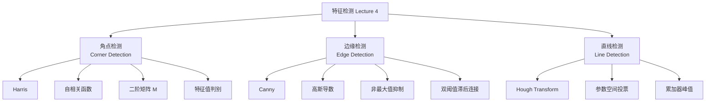
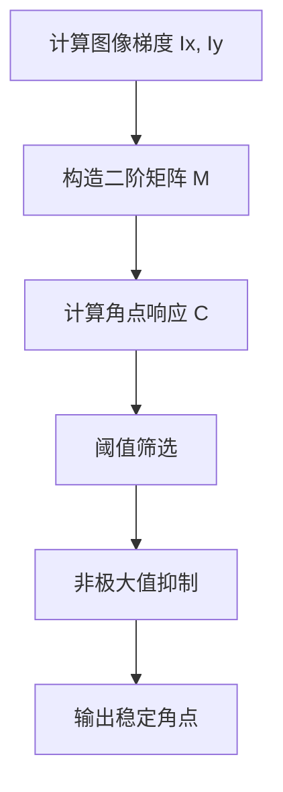

# Lecture 4 - 特征检测

> [!info] 课程概要
> 本讲围绕三类经典视觉特征展开：**角点（Corner）**、**边缘（Edge）**、**直线（Line）**。
> 主线可以概括为：**局部灰度变化 → 边界信息 → 几何结构**。

---

## 1. 本讲整体框架

本章主要分为三部分：



> [!tip] 本章目标
> 从图像中找出 **稳定、显著、适合后续处理** 的结构信息，为图像匹配、全景拼接、三维重建、图像配准、目标识别等任务服务。

这些特征可以用于：

- 图像匹配
- 全景拼接
- 三维重建
- 图像配准
- 目标识别

---

## 2. 角点检测（Corner Detection）

### 2.1 角点的直观理解

> [!definition] 角点
> 角点是指：**沿任意方向做一个很小的位移，局部窗口内容都会发生明显变化的点。**

与其他区域对比：

| 区域类型 | 位移后变化 | 直观理解 |
|---------|-----------|---------|
| **平坦区** | 各方向变化都很小 | 到处都差不多 |
| **边缘点** | 仅某一个方向变化明显 | 只在垂直边缘方向敏感 |
| **角点** | 两个主方向都变化明显 | 任意方向挪动都会变 |

---

### 2.2 自相关函数（Auto-correlation Function）

Harris 角点检测从下面的位移误差函数出发：

$$
E(u,v)=\sum_{x,y} w(x,y)\big(I(x+u,y+v)-I(x,y)\big)^2
$$

其中：

- $w(x,y)$：局部窗口函数（通常是高斯窗）
- $(u,v)$：窗口平移量
- $I(x,y)$：图像灰度值

> [!info] 物理含义
> 先截取一个局部窗口，再把窗口平移 $(u,v)$，比较平移前后的灰度差异。
> 差异越大，说明该位置越“有特征”。

#### 三类区域的判别思路

- **平坦区**：各方向 $E(u,v)$ 都小
- **边缘点**：某一方向小、另一方向大
- **角点**：各方向都大

> [!warning] 容易误解
> 课件里的 $E(u,v)$ 图不是“特征强度图”，而是**位移误差函数图**。
> 其中心 $(0,0)$ 一定最小，关键是看从中心往外增长的方式。

---

### 2.3 泰勒展开与二阶矩阵

为了高效计算，不直接枚举所有位移，而是在 $(0,0)$ 附近做局部近似。

先做一阶泰勒展开：

$$
I(x+u,y+v)-I(x,y) \approx I_x u + I_y v
$$

于是：

$$
E(u,v) \approx
\begin{bmatrix}
 u & v
\end{bmatrix}
M
\begin{bmatrix}
 u \\
 v
\end{bmatrix}
$$

其中，$M$ 是 **二阶矩矩阵**（second moment matrix / structure tensor）：

$$
M=\sum w(x,y)
\begin{bmatrix}
I_x^2 & I_xI_y \\
I_xI_y & I_y^2
\end{bmatrix}
$$

这里：

- $I_x$：图像对 $x$ 的偏导
- $I_y$：图像对 $y$ 的偏导

> [!tip] 核心理解
> 角点检测最后被转化为：**分析矩阵 $M$ 的性质**。
> 它本质上描述了局部窗口中灰度梯度在不同方向上的变化强弱。

---

### 2.4 为什么对 $u$ 求导会变成对 $x$ 求导？

因为图像函数中出现的是：

$$
I(x+u,y+v)
$$

其中：

- $u$ 是加在 $x$ 上的位移
- $v$ 是加在 $y$ 上的位移

根据链式法则：

$$
\frac{\partial}{\partial u}I(x+u,y+v)=I_x(x+u,y+v)
$$

$$
\frac{\partial}{\partial v}I(x+u,y+v)=I_y(x+u,y+v)
$$

> [!tip] 一句话记忆
> - $u$ 控制横向位移，所以对应 $x$ 导数
> - $v$ 控制纵向位移，所以对应 $y$ 导数

---

### 2.5 特征值解释

设矩阵 $M$ 的两个特征值为 $\lambda_1,\lambda_2$。

它们反映窗口沿两个主方向上的变化强弱。

| 区域 | 特征值关系 | 含义 |
|------|-----------|------|
| **平坦区** | $\lambda_1,\lambda_2$ 都小 | 各方向变化都不明显 |
| **边缘点** | 一个大，一个小 | 只有一个方向变化明显 |
| **角点** | 两个都大且接近 | 两个方向都变化明显 |

对应地：

$$
\text{平坦区：}\lambda_1,\lambda_2 \text{ 都小}
$$

$$
\text{边缘：}\lambda_1 \gg \lambda_2 \quad \text{或} \quad \lambda_2 \gg \lambda_1
$$

$$
\text{角点：}\lambda_1,\lambda_2 \text{ 都大，且接近}
$$

---

### 2.6 Harris 响应函数

为了避免每次都显式求特征值，Harris 构造角点响应函数：

$$
C=\lambda_1\lambda_2-\alpha(\lambda_1+\lambda_2)^2
$$

也可以写成：

$$
C=\det(M)-\alpha\big(\operatorname{trace}(M)\big)^2
$$

其中：

- $\det(M)=\lambda_1\lambda_2$
- $\operatorname{trace}(M)=\lambda_1+\lambda_2$
- $\alpha$ 一般取 $0.04 \sim 0.06$

> [!important] 判别规则
> - $C$ 大：角点
> - $C$ 小：平坦区
> - $C$ 很小或为负：边缘

---

### 2.7 Harris 角点检测流程



步骤写成文字就是：

1. 计算图像梯度 $I_x, I_y$
2. 构造每个窗口的二阶矩阵 $M$
3. 计算角点响应 $C$
4. 阈值筛选：保留 $C > \text{threshold}$ 的点
5. 非极大值抑制：保留局部最大响应点

最终得到一组 **稀疏、稳定、适合匹配** 的角点。

---

### 2.8 角点检测易错点

> [!warning] 易错点总结
> 1. 角点不是“看起来尖”的地方，而是**两个方向灰度都明显变化**的地方。
> 2. $E(u,v)$ 表示位移误差函数，不是直接的特征强度图。
> 3. 边缘点不适合精确匹配，因为沿边方向不稳定。

---

## 3. 边缘检测（Edge Detection）

### 3.1 边缘的定义

> [!definition] 边缘
> 边缘是图像中 **灰度快速变化的位置**。

它可能由以下因素引起：

- 深度突变
- 表面颜色突变
- 光照突变
- 表面法向突变

> [!tip] 核心理解
> 边缘反映的是“图像变化”，**不一定**就是物体真实轮廓。

---

### 3.2 边缘与导数

边缘对应灰度变化剧烈的位置，因此常使用 **一阶导数** 检测。

#### 直观理解

- 灰度曲线变化快
- 导数绝对值大
- 边缘通常对应导数极值点

#### 频率角度

> [!info] 频率视角
> 边缘本质上对应图像中的 **高频信息**。

---

### 3.3 噪声问题与高斯导数

直接求导对噪声很敏感，因为噪声本身也是高频信息。

所以通常的思路是：**先平滑，再求导**。

根据卷积求导定理：

$$
\frac{d}{dx}(f*g)=f*\frac{dg}{dx}
$$

因此可以直接使用 **高斯导数核** 对图像进行滤波与求导。

> [!tip] 结论
> 边缘检测中常见的“先高斯平滑、再求梯度”，本质上可以统一理解为：
> **用高斯的一阶导数作为滤波器。**

---

### 3.4 平滑与定位的权衡

高斯核参数 $\sigma$ 决定平滑强度。

| $\sigma$ 大小 | 作用 | 代价 |
|--------------|------|------|
| **小** | 保留细节、定位更精细 | 更容易受噪声影响 |
| **大** | 去噪更强、边缘更平滑 | 小细节可能被抹掉 |

> [!warning] 经典权衡
> 边缘检测中始终存在：**抗噪性** 与 **定位精度** 的权衡。

---

### 3.5 Canny 边缘检测

> [!definition] Canny
> Canny 是经典边缘检测方法，其目标是同时兼顾：
> **高信噪比、高定位精度、高边缘连续性。**

---

### 3.6 Canny 算法步骤


#### Step 1：高斯导数滤波

分别计算：

- $G_x$：$x$ 方向梯度
- $G_y$：$y$ 方向梯度

#### Step 2：计算梯度幅值和方向

梯度幅值：

$$
\sqrt{G_x^2+G_y^2}
$$

梯度方向通常由反正切计算得到。

#### Step 3：非最大值抑制（Non-maximum Suppression）

沿梯度方向检查局部最大值，只保留真正的峰值点。

> [!important] 作用
> **把粗边缘压细成单像素宽。**

#### Step 4：双阈值滞后连接（Hysteresis Thresholding）

设两个阈值：

- $t_{high}$
- $t_{low}$

分类规则：

- $> t_{high}$：强边缘
- $< t_{low}$：噪声
- 介于两者之间：弱边缘

弱边缘只有在与强边缘连通时才保留。

> [!tip] 作用
> 既保留连续边缘，又抑制孤立噪声。

---

### 3.7 Canny 的核心思想总结

> [!summary] 一句话总结
> Canny 不是“简单求个梯度”，而是一整套流程：
> **去噪 → 求梯度 → 细化 → 连边**

这也是它通常比简单 Sobel 算子效果更好的原因。

---

### 3.8 Canny 易错点

> [!warning] 易错点总结
> 1. 非最大值抑制的作用不是去噪，而是**让边缘变细**。
> 2. 双阈值不是简单筛点，而是利用边缘的**连通性**。
> 3. $\sigma$ 越大不一定越好，只是表示检测尺度更粗。

---

## 4. 直线检测（Line Detection）

### 4.1 为什么直线检测不容易？

实际图像中的直线检测往往面临：

- 边缘点很多且杂乱
- 线段可能断裂
- 存在噪声
- 场景中可能有多条线

因此不能简单地“随便挑几个点去拟合”。

---

### 4.2 霍夫变换的核心思想

> [!definition] Hough Transform
> 让图像中的边缘点在参数空间中“投票”，票数高的参数对应真实存在的直线。

也就是说：

- 在图像空间中直接找线比较难
- 转到参数空间中找峰值反而更容易

---

### 4.3 直线的参数表示

#### 普通形式

$$
y=mx+b
$$

问题：

- 垂直线无法表示
- 斜率可能趋于无穷大

#### 极坐标形式

$$
d=x\cos\theta+y\sin\theta
$$

其中：

- $d$：直线到原点的距离
- $\theta$：法线与 $x$ 轴的夹角

> [!tip] 为什么用极坐标形式？
> - 能统一表示所有直线
> - 更适合霍夫变换中的参数空间投票

---

### 4.4 图像空间与参数空间的对应关系

| 图像空间中的对象 | 参数空间中的对象 |
|------------------|------------------|
| 一条直线 | 一个点 |
| 一个图像点 | 一条曲线 |
| 多个共线点 | 多条曲线交于一点 |

更具体地说：

- 在 $(m,b)$ 表示中，一个图像点对应参数空间中的一条直线
- 在 $(d,\theta)$ 表示中，一个图像点对应参数空间中的一条正弦曲线
- 若多个点共线，则它们在参数空间中的曲线会交汇于同一点

这个交点对应的参数，就是该直线的参数。

---

### 4.5 霍夫变换算法步骤

```mermaid
graph TD
    A[提取边缘点] --> B[初始化累加器 H(d,θ)]
    B --> C[对每个边缘点枚举 θ]
    C --> D[计算 d = xcosθ + ysinθ]
    D --> E[对对应参数单元投票]
    E --> F[在累加器中寻找峰值]
    F --> G[峰值对应显著直线]
```

#### Step 1

初始化累加器：

$$
H[d,\theta]=0
$$

#### Step 2

对每个边缘点 $(x,y)$，枚举 $\theta$，计算：

$$
d=x\cos\theta+y\sin\theta
$$

然后对对应参数 bin 加 1。

#### Step 3

在累加器中寻找峰值。

#### Step 4

峰值对应图像中的显著直线。

---

### 4.6 霍夫变换的特点

#### 优点

- 对噪声有一定鲁棒性
- 能处理断裂边缘
- 能检测多条线

#### 缺点

- 参数空间离散后精度受 bin 大小影响
- 参数维度高时计算量大
- 对圆、椭圆等高维参数模型更耗时

---

### 4.7 广义霍夫变换

霍夫思想不仅能用于直线，还能检测：

- 圆
- 椭圆
- 抛物线

> [!tip] 本质不变
> 只要能写出参数方程，就可以让边缘点在参数空间投票，再通过峰值检测找目标结构。

---

## 5. 三大算法对比

| 方法 | 检测对象 | 核心思想 | 本质工具 |
|------|----------|----------|----------|
| **Harris** | 角点 | 分析局部窗口在各方向的灰度变化 | 梯度、二阶矩阵、特征值 |
| **Canny** | 边缘 | 去噪后计算梯度，再细化并连边 | 高斯导数、梯度幅值、连通性 |
| **Hough** | 直线 | 点在参数空间投票，峰值对应目标直线 | 参数化表示、累加器、峰值检测 |

---

## 6. 整章主线总结

> [!summary] 本章逻辑
> 这一章体现的是从低层到高层逐步提取图像结构的思路：
>
> 1. **角点**：提取适合匹配的稳定点特征
> 2. **边缘**：提取灰度突变和物体边界信息
> 3. **直线**：从边缘中进一步抽取高层几何结构

因此整章可概括为：

$$
\text{局部变化} \;\longrightarrow\; \text{边界} \;\longrightarrow\; \text{几何结构}
$$

---

## 7. 考试复习版速记

### 7.1 Harris 角点

> [!important] 核心公式
> $$
> E(u,v)=\sum w(x,y)\big(I(x+u,y+v)-I(x,y)\big)^2
> $$
>
> $$
> E(u,v) \approx
> \begin{bmatrix}
>  u & v
> \end{bmatrix}
> M
> \begin{bmatrix}
>  u \\
>  v
> \end{bmatrix}
> $$
>
> $$
> M=\sum w(x,y)
> \begin{bmatrix}
> I_x^2 & I_xI_y \\
> I_xI_y & I_y^2
> \end{bmatrix}
> $$
>
> $$
> C=\det(M)-\alpha\big(\operatorname{trace}(M)\big)^2
> $$

判别：

- 两个特征值都小：平坦区
- 一大一小：边缘
- 都大：角点

---

### 7.2 Canny 边缘检测

> [!important] 四步法
> 1. 高斯导数滤波
> 2. 梯度幅值和方向
> 3. 非最大值抑制
> 4. 双阈值滞后连接

---

### 7.3 Hough 直线检测

> [!important] 极坐标方程
> $$
> d=x\cos\theta+y\sin\theta
> $$

步骤：

1. 边缘点提取
2. 参数空间投票
3. 累加器找峰值
4. 峰值对应直线

---

## 8. 一句话总复习

> [!quote] 总结
> **Lecture 4 讲的是如何从图像中提取有用特征：用 Harris 找角点，用 Canny 找边缘，用 Hough 从边缘中找直线。**

---

*本笔记由 Claudian 整理 | [[机器视觉]] 系列课程笔记 | 承接 [[Lecture 3 - 图像处理]]*