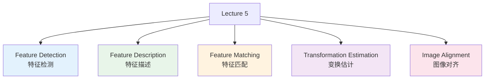

# Lecture 5 - 特征描述与图像对齐

> [!info] 课程概要
> 本讲围绕“**特征描述 → 特征匹配 → 几何变换估计 → 图像对齐**”展开，是 [[Lecture 4 - 特征提取]] 的自然延续。
> 上一讲重点回答“**哪里有关键点**”，这一讲重点回答：
> - **怎么描述关键点**
> - **怎么在两张图中找到对应点**
> - **怎么根据对应点把两张图对齐**

---

## 1. 本讲整体框架

> [!tip] 主线一句话
> 本讲的经典视觉流程是：**特征检测 → 特征描述 → 特征匹配 → 几何变换估计 → 图像对齐**。

---

## 2. 局部特征的三个基本步骤

| 步骤 | 核心问题 | 作用 | 输出 |
|------|----------|------|------|
| **Detection** | 图像中哪里最稳定、最有辨识度？ | 找到关键点 | 角点、尺度空间极值点等 |
| **Description** | 如何把局部区域变成可比较的数值表示？ | 为关键点构造向量描述 | 特征描述子 |
| **Matching** | 两张图中哪些点彼此对应？ | 比较描述子相似性 | 候选匹配点对 |

### 2.1 Detection（特征检测）

从图像中找出有辨识度的关键点，例如：

- 角点
- 尺度空间极值点

### 2.2 Description（特征描述）

在每个关键点附近提取一个向量，作为该点的局部表示。

作用：

- 把局部图像块变成数值向量
- 方便后续比较“两个点是否相似”

### 2.3 Matching（特征匹配）

比较两个特征向量之间的相似性，找出对应点。

常见判断方式：

- 欧氏距离小
- 余弦相似度高

---

## 3. 图像表示：直方图思想

### 3.1 直方图表示

图像可用某类特征的分布来表示，例如：

- 颜色直方图
- 纹理直方图
- 深度直方图

### 3.2 全局直方图与局部直方图

| 类型 | 统计范围 | 特点 | 适用场景 |
|------|----------|------|----------|
| **全局直方图** | 整幅图像 | 反映整体分布，但空间信息弱 | 粗略检索、整体统计 |
| **局部直方图** | 关键点附近区域 | 更关注局部结构 | 局部特征描述 |

局部直方图更适合做关键点附近的特征表示。

### 3.3 普通直方图的缺点

普通直方图存在两个主要问题：

- 对光照敏感
- 对方向敏感

因此后面引入更鲁棒的方式：

**基于局部梯度直方图的描述方法**。

---

## 4. SIFT：尺度不变特征变换

SIFT（Scale-Invariant Feature Transform）是本讲最核心的局部描述方法，特点是：

- **尺度不变**
- **旋转不变**
- **对光照变化不敏感**

### 4.1 SIFT 的基本思想

SIFT 不直接记录原始灰度值，而是记录：

- 关键点附近图像的梯度方向
- 梯度变化强度

也就是说：

**用局部梯度分布来描述关键点。**

### 4.2 SIFT 的主要步骤

#### （1）尺度空间极值检测

在多个尺度上对图像进行处理，寻找位置—尺度空间中的局部极值点。

常用方法：

- **Difference of Gaussian（DoG）**

输出关键点形式为：

$$
(x, y, s)
$$

其中：

- $(x, y)$：位置
- $s$：尺度

> [!note] 意义
> 同一个物体在不同距离下大小不同，多尺度检测可以让关键点在缩放情况下仍然稳定。

#### （2）主方向估计

在关键点附近计算梯度方向直方图，选取峰值最大的方向作为：

**主导方向 $\theta$**

然后把局部区域旋转到统一方向。

作用：

- 实现 **旋转不变性**

#### （3）描述子构造

以关键点为中心，取一个 **16×16** 的局部窗口，并将窗口划分成 **4×4 个子区域**。

对每个子区域：

- 统计 **8 个方向** 的梯度直方图

因此总维度为：

$$
4 \times 4 \times 8 = 128
$$

所以 SIFT 描述子是：

**128 维特征向量**。

### 4.3 梯度直方图的构造细节

对每个像素计算：

- 梯度幅值（magnitude）
- 梯度方向（orientation）

然后把该像素的梯度幅值累加到对应方向的 bin 中。

注意：

- 不是简单计数
- 而是按梯度强度进行加权累加

### 4.4 高斯加权

SIFT 对 16×16 窗口中的像素还会做 **高斯加权**：

- 靠近中心的像素权重大
- 远离中心的像素权重小

作用：

- 提高位置鲁棒性
- 降低外围区域干扰

### 4.5 SIFT 的鲁棒性来源

| 鲁棒性来源 | 对应机制 |
|------------|----------|
| **尺度不变** | 多尺度极值检测 |
| **旋转不变** | 主方向估计 + 方向对齐 |
| **对光照变化不敏感** | 在梯度空间工作 + 描述向量归一化 |

更具体地说：

1. 在梯度空间工作，对整体亮度加常数不太敏感
2. 最后对描述向量做归一化，对亮度整体缩放较鲁棒

> [!abstract] SIFT 一句话总结
> **SIFT = 在关键点邻域内，对梯度方向分布进行编码，得到一个具有尺度、旋转和一定光照鲁棒性的 128 维描述子。**

---

## 5. GLOH 描述子

GLOH（Gradient Location-Orientation Histogram）是另一种局部描述子。

### 5.1 与 SIFT 的关系

可以把 GLOH 理解为：

**SIFT 的一种改进型变体**。

它仍然是：

- 统计局部梯度
- 构造位置—方向直方图

### 5.2 与 SIFT 的主要区别

SIFT 使用的是**方形网格划分**，而 GLOH 使用的是：

- **log-polar（对数极坐标）划分**

也就是按：

- 半径
- 角度

来划分空间区域。

### 5.3 GLOH 维度

课件中给出的 GLOH 直方图维度为：

$$
17 \times 16 = 272
$$

即：

**272 维特征向量**。

### 5.4 GLOH 小结

| 描述子 | 空间划分方式 | 维度 | 特点 |
|--------|--------------|------|------|
| **SIFT** | 方形网格 | 128 | 经典、稳定 |
| **GLOH** | log-polar | 272 | 位置划分更细，维度更高 |

---

## 6. 特征匹配

有了描述子之后，就要在两幅图中找出最相似的特征点。

### 6.1 匹配的本质

给定两张图：

- 图 1 中每个关键点有一个描述向量
- 图 2 中每个关键点也有一个描述向量

目标是：

**寻找描述子最相似的点对，作为候选对应点。**

### 6.2 常用相似性度量

| 方法 | 含义 | 判别准则 |
|------|------|----------|
| **Euclidean distance（欧氏距离）** | 比较向量之间的几何距离 | 距离越小越相似 |
| **Cosine similarity（余弦相似度）** | 比较两个向量方向是否接近 | 相似度越高越相似 |

### 6.3 匹配中的问题

即使描述子最近，也不一定是真实匹配。常见原因包括：

- 重复纹理
- 噪声
- 遮挡
- 视角变化

因此初始匹配结果中通常会存在：

**错配点（outliers）**。

> [!warning] 关键点
> “最近邻”不等于“真实对应点”。特征匹配之后通常还需要几何一致性验证。

---

## 7. 模板匹配与图像对齐

### 7.1 模板匹配回顾

模板匹配通常用归一化互相关（NCC）等方法。

它一般要求：

- 目标和模板大小接近
- 方向接近
- 颜色值接近

### 7.2 模板匹配的局限

如果两张图之间存在：

- 旋转
- 缩放
- 视角变化

那么单纯模板匹配往往不够。

这时需要：

**估计两张图之间的几何变换关系**。

---

## 8. 图像对齐的应用

### 8.1 医学图像配准（Medical Image Registration）

例如：

- MRI
- CT

其中：

- CT 对骨骼显示效果好
- MRI 对软组织显示效果好

如果两者能对齐，就可以融合信息。

### 8.2 全景图拼接（Panorama）

将多张相邻图像对齐并融合，可以得到更宽视角的图像。

---

## 9. 参数化全局变换（Parametric Global Warping）

图像对齐的本质是：

**寻找一个几何变换，把一张图的点映射到另一张图中的对应位置。**

### 9.1 常见二维变换类型

| 变换类型 | 中文 | 说明 |
|----------|------|------|
| Translation | 平移 | 位置整体移动 |
| Rotation | 旋转 | 围绕原点或某中心旋转 |
| Aspect | 拉伸/非等比缩放 | 不同方向缩放比例不同 |
| Affine | 仿射 | 线性变换 + 平移 |
| Perspective | 投影 | 能描述透视变化 |
| Cylindrical | 柱面 | 常见于全景拼接建模 |

---

## 10. 基本二维变换矩阵

在齐次坐标下，二维点可写为：

$$
\begin{bmatrix}
x \\
y \\
1
\end{bmatrix}
$$

这样各种几何变换都能统一写成 **3×3 矩阵乘法**。

### 10.1 平移（Translation）

$$
\begin{bmatrix}
x' \\
y' \\
1
\end{bmatrix}
=
\begin{bmatrix}
1 & 0 & t_x \\
0 & 1 & t_y \\
0 & 0 & 1
\end{bmatrix}
\begin{bmatrix}
x \\
y \\
1
\end{bmatrix}
$$

结果为：

$$
x' = x + t_x, \qquad y' = y + t_y
$$

### 10.2 缩放（Scale）

$$
\begin{bmatrix}
x' \\
y' \\
1
\end{bmatrix}
=
\begin{bmatrix}
s_x & 0 & 0 \\
0 & s_y & 0 \\
0 & 0 & 1
\end{bmatrix}
\begin{bmatrix}
x \\
y \\
1
\end{bmatrix}
$$

结果为：

$$
x' = s_x x, \qquad y' = s_y y
$$

### 10.3 旋转（Rotation）

$$
\begin{bmatrix}
x' \\
y' \\
1
\end{bmatrix}
=
\begin{bmatrix}
\cos\theta & -\sin\theta & 0 \\
\sin\theta & \cos\theta & 0 \\
0 & 0 & 1
\end{bmatrix}
\begin{bmatrix}
x \\
y \\
1
\end{bmatrix}
$$

### 10.4 错切（Shear）

错切会把矩形变成平行四边形，是一种“斜着拉”的变换。

---

## 11. 仿射变换（Affine Transformation）

仿射变换是图像对齐中非常常用的模型。

### 11.1 定义

仿射变换 = **线性变换 + 平移**。

一般形式为：

$$
\begin{bmatrix}
x' \\
y' \\
1
\end{bmatrix}
=
\begin{bmatrix}
a & b & e \\
c & d & f \\
0 & 0 & 1
\end{bmatrix}
\begin{bmatrix}
x \\
y \\
1
\end{bmatrix}
$$

展开为：

$$
x' = ax + by + e
$$

$$
y' = cx + dy + f
$$

### 11.2 参数个数

仿射变换共有 **6 个参数**：

- $(a,b,c,d)$：线性部分
- $(e,f)$：平移部分

### 11.3 仿射变换的性质

**平行线经过仿射变换后仍然保持平行。**

这是仿射变换最重要的几何性质之一。

### 11.4 仿射变换可表示的变化

- 平移
- 旋转
- 缩放
- 错切

因此它比简单的平移/旋转更灵活。

---

## 12. 投影变换（Projective Transformation）

投影变换比仿射变换更一般。

### 12.1 一般形式

投影变换可以表示为一个一般的 $3 \times 3$ 齐次矩阵。

### 12.2 特点

**平行线经过投影变换后不一定保持平行。**

这使它能够描述真实相机成像中的透视现象。

### 12.3 与仿射变换的区别

| 变换类型 | 平行线是否保持平行 | 适用情况 |
|----------|-------------------|----------|
| **仿射变换** | 保持平行 | 中等程度几何变化 |
| **投影变换** | 不一定保持平行 | 更强的透视变化 |

---

## 13. 图像对齐的两种思路

### 13.1 Direct Alignment（基于像素的对齐）

直接在像素层面寻找最一致的变换。

缺点：

- 费时
- 对颜色变化敏感

### 13.2 Feature-based Alignment（基于特征的对齐）

先提取和匹配特征，再估计变换。

优点：

- 更高效
- 对颜色变化更鲁棒

### 13.3 本讲重点

本讲主要讨论的是：

**基于特征的图像对齐**。

---

## 14. 仿射参数拟合

假设已经知道两幅图之间的对应点：

$$
(x_i, y_i) \leftrightarrow (x_i', y_i')
$$

如何求仿射变换参数？

### 14.1 仿射模型写法

$$
\begin{bmatrix}
x_i' \\
y_i'
\end{bmatrix}
=
\begin{bmatrix}
m_1 & m_2 \\
m_3 & m_4
\end{bmatrix}
\begin{bmatrix}
x_i \\
y_i
\end{bmatrix}
+
\begin{bmatrix}
t_1 \\
t_2
\end{bmatrix}
$$

展开后：

$$
x_i' = m_1 x_i + m_2 y_i + t_1
$$

$$
y_i' = m_3 x_i + m_4 y_i + t_2
$$

### 14.2 未知参数

共有 6 个：

- $(m_1, m_2, m_3, m_4, t_1, t_2)$

### 14.3 最少需要多少对点

每对对应点提供 2 个方程：

- 一个关于 $x_i'$
- 一个关于 $y_i'$

因此理论上最少需要：

**3 对点**

才能确定仿射变换。

---

## 15. 写成矩阵方程

将多个点对堆叠起来，可以写成线性系统：

$$
A\theta = b
$$

其中：

- $A$：由原始点坐标构成
- $\theta$：待求仿射参数
- $b$：目标点坐标构成

> [!tip] 本质理解
> 这一步把“几何变换求解问题”转化成了“线性代数中的参数估计问题”。

---

## 16. 最小二乘法（Least Squares）

由于实际中通常有很多对应点，而且带有噪声，方程组一般是超定的，因此可以用：

**最小二乘法**

来求总体误差最小的参数。

### 16.1 最小二乘的目标

找到一组参数，使得所有点的映射误差平方和最小。

### 16.2 误差含义

对于每个点对：

- 用当前变换把原图点映射过去
- 与真实目标点比较
- 两者差值就是该点误差

### 16.3 最小二乘的优点

当大多数点都正确时，能得到稳定合理的参数估计。

### 16.4 最小二乘的问题

**对离群点非常敏感。**

---

## 17. 离群点（Outliers）

### 17.1 什么是离群点

离群点是指：

**不符合整体变换模型的点。**

在图像匹配中，最典型的就是：

- 错误匹配点

### 17.2 为什么离群点有害

最小二乘最小化的是误差平方和，大误差会被平方放大，因此少量错点也可能严重破坏拟合结果。

---

## 18. RANSAC：随机抽样一致性

RANSAC 是这一讲的另一个核心内容，全称：

**RANdom Sample Consensus**

### 18.1 RANSAC 的目标

在存在大量 outliers 的情况下，仍然估计出可靠的模型参数。

### 18.2 基本思想

不直接相信所有点，而是寻找那些真正支持同一个模型的点：

- **inliers**：符合模型的点
- **outliers**：不符合模型的点

### 18.3 RANSAC 的核心直觉

- 如果一个模型是由错误点算出来的，它通常得不到很多其他点支持
- 如果一个模型接近真实变换，就会得到较多点支持

---

## 19. RANSAC 标准流程

### Step 1：随机选一小组点

选一个最小样本集来估计当前模型。例如：

- 直线：2 个点
- 仿射变换：3 对点

### Step 2：由这组点拟合模型

用抽到的样本求一个候选变换。

### Step 3：寻找内点（inliers）

检验所有数据点：

- 若与当前模型误差小于阈值 → inlier
- 否则 → outlier

### Step 4：若内点足够多，则重新拟合

用所有 inliers 再做一次最小二乘拟合，得到更稳定的参数。

### 最终选择

保留：

**拥有最多 inliers 的模型**。

> [!example] RANSAC 四字诀
> **抽样 → 拟合 → 验证 → 重估**

---

## 20. RANSAC 的几个关键理解点

### 20.1 RANSAC 不是取代最小二乘

它不是完全替代最小二乘，而是：

- 先用 RANSAC 找到靠谱的内点
- 再用最小二乘做最终精确拟合

### 20.2 为什么必须重复很多次

因为一次随机抽样不一定抽到正确内点集。

多次重复后，抽到全是 inlier 的概率会增大。

---

## 21. RANSAC 的课件例子

### 21.1 直线拟合

流程如下：

1. 随机抽两个点
2. 连成一条线
3. 统计离直线足够近的点数
4. 重复多次
5. 选出 inliers 最多的那条线

### 21.2 圆 / 椭圆拟合

课件说明：

- RANSAC 也可用于圆和椭圆参数估计
- 在噪声较多时，比单纯霍夫变换更适合做稳健估计

### 21.3 特征匹配中的 RANSAC

课件把 RANSAC 用到“putative matches（候选匹配）”中：

- 先有一批候选匹配点对
- 每次随机选一个假设模型
- 看有多少匹配点支持该模型
- 最终筛出内点并重新估计变换

---

## 22. 基于特征的图像对齐完整流程

进一步展开可写成：

1. 输入两幅待对齐图像
2. 检测关键点并构造描述子
3. 根据描述子相似性建立候选对应点
4. 假设一个变换 $T$，并验证多少匹配与 $T$ 一致
5. 利用 RANSAC 选出最可靠模型
6. 用最终估计的变换对图像进行 warping 和融合

---

## 23. 整章知识框架总结

### 23.1 特征描述

核心代表：**SIFT**

- DoG 检测尺度空间极值
- 估计主方向
- 构造 128 维梯度直方图描述子
- 对尺度、旋转、一定光照变化鲁棒

### 23.2 特征匹配

通过描述子相似性建立候选对应点：

- 欧氏距离
- 余弦相似度

### 23.3 图像对齐

把一张图通过几何变换映射到另一张图：

- 平移
- 旋转
- 缩放
- 错切
- 仿射
- 投影

### 23.4 参数拟合

已知匹配点时：

- 写出仿射方程
- 形成线性系统
- 用最小二乘求解参数

### 23.5 RANSAC

面对错误匹配时：

- 随机抽样
- 估计模型
- 找 inliers
- 用 inliers 重拟合
- 得到鲁棒结果

---

## 24. 考试 / 复习最该背住的结论

### 24.1 SIFT 为什么鲁棒

- 多尺度检测 → 尺度不变
- 主方向对齐 → 旋转不变
- 梯度描述 + 归一化 → 对光照变化较稳

### 24.2 SIFT 为什么是 128 维

$$
4 \times 4 \times 8 = 128
$$

### 24.3 GLOH 与 SIFT 的区别

- SIFT：方形网格
- GLOH：log-polar 划分
- GLOH 维度更高（272 维）

### 24.4 仿射与投影最关键区别

- 仿射：平行线保持平行
- 投影：平行线不一定保持平行

### 24.5 仿射变换最少需要几对点

仿射变换有 6 个参数，每对点给出 2 个方程，
所以理论上最少需要 **3 对点**。

### 24.6 最小二乘为什么会失败

因为它对离群点敏感。

### 24.7 RANSAC 的标准四步

1. 随机抽样
2. 拟合模型
3. 找 inliers
4. 用 inliers 重新拟合

> [!question] 复习时最重要的主线
> **描述子负责“表示”，匹配负责“找对应”，变换模型负责“做映射”，RANSAC 负责“抗错配”。**

---

## 25. 一句话总复习

**Lecture 5 讲的是：如何用局部特征描述子在两幅图中找到对应点，并通过鲁棒几何参数估计，把两幅图对齐到同一坐标系中。**

---

*本笔记由 Claudian 整理 | [[Lecture 4 - 特征提取]] 系列课程笔记*