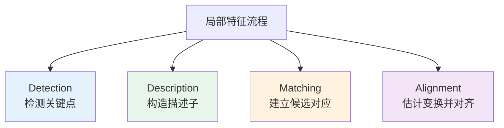
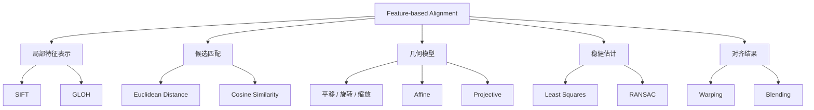

# Lecture 5 - 特征描述与图像对齐

## 什么是特征描述与图像对齐？

> [!definition] 定义
> 特征描述（Feature Description）是把关键点邻域编码成可比较的向量表示；图像对齐（Image Alignment）是利用这些对应点估计几何变换，使多张图像落到同一坐标系中。

本讲是 [[Lecture 4 - 特征提取]] 的自然延续：上一讲重点回答“哪里有稳定特征”，这一讲重点回答：

- 怎么把关键点表示成可比较的描述子
- 怎么在两张图中建立可靠对应关系
- 怎么根据对应关系估计变换并完成对齐

它同时也为 [[Lecture 6 - 多视图几何]] 中的极线约束、位姿恢复和三角测量打基础。

---

## 相关概念区分

### Detection vs Description vs Matching vs Alignment



| 阶段 | 核心问题 | 作用 | 典型输出 |
|------|----------|------|----------|
| **Detection** | 图像中哪里最稳定？ | 找到关键点 | 角点、尺度空间极值点 |
| **Description** | 怎样表示关键点邻域？ | 把局部结构变成向量 | SIFT、GLOH 等描述子 |
| **Matching** | 两张图里哪些点彼此对应？ | 比较描述子相似性 | 候选匹配点对 |
| **Alignment** | 如何把一张图映射到另一张图？ | 估计几何变换并完成对齐 | 仿射矩阵、单应矩阵、对齐图像 |

> [!tip] 关系
> 这一讲的主线可以记成一句话：**描述子负责“表示”，匹配负责“找对应”，几何模型负责“做映射”，RANSAC 负责“抗错配”。**

---

## 方法主线

### 从模板匹配到鲁棒对齐


| 阶段 | 核心思想 | 解决的问题 |
|------|----------|------------|
| **模板匹配** | 直接比较像素块相似性 | 适合位置和外观变化较小的情况 |
| **局部描述子** | 用局部梯度或直方图表示关键点 | 提升对旋转、缩放、亮度变化的鲁棒性 |
| **几何模型** | 用矩阵统一描述点到点映射 | 把匹配问题转成变换估计问题 |
| **RANSAC** | 在错配中寻找一致模型 | 让估计结果对 outliers 更稳健 |
| **图像融合** | Warping 后再做拼接或融合 | 得到最终可用的对齐结果 |

> [!note] 关键过渡
> 模板匹配更像“直接比像素”，而本讲的方法是“先找稳定特征，再用几何一致性筛选”，因此更适合真实场景中的视角变化和错配噪声。

---

## 应用领域

### 典型场景

> [!example] 典型场景
> - **医学图像配准**：对齐 CT 与 MRI，融合骨骼与软组织信息
> - **全景图拼接**：把多张相邻照片映射到统一视角并融合
> - **遥感图像配准**：对齐不同时间、不同传感器拍摄的地表图像
> - **视觉定位与跟踪**：根据稳定匹配点估计相机或目标运动

### 这些场景为什么需要特征对齐？

- 真实图像之间常常存在平移、旋转、缩放甚至透视变化
- 单纯比较像素值，对光照变化和遮挡比较敏感
- 稳定的局部特征 + 几何验证，才能在复杂场景下建立可靠对应关系

---

## 核心技术模块



| 模块 | 核心结论 | 记忆点 |
|------|----------|--------|
| **局部直方图** | 比全局直方图更能保留关键点附近的空间结构 | 更适合做局部特征表示 |
| **SIFT** | 在 16×16 邻域中统计 4×4 子区的 8 方向梯度直方图 | `4 × 4 × 8 = 128` |
| **GLOH** | 用 log-polar 划分替代方形网格 | 272 维，是 SIFT 的改进型变体 |
| **仿射变换** | 共有 6 个参数，至少需要 3 对点 | 平行线保持平行 |
| **投影变换** | 比仿射更一般，能描述透视变化 | 平行线不一定保持平行 |
| **最小二乘** | 适合在噪声较小、内点较多时求稳定参数 | 对 outliers 敏感 |
| **RANSAC** | 通过抽样寻找支持最多的模型 | 抽样 → 拟合 → 验证 → 重估 |

> [!info] 与后续课程的联系
> 本讲把“局部特征匹配 + 几何变换估计”建立起来，下一步就可以进入 [[Lecture 6 - 多视图几何]]：从二维对应点进一步恢复相机关系与三维结构。

---

## 学习路线

### 推荐复习路径

```text
第一步：先理解“表示”
├── Detection / Description / Matching 的分工
├── 全局直方图 vs 局部直方图
└── SIFT / GLOH 的核心思想
    ↓
第二步：再理解“几何”
├── 平移 / 旋转 / 缩放 / 仿射 / 投影
├── 仿射 6 参数，至少 3 对点
└── 把变换写成线性系统 Aθ = b
    ↓
第三步：最后理解“鲁棒”
├── 最小二乘为什么怕 outliers
├── RANSAC 四字诀：抽样 → 拟合 → 验证 → 重估
└── 用内点重新拟合得到最终模型
    ↓
第四步：落到应用
├── 医学图像配准
├── 全景图拼接
└── 为多视图几何做准备
```

---

## 相关资源

### 核心公式速记

- **SIFT 维度**：
  $$
  4 \times 4 \times 8 = 128
  $$
- **仿射参数估计**：
  $$
  A\theta = b
  $$
- **仿射变换矩阵**：
  $$
  \begin{bmatrix}
  x' \\
  y' \\
  1
  \end{bmatrix}
  =
  \begin{bmatrix}
  a & b & e \\
  c & d & f \\
  0 & 0 & 1
  \end{bmatrix}
  \begin{bmatrix}
  x \\
  y \\
  1
  \end{bmatrix}
  $$

### 常用工具库

| 库/函数 | 用途 | 说明 |
|---------|------|------|
| `cv2.SIFT_create()` / `detectAndCompute()` | 检测关键点并构造描述子 | 对应 SIFT 主线 |
| `cv2.BFMatcher()` / `cv2.FlannBasedMatcher()` | 建立候选匹配 | 对应 Matching |
| `cv2.estimateAffine2D()` / `cv2.findHomography()` | 估计几何模型 | 对应仿射 / 投影变换 |
| `cv2.warpAffine()` / `cv2.warpPerspective()` | 执行图像对齐 | 对应 Warping |

### 推荐联动笔记

- [[Lecture 4 - 特征提取]]
- [[Lecture 6 - 多视图几何]]

---

> [!question] 思考题
> 如果只做“最近邻匹配”而不做 RANSAC，在哪些场景下最容易失败？为什么全景拼接往往更偏向投影模型，而简单配准常先尝试仿射模型？

---

*本笔记由 Claudian 整理 | [[Lecture 4 - 特征提取]] → [[计算机视觉/笔记/Lecture 5 - 特征描述与图像对齐]] → [[Lecture 6 - 多视图几何]]*
