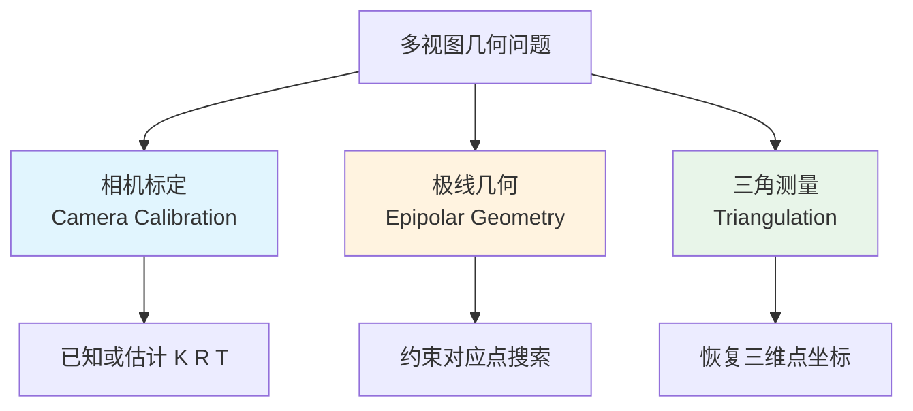
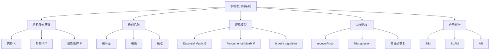

# Lecture 6 - 多视图几何

## 什么是多视图几何？

> [!definition] 定义
> 多视图几何（Multi-view Geometry）研究的是：**多张图像之间的几何关系，以及如何利用这些关系恢复相机运动和场景三维结构。**

这一讲把 [[Lecture 2 - 相机模型与图像]] 的成像几何，与 [[计算机视觉/笔记/Lecture 5 - 特征描述与图像对齐]] 中的特征匹配真正连接起来。

核心目标是回答三个问题：

- 已知两幅或多幅图像中的对应点，如何描述相机之间的关系？
- 如何用极线约束缩小匹配搜索范围？
- 如何从二维对应点恢复三维点坐标？

---

## 相关概念区分

### 相机标定 vs 极线几何 vs 三角测量



| 概念 | 主要回答什么问题 | 已知信息 | 输出 |
|------|------------------|----------|------|
| **相机标定** | 相机如何成像？参数是多少？ | 3D-2D 对应点 | 内参 $K$、外参 $R,T$ |
| **极线几何** | 两幅图中的对应点满足什么约束？ | 相机关系或点匹配 | 极线、极点、$E/F$ 约束 |
| **三角测量** | 怎样从两个视角恢复三维点？ | 投影矩阵 + 匹配点 | 三维点坐标 |

### 本征矩阵 E vs 基础矩阵 F

| 矩阵 | 使用坐标 | 前提 | 自由度 | 核心作用 |
|------|----------|------|--------|----------|
| **Essential Matrix $E$** | 归一化坐标 | 已知内参 | 5 | 编码两台已标定相机的相对位姿 |
| **Fundamental Matrix $F$** | 原始像素坐标 | 不要求已知内参 | 7 | 在原始图像坐标中表达极线约束 |

> [!tip] 关系
> 如果你记住了下面这两个公式，就能抓住 Lecture 6 的主干：
> - $x_2^T E x_1 = 0$
> - $F = K^{-T} E K^{-1}$

---

## 核心问题主线

### 从二维对应到三维恢复


| 阶段 | 核心内容 | 代表公式 / 关键词 |
|------|----------|-------------------|
| **相机模型** | 三维点如何投影到二维图像 | $P = K[R|T]$ |
| **相机标定** | 估计内参与外参 | $K, R, T$ |
| **归一化相机** | 去掉内参影响，简化几何关系 | $\tilde x = K^{-1}x$ |
| **极线几何** | 限制对应点只能落在极线上 | 极平面、极线、极点 |
| **矩阵表达** | 用 $E/F$ 统一表示对应约束 | $x_2^TEx_1=0$，$x_2^TFx_1=0$ |
| **位姿恢复** | 从矩阵约束回到相机运动 | $E=[T]_\times R$ |
| **三角测量** | 从两条视线交汇估计三维点 | Triangulation |

> [!note] 主线总结
> Lecture 6 的逻辑可以记成：**先建模相机 → 再建立两幅图间约束 → 最后从约束恢复三维。**

---

## 应用领域

### 三维恢复相关应用

> [!example] 典型场景
> - **Structure from Motion（SfM）**：从多张图片恢复相机轨迹和稀疏三维结构
> - **双目 / 多目深度估计**：根据视差恢复深度信息
> - **视觉 SLAM**：一边运动一边定位，同时构建环境地图
> - **增强现实（AR）**：已知相机姿态后，把虚拟物体正确投影到真实图像中

### 其他领域

- **无人机测绘**：利用航拍图像恢复地表三维模型
- **机器人视觉**：用于导航、抓取、空间定位
- **自动驾驶**：估计车体运动、路面结构和障碍物距离
- **医学三维重建**：从多角度影像恢复解剖结构

---

## 核心技术模块



| 模块 | 核心结论 | 记忆点 |
|------|----------|--------|
| **投影模型** | 三维到二维的统一表达是投影矩阵 | $P = K[R|T]$ |
| **归一化坐标** | 已知内参时可先去掉相机成像影响 | $\tilde x = K^{-1}x$ |
| **极线几何** | 一幅图中的点，在另一幅图中的对应点只可能位于一条极线上 | 二维搜索降为一维搜索 |
| **本征矩阵 $E$** | 编码两台已标定相机的相对旋转和平移方向 | $E = [T]_\times R$ |
| **基础矩阵 $F$** | 在原始像素坐标中表达极线约束 | 更通用，但不直接给位姿 |
| **8 点算法** | 至少 8 对匹配点可估计 $E/F$ | 本质是线性代数求解 |
| **三角测量** | 两个视角对应两条射线，交汇确定三维点 | 噪声下常求最优近似交点 |

> [!info] 后续课程
> 如果继续往后学，本讲会自然延伸到 **SfM、SLAM、双目深度估计、三维重建与机器人视觉**。

---

## 学习路线

### 推荐学习路径

```text
第一阶段：几何基础
├── 回顾针孔相机模型与投影矩阵
├── 区分内参与外参
└── 理解相机标定的目标
    ↓
第二阶段：建立双视图约束
├── 归一化坐标
├── 极线、极点、极平面
└── Essential / Fundamental Matrix
    ↓
第三阶段：从约束恢复三维
├── 8 点算法估计 E / F
├── recoverPose 恢复相机姿态
└── Triangulation 恢复三维点
    ↓
第四阶段：进入应用
├── SfM
├── SLAM
└── AR / 双目深度估计
```

---

## 相关资源

### 核心公式速记

- 投影矩阵：
  $$
  P = K[R|T]
  $$
- 归一化坐标：
  $$
  \tilde x = K^{-1}x
  $$
- 本征矩阵约束：
  $$
  x_2^T E x_1 = 0
  $$
- 基础矩阵约束：
  $$
  x_2^T F x_1 = 0
  $$
- 本征矩阵表达式：
  $$
  E = [T]_\times R
  $$
- 两者关系：
  $$
  F = K^{-T} E K^{-1}
  $$

### 常用工具库

| 库/函数 | 用途 | 说明 |
|---------|------|------|
| `cv2.calibrateCamera()` | 相机标定 | 估计内参、外参与畸变参数 |
| `cv2.findEssentialMat()` | 估计本征矩阵 | 已知内参时使用 |
| `cv2.findFundamentalMat()` | 估计基础矩阵 | 原始像素坐标下使用 |
| `cv2.recoverPose()` | 恢复相机相对位姿 | 从 $E$ 得到 $R, t$ |
| `cv2.triangulatePoints()` | 三角测量 | 恢复稀疏三维点 |

### 推荐联动笔记

- [[Lecture 2 - 相机模型与图像]]
- [[计算机视觉/笔记/Lecture 5 - 特征描述与图像对齐]]
- [[计算机视觉课程总思维导图（Lecture 1-15）]]

---

> [!question] 思考题
> 为什么多视图几何必须建立在“可靠匹配点”之上？如果相机内参未知，为什么通常先考虑基础矩阵 $F$，而不是直接使用本征矩阵 $E$？

---

*本笔记由 Claudian 整理 | [[Lecture 2 - 相机模型与图像]] → [[计算机视觉/笔记/Lecture 5 - 特征描述与图像对齐]] → [[Lecture 6 - 多视图几何]]*
