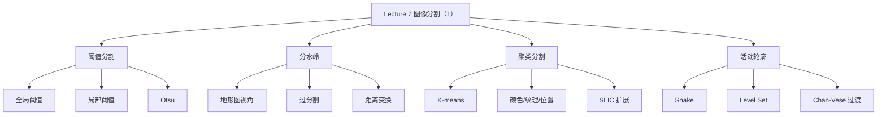

# Lecture 7 - 图像分割（1）

> [!info] 课程概要
> 本讲从 [[Lecture 3 - 图像处理]] 的灰度变换、滤波与距离变换出发，转向“如何把图像划分为有意义区域”的核心任务。主线可以概括为：**阈值分割 → 分水岭 → 聚类分割 → 活动轮廓**。其中边缘、梯度与轮廓思想又与 [[Lecture 4 - 特征提取]] 直接相连，并为 [[Lecture 8 - 图像分割（2）|Lecture 8 - 图像分割（2）]] 的图模型与后处理打基础。

## 1. 图像分割在课程中的位置

### 1.1 什么是图像分割？

> [!definition] 定义
> 图像分割（Segmentation）是把一幅图像划分为若干个**内部相对一致、彼此可区分**的区域，使后续的测量、识别和理解更容易进行。

### 1.2 为什么需要分割？

| 目标 | 说明 |
|---|---|
| 简化表示 | 把“像素集合”转成“区域/目标” |
| 强化结构 | 突出前景、边界、连通区域 |
| 服务后续任务 | 为 [[Lecture 9 -.md|Lecture 9 - 图像识别]]、测量、跟踪、检测提供输入 |

### 1.3 二值分割是最基本的特例

- 前景（foreground）
- 背景（background）

当任务只需要区分“目标/非目标”时，二值分割就是最直接的建模方式。

---

## 2. 本讲整体框架



> [!note] 主线总结
> Lecture 7 的重点不是只记某一个算法，而是理解**分割方法从“基于灰度规则”逐步走向“基于区域统计与轮廓优化”**的演进过程。

---

## 3. 阈值分割（Thresholding）

### 3.1 基本思想

阈值分割只关心像素值本身，不显式建模复杂空间关系。  
给定阈值 $T$ 后，可把图像划分为两类：

$$
I(x,y) =
\begin{cases}
1, & f(x,y) > T \\
0, & f(x,y) \le T
\end{cases}
$$

它的优势是**简单、快速、易实现**，但前提通常是前景与背景在灰度上有一定可分性。

### 3.2 全局阈值（Global Threshold）

整幅图像只使用一个统一阈值 $T$。

#### 迭代求阈值的典型思路

1. 给定初始阈值 $T_0$
2. 按 $T_0$ 划分前景/背景
3. 分别计算前景均值 $\mu_f$ 和背景均值 $\mu_b$
4. 更新阈值：

$$
T_i = \frac{\mu_b + \mu_f}{2}
$$

5. 直到阈值收敛

#### 适用场景

- 光照较均匀
- 前景/背景灰度差异明显
- 任务只需要粗分离目标与背景

### 3.3 局部阈值（Local / Adaptive Threshold）

当图像不同区域的亮度背景差异较大时，只用一个全局阈值往往不够。  
局部阈值法会把图像划分成多个局部区域，再分别估计阈值。

| 方法 | 优点 | 局限 |
|---|---|---|
| 全局阈值 | 实现简单、速度快 | 对光照不均敏感 |
| 局部阈值 | 更适应局部亮度变化 | 分块尺度选择困难，易受噪声影响 |

### 3.4 Otsu（大津法）

> [!definition] Otsu 的核心思想
> 自动选择一个阈值，使分割后的两类**类内更集中、类间更分离**。

可以把它理解为：

- 类内方差尽量小
- 等价地，类间方差尽量大

#### 记忆抓手

- **不需要手动设阈值**
- **对双峰直方图最友好**
- 仍然属于阈值法，因此依然受噪声和光照条件影响

---

## 4. 分水岭（Watershed）

### 4.1 地形图视角

分水岭把灰度图看成一个“地形表面”：

- 灰度低的位置像山谷
- 灰度高的位置像山峰

随后从各个低谷开始“灌水”：

- 水位逐渐上升
- 相邻盆地的水相遇时，在交界处筑坝
- 最终“坝线”就对应区域边界

### 4.2 为什么容易过分割？

如果直接在原始图像上做分水岭，往往会得到许多碎片区域，因为：

- 噪声会制造大量局部极小值
- 纹理起伏会形成许多小盆地
- 边界附近的细小波动会被放大成独立区域

### 4.3 常见改进思路

#### 先平滑再分水岭

- 用 [[Lecture 3 - 图像处理]] 中的滤波减小噪声
- 降低无意义的小盆地数量

#### 距离变换 + 分水岭

特别适合分离粘连目标：

1. 先获得前景区域
2. 对前景做距离变换
3. 目标中心形成局部峰值
4. 再做分水岭，把粘连区域分开

### 4.4 典型应用

- 细胞分割
- 颗粒分离
- 粘连目标拆分
- 二值 mask 的区域细分

---

## 5. 基于聚类的分割（Clustering-based Segmentation）

### 5.1 基本思想

把像素看作样本，把像素的颜色、灰度、纹理或位置看作特征，再按相似性完成分组。

> [!definition] 聚类分割
> 本质是让**簇内更相似、簇间更不同**，因此属于“区域一致性”导向的分割方法。

### 5.2 K-means

K-means 是最典型的聚类分割方法。

#### 过程

1. 初始化 $K$ 个聚类中心
2. 每个像素归到最近的中心
3. 根据当前分配更新中心
4. 迭代直到稳定

#### 可选特征

- 灰度
- 颜色
- 纹理
- 空间位置
- 以上特征的组合

### 5.3 K-means 的优缺点

| 方面 | 说明 |
|---|---|
| 优点 | 思路直观、易实现、可扩展到多种特征 |
| 缺点 | 需要预先指定 $K$；对初始中心敏感；可能把空间不连通但颜色相似的区域分到一起 |

### 5.4 SLIC 作为扩展视角

SLIC 可看作一种更偏工程化的超像素聚类方法：

- 把图像先切成许多局部连贯的小区域
- 既保留局部一致性，又减少后续图模型/识别的计算量
- 常作为更高级分割和识别任务的前处理

---

## 6. 活动轮廓（Active Contours）

### 6.1 为什么需要轮廓演化方法？

阈值法与聚类法更偏“像素分类”或“区域划分”，而活动轮廓更强调：

- 显式地追踪目标边界
- 把分割看成一个优化过程
- 在弱边界、不完整边界条件下加入平滑先验

### 6.2 Snake：显式轮廓模型

Snake 用一组离散控制点表示曲线，通过最小化能量让曲线逐步靠近目标边界。

#### 能量的两部分

- **内部能量**：约束轮廓平滑、限制剧烈弯折
- **外部能量**：吸引轮廓靠近图像边缘

常见外部能量形式可写成：

$$
E_{\text{external}} = -\left(G_x(I)^2 + G_y(I)^2\right)
$$

梯度越强，外部能量越低，轮廓越容易停在边缘附近。

#### Snake 的特点

| 优点 | 缺点 |
|---|---|
| 直观、可加入先验、适合光滑边界 | 对初始轮廓敏感，难以自然处理拓扑变化 |

### 6.3 Level Set：隐式轮廓模型

Level Set 不直接记录轮廓点，而是用一个函数 $\phi(x,y)$ 来表示曲线：

- $\phi(x,y)=0$ 的位置就是轮廓
- 曲线是函数的零水平集

#### 核心优势

> [!tip] Level Set 的最大优势
> 能够自然处理轮廓的**分裂、合并和拓扑变化**，这正是显式 Snake 难处理的地方。

### 6.4 Chan-Vese：从边缘型走向区域型

Chan-Vese 可以看作从 Lecture 7 过渡到 [[Lecture 8 - 图像分割（2）|Lecture 8 - 图像分割（2）]] 的关键桥梁：

- 不再强依赖清晰边缘
- 而是利用区域内部/外部的统计差异完成分割
- 对弱边界和模糊边界更稳健

---

## 7. 方法对比与适用场景

| 方法 | 核心依据 | 优势 | 局限 | 典型场景 |
|---|---|---|---|---|
| 阈值分割 | 灰度差异 | 简单、快速 | 对光照和噪声敏感 | 前景/背景对比明显的二值任务 |
| 分水岭 | 地形/区域边界 | 适合粘连目标分离 | 易过分割 | 颗粒、细胞、连通区域分离 |
| 聚类分割 | 像素相似性 | 可联合颜色/纹理/位置 | 需设参数，空间连贯性不总是好 | 彩色图像粗分割、超像素预处理 |
| Snake | 显式轮廓 + 能量最小化 | 可加平滑和形状先验 | 初值敏感，拓扑变化困难 | 边界较明确的轮廓提取 |
| Level Set / Chan-Vese | 隐式轮廓 / 区域统计 | 可处理拓扑变化，弱边界更稳 | 实现和理解更复杂 | 医学图像、复杂区域分割 |

> [!note] 与课程主线的关系
> - [[Lecture 3 - 图像处理]] 提供阈值、平滑、梯度、距离变换等工具
> - [[Lecture 4 - 特征提取]] 提供边缘与轮廓视角
> - Lecture 7 把这些低层操作提升为“区域划分”问题
> - 后续 [[Lecture 8 - 图像分割（2）|Lecture 8 - 图像分割（2）]] 会继续进入图模型与后处理
> - 再往后则自然衔接到 [[Lecture 9 -.md|Lecture 9 - 图像识别]]

---

## 8. 学习路线

```text
第一步：先抓住“分割要做什么”
├── 把图像变成区域 / 前景 / 边界
└── 理解分割是识别之前的重要中间层
    ↓
第二步：先学最简单的灰度方法
├── 全局阈值
├── 局部阈值
└── Otsu
    ↓
第三步：理解区域方法
├── 分水岭的地形图视角
└── K-means 的相似性分组
    ↓
第四步：进入轮廓演化
├── Snake：显式曲线
├── Level Set：隐式曲线
└── Chan-Vese：区域统计
    ↓
第五步：衔接下一讲
└── 图模型分割 + 形态学后处理
```

---

## 9. 相关资源

| 工具 / 函数 | 用途 | 说明 |
|---|---|---|
| `cv2.threshold()` | 全局阈值 | 二值分割起点 |
| `cv2.adaptiveThreshold()` | 局部阈值 | 适合光照不均 |
| `cv2.distanceTransform()` | 距离变换 | 常与分水岭联动 |
| `cv2.watershed()` | 分水岭 | 粘连目标分离 |
| `cv2.kmeans()` | 聚类分割 | 颜色/灰度聚类 |
| `skimage.segmentation.active_contour` | 活动轮廓 | Python 中更常见的 Snake 实现 |

> [!tip] 复习建议
> 如果只准备考试，优先记住：
> 1. 阈值 / 分水岭 / 聚类 / 活动轮廓这四条主线；
> 2. Otsu、距离变换 + 分水岭、Snake vs Level Set 三组高频对比；
> 3. “分割是识别前的区域组织步骤”这一课程定位。

---

> [!question] 思考题
> 1. 为什么阈值分割在光照不均时容易失败？
> 2. 分水岭为什么常和距离变换搭配使用？
> 3. Snake 和 Level Set 的本质区别是什么？
> 4. 如果目标边界很弱但区域内部较一致，你会更偏向哪一类方法？

---

> [!summary] 一句话总结
> Lecture 7 的核心逻辑是：**从灰度规则出发，逐步过渡到区域一致性与轮廓优化，把“像素处理”升级为“有意义区域提取”。**

---

*本笔记由 Claudian 整理 | [[Lecture 3 - 图像处理]] → [[Lecture 4 - 特征提取]] → [[Lecture 7 - 图像分割（1）|Lecture 7 - 图像分割（1）]] → [[Lecture 8 - 图像分割（2）|Lecture 8 - 图像分割（2）]]*