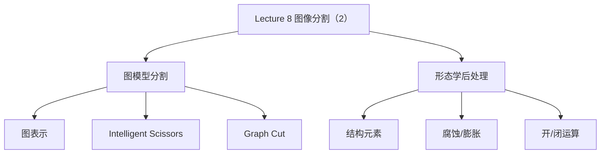

# Lecture 8 - 图像分割（2）

> [!info] 课程概要
> 本讲承接 [[Lecture 7 - 图像分割（1）|Lecture 7 - 图像分割（1）]] 中的阈值、区域和轮廓主线，继续推进到**基于图的分割**与**形态学后处理**。可以把它理解成：前一讲更像“如何得到一个初始分割”，这一讲更强调“如何通过图模型得到更全局的划分，并用形态学把结果修得更干净”。同时，它也和 [[Lecture 4 - 特征提取]] 中的边缘/轮廓思想保持紧密联系，并为 [[Lecture 9 -.md|Lecture 9 - 图像识别]] 中的目标表示与分类准备更稳定的输入。

## 1. 本讲在分割主线中的位置

### 1.1 承接 Lecture 7 的三个关键词

- **边界表示**：Snake / Level Set
- **区域一致性**：Chan-Vese
- **分割之后还需要修整**：mask 去噪、填洞、修边界

### 1.2 本讲新增的两条主线



> [!note] 主线总结
> 如果说 Lecture 7 更强调“分割方法有哪些”，那么 Lecture 8 更强调“**怎样把边界、区域和后处理组织成一套更完整的分割流程**”。

---

## 2. Lecture 7 内容回顾：Snake / Level Set / Chan-Vese

### 2.1 Snake：显式轮廓

Snake 把轮廓表示为一组离散控制点，并通过能量最小化让曲线逐步贴近边界。

- 内部能量：约束弹性与平滑性
- 外部能量：利用梯度把轮廓吸到边缘上
- 问题：对初始轮廓敏感，不易自然处理拓扑变化

### 2.2 Level Set：隐式轮廓

Level Set 用函数 $\phi(x,y)$ 的零水平集表示分割边界：

- 不直接追踪曲线点
- 可自然处理轮廓分裂、合并
- 便于把平滑、传播、边缘停止等机制写入统一演化框架

### 2.3 Chan-Vese：区域型视角

Chan-Vese 不强依赖边缘，而是利用区域内外统计差异做分割：

- 内部像素接近某一均值 $C_1$
- 外部像素接近另一均值 $C_2$
- 更适合弱边界、模糊边界场景

> [!tip] 为什么这一回顾重要？
> 因为 Lecture 8 的图模型分割同样在做“边界 + 区域”的平衡，只是表达方式从连续曲线进一步转向图结构与全局优化。

---

## 3. 基于图的分割（Graph-based Segmentation）

### 3.1 为什么把图像看成图？

图结构可以自然表达两类信息：

- 像素或区域之间的**邻接关系**
- 它们之间的**相似性 / 代价 / 连通强度**

> [!definition] 图像到图的映射
> 在图像分割中，常把像素或超像素视作**顶点（vertex）**，把相邻元素之间的关系视作**边（edge）**。

### 3.2 两种常见建图方式

| 建图方式 | 特点 | 适合场景 |
|---|---|---|
| 局部邻域连接（4 邻域 / 8 邻域） | 结构简单、计算量较小 | 常规像素图 |
| 更丰富的连接方式 | 表达能力更强，但代价更高 | 更复杂的图模型或区域图 |

### 3.3 图模型方法的两种代表思路

- **最短路径**：更偏边界跟踪
- **图割（Graph Cut）**：更偏区域划分与全局最优

---

## 4. Intelligent Scissors（智能剪刀）

### 4.1 基本思想

Intelligent Scissors 是一种典型的交互式边界提取方法。  
给定：

- 一个种子点 seed
- 一个当前目标点 / 鼠标位置 mouse

算法会在图中寻找：

> [!definition] 最低代价路径
> 从 seed 到 mouse 的最小代价路径，并让这条路径尽量沿着图像真实边缘前进。

### 4.2 为什么它会“吸附”到边缘？

因为路径代价通常基于局部梯度或对比度设计：

- 边缘明显的位置，代价更低
- 平坦区域，代价更高

于是最短路径倾向于贴着边缘走。

### 4.3 求解方式

常见求解器是 **Dijkstra 最短路径算法**。

### 4.4 方法特点

| 优点 | 缺点 |
|---|---|
| 适合交互式抠图；边界清晰时效果好；路径可自动吸附到边缘 | 更像边界跟踪，不是全局区域最优；对边缘质量依赖大 |

> [!note] 课程定位
> Intelligent Scissors 更偏“**局部边界选择**”而不是完整意义上的全自动区域分割，因此它和 [[Lecture 4 - 特征提取]] 的边缘检测思路联系更紧密。

---

## 5. Graph Cut（图割）

### 5.1 基本思想

图割把图像分成前景与背景两部分。  
除了普通像素节点外，还会引入两个特殊节点：

- **源点 $s$**：代表前景
- **汇点 $t$**：代表背景

算法的目标是找到一种代价最小的切分方式，把所有像素分到前景或背景一侧。

### 5.2 两类关键边

#### n-link

连接相邻像素之间的边，用来表示：

- 相邻像素是否相似
- 它们是否应被分到同一区域

#### t-link

连接像素与源点/汇点的边，用来表示：

- 该像素更像前景还是背景
- 用户种子、颜色模型或概率信息对该像素类别的偏好

### 5.3 Cut 的含义

一个 cut 就是一组被切断的边。  
切断之后：

- 一部分节点连到源点 $s$
- 一部分节点连到汇点 $t$

于是就得到前景/背景的区域划分。

### 5.4 Min-Cut 与 Max-Flow

> [!definition] 最小割
> 在所有能够把 $s$ 与 $t$ 分开的切法中，总代价最小的那一种。

图割分割本质上就是寻找最小代价的前景/背景划分，它与图论中的 **最大流（Max-Flow）** 问题等价。

### 5.5 如何理解权重设计？

| 边类型 | 权重含义 | 设计原则 |
|---|---|---|
| n-link | 邻近像素被切开的代价 | 越相似越不该分开，权重越大 |
| t-link | 像素属于前景/背景的倾向 | 越像前景就越应连向源点，越像背景就越应连向汇点 |

### 5.6 图割的本质

图割其实是在同时平衡两类信息：

- **数据项**：单个像素更像前景还是背景
- **平滑项**：相邻像素是否应该保持一致

这也是它相较于单纯边界跟踪更“全局”的原因。

---

## 6. 形态学后处理（Morphological Operations）

### 6.1 为什么分割后还要做后处理？

自动分割结果常见问题包括：

- 小噪声块
- 小孔洞
- 边界毛刺
- 细小断裂
- 邻近区域粘连

因此需要形态学操作对二值 mask 或区域结果进行修整。

### 6.2 结构元素（Structuring Element）

> [!definition] 结构元素
> 形态学操作所依赖的小模板，用来定义局部邻域中“怎样算保留、扩张或收缩”。

常见形状：

- 方形
- 圆盘形
- 十字形

结构元素的大小与形状会显著影响最终结果。

---

## 7. 腐蚀与膨胀

### 7.1 腐蚀（Erosion）

腐蚀会让前景区域收缩。可以直观理解为：

- 只有结构元素覆盖范围都满足前景条件时
- 中心点才继续保留为前景

#### 效果

- 前景变瘦
- 毛刺减少
- 小噪声块被去掉
- 细连接可能断开

> [!tip] 记忆口诀
> **腐蚀：变瘦、去小点、断细桥**

### 7.2 膨胀（Dilation）

膨胀会让前景区域向外扩张。可理解为：

- 只要邻域内存在前景
- 周围位置就更容易被并入前景

#### 效果

- 前景变胖
- 小孔洞被填补
- 邻近断裂更容易连起来

> [!tip] 记忆口诀
> **膨胀：变胖、填小洞、连断裂**

### 7.3 对比总结

| 操作 | 本质 | 常见用途 |
|---|---|---|
| 腐蚀 | 收缩前景 | 去小噪声、断细桥 |
| 膨胀 | 扩张前景 | 填小洞、连断裂 |

---

## 8. 开运算与闭运算

### 8.1 开运算（Opening）

> [!definition] 开运算
> 先腐蚀，再膨胀。

#### 典型作用

- 去掉小前景噪声
- 去除细线和细连接
- 保留较大主体

> [!tip] 记忆口诀
> **开运算：去小物体、断细连接**

### 8.2 闭运算（Closing）

> [!definition] 闭运算
> 先膨胀，再腐蚀。

#### 典型作用

- 填补小孔洞
- 修补小裂缝
- 让目标区域更完整

> [!tip] 记忆口诀
> **闭运算：补小孔、连小缝**

### 8.3 结构元素大小的影响

| 结构元素大小 | 效果 |
|---|---|
| 小 | 处理更温和，主要影响小尺度噪声或孔洞 |
| 大 | 效果更强，但更可能破坏细节与形状 |

因此实际使用时，结构元素大小必须和：

- 噪声尺度
- 孔洞尺度
- 目标尺寸

一起考虑。

---

## 9. 方法对比与课程联系

### 9.1 边界跟踪 vs 区域划分 vs 后处理

| 类型 | 代表方法 | 核心思路 | 适合场景 |
|---|---|---|---|
| 边界跟踪 | Snake、Intelligent Scissors | 沿边界演化或寻路 | 边界较明显、需要轮廓 |
| 区域划分 | Graph Cut、Chan-Vese | 在区域内部一致性与边界代价之间平衡 | 前景/背景分割、交互式抠图 |
| 后处理 | 腐蚀、膨胀、开、闭 | 修整 mask 结构 | 去噪、填洞、修边 |

### 9.2 本讲与前后课程的关系

- 与 [[Lecture 4 - 特征提取]]：边缘、轮廓和梯度是 Graph-based 方法的重要基础
- 与 [[Lecture 7 - 图像分割（1）|Lecture 7 - 图像分割（1）]]：从轮廓/区域方法继续推进到图模型和结果修整
- 与 [[Lecture 9 -.md|Lecture 9 - 图像识别]]：更稳定的前景区域、mask 和局部区域表示能为识别提供更干净的输入

> [!note] 课程位置总结
> Lecture 7-8 一起构成了课程里“**从低层处理到中层区域组织**”的关键桥梁：先完成分割，再进入识别。

---

## 10. 学习路线

```text
第一步：回顾 Lecture 7
├── 阈值
├── 分水岭
├── K-means
└── Snake / Level Set / Chan-Vese
    ↓
第二步：理解图表示
├── 像素/区域 = 节点
└── 相似性/代价 = 边
    ↓
第三步：区分两类图方法
├── Intelligent Scissors：最短路径找边界
└── Graph Cut：最小割做区域划分
    ↓
第四步：学会后处理
├── 腐蚀 / 膨胀
└── 开 / 闭运算
    ↓
第五步：建立完整流程观
└── 初始分割 → 图模型优化 → 形态学修整 → 送入识别
```

---

## 11. 相关资源

| 工具 / 函数 | 用途 | 说明 |
|---|---|---|
| `cv2.grabCut()` | 基于图割的前景/背景分割 | 工程上常见交互式分割实现 |
| `cv2.erode()` | 腐蚀 | 去小噪声、断细桥 |
| `cv2.dilate()` | 膨胀 | 填洞、连断裂 |
| `cv2.morphologyEx()` | 开运算 / 闭运算等 | 统一形态学接口 |
| `cv2.getStructuringElement()` | 生成结构元素 | 设定核形状与大小 |

> [!tip] 复习时优先级
> 高优先级内容通常是：
> 1. Intelligent Scissors 与 Graph Cut 的区别；
> 2. n-link / t-link 的作用；
> 3. 腐蚀 / 膨胀 / 开 / 闭 四种操作的效果与口诀；
> 4. “分割结果需要后处理”这一工程意识。

---

> [!question] 思考题
> 1. 为什么 Intelligent Scissors 更像边界跟踪，而 Graph Cut 更像区域分割？
> 2. Graph Cut 中，数据项和平滑项分别在解决什么问题？
> 3. 为什么二值 mask 常需要开运算或闭运算？
> 4. 如果一个分割结果边缘毛刺很多、内部还有小孔洞，你会如何组合形态学操作？

---

> [!summary] 一句话总结
> Lecture 8 的核心逻辑是：**用图模型完成更全局的边界/区域划分，再用形态学操作把分割结果修成可用于后续识别的稳定表示。**

---

*本笔记由 Claudian 整理 | [[Lecture 4 - 特征提取]] → [[Lecture 7 - 图像分割（1）|Lecture 7 - 图像分割（1）]] → [[Lecture 8 - 图像分割（2）|Lecture 8 - 图像分割（2）]] → [[Lecture 9 -.md|Lecture 9 - 图像识别]]*