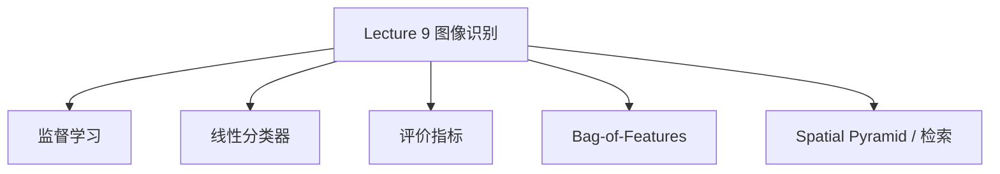

# Lecture 9 - 图像识别

> [!info] 课程概要
> 本讲把课程主线从 [[Lecture 7 - 图像分割（1）|图像分割]] / [[Lecture 8 - 图像分割（2）|图像分割后处理]] 继续推进到“如何根据图像内容做类别判断”。在经典计算机视觉框架中，图像识别通常可以概括为：**特征提取 → 特征表示 → 分类器 → 输出类别**。因此它与 [[计算机视觉/笔记/Lecture 5 - 特征描述与图像对齐]] 中的局部特征表示、与 [[Lecture 4 - 特征提取]] 中的稳定结构特征都有直接联系。本笔记以现有整理稿为事实基础，聚焦结构统一与知识主线整理。

## 1. 图像识别在课程中的位置

### 1.1 识别的核心任务

> [!definition] 图像识别
> 图像识别（Object Recognition / Image Recognition）通常可视为一个**分类问题**：输入一张图像，输出它所属的类别标签。

例如：

- dog / cat / rabbit
- indoor / outdoor
- salmon / sea bass

### 1.2 为什么识别放在分割之后？

从课程递进看：

- [[Lecture 3 - 图像处理]] 解决“图像如何增强和分析”
- [[Lecture 4 - 特征提取]] 解决“哪里有稳定结构”
- [[计算机视觉/笔记/Lecture 5 - 特征描述与图像对齐]] 解决“怎样把局部结构表示出来并比较”
- [[Lecture 7 - 图像分割（1）|Lecture 7]] / [[Lecture 8 - 图像分割（2）|Lecture 8]] 解决“怎样得到更干净的区域/前景”
- **Lecture 9** 则回答：**怎样根据这些表示做类别判断**

---

## 2. 图像识别的经典框架

### 2.1 基本流程

经典识别流程可以概括为：

**输入图像 → 特征提取 → 分类器 → 识别结果**

### 2.2 为什么需要特征？

传统分类器通常并不直接吃“原始图像像素”本身，而是更依赖一个固定维度的特征向量表示。

可写成：

$$
y = f(x,w)
$$

其中：

- $x$：图像特征
- $w$：模型参数
- $f$：预测函数
- $y$：输出类别

> [!note] 课程联系
> 这里的“特征”并不是凭空出现的，而是和 [[Lecture 4 - 特征提取]]、[[计算机视觉/笔记/Lecture 5 - 特征描述与图像对齐]] 中的局部描述子、结构特征直接关联。

---

## 3. 监督学习与训练 / 验证 / 测试

### 3.1 两类机器学习问题

| 类型 | 训练数据是否带标签 | 典型任务 |
|---|---|---|
| 监督学习（Supervised Learning） | 是 | 分类、回归 |
| 无监督学习（Unsupervised Learning） | 否 | 聚类、降维 |

本讲重点是：**监督学习在图像分类中的应用**。

### 3.2 训练样本表示

监督学习中的训练样本可写为：

$$
(x_i, y_i)
$$

其中：

- $x_i$：第 $i$ 个样本的特征向量
- $y_i$：对应标签

### 3.3 训练的本质：参数估计

训练过程就是寻找一组更优参数，使模型在训练样本上的损失最小：

$$
w^* = \arg\min_w \sum_i L\big(y_i, f(x_i,w)\big)
$$

其本质是：

- 让模型预测尽量接近真实标签
- 让整体误差尽量小

### 3.4 训练集 / 验证集 / 测试集

| 数据集 | 作用 |
|---|---|
| 训练集 | 学模型参数 |
| 验证集 | 调参、选模型、看是否过拟合 |
| 测试集 | 最终评估泛化性能 |

> [!warning] 常见误区
> 训练误差低，不等于模型在新样本上也表现好；验证集也不能直接替代最终测试集。

---

## 4. 线性分类器与拟合问题

### 4.1 线性分类器的形式

对二维特征 $(x_1, x_2)$，决策边界可写为：

$$
w_0 + w_1x_1 + w_2x_2 = 0
$$

它会把特征空间分成两个区域，对应不同类别。

更一般地，可写为：

$$
f(X, W) = u(W^T X)
$$

其中 $u(\cdot)$ 可以理解为一个阶跃式判别函数。

### 4.2 本质理解

线性分类器的核心就是：

- 对特征做线性加权
- 用一个超平面做分类边界

二维中是直线，三维中是平面，更高维中则是超平面。

### 4.3 欠拟合与过拟合

| 概念 | 含义 | 常见表现 |
|---|---|---|
| 欠拟合（Underfitting） | 模型太简单，学不到数据规律 | 训练集上都分不好 |
| 过拟合（Overfitting） | 模型太复杂，把噪声也记住了 | 训练集很好，测试集变差 |

#### 记忆抓手

- **欠拟合**：模型表达能力不够
- **过拟合**：模型把训练数据记得太细，泛化变差

---

## 5. 分类性能评价指标

### 5.1 混淆矩阵

二分类问题常用四个量：

- TP：真阳性
- FP：假阳性
- FN：假阴性
- TN：真阴性

### 5.2 Accuracy

$$
Acc = \frac{TP + TN}{TP + FP + TN + FN}
$$

含义：所有样本中预测正确的比例。  
但在类别不平衡时，Accuracy 可能不够可靠。

### 5.3 Precision

$$
Precision = \frac{TP}{TP + FP}
$$

含义：被预测为正类的样本中，真正为正类的比例，即**查准率**。

### 5.4 Recall

$$
Recall = \frac{TP}{TP + FN}
$$

含义：所有真实正类样本中，被正确找出的比例，即**查全率**。

### 5.5 F1

F1 是 Precision 与 Recall 的综合指标，用来平衡“查得准”和“查得全”。

### 5.6 ROC / AUC

- ROC：横轴 FPR，纵轴 TPR
- AUC：ROC 曲线下的面积

AUC 越接近 1，通常表示分类器越强；若接近 0.5，则接近随机猜测。

### 5.7 指标对比速记

| 指标 | 更关注什么 |
|---|---|
| Accuracy | 总体对不对 |
| Precision | 预测为正的有多准 |
| Recall | 真实正样本找回多少 |
| F1 | Precision 与 Recall 的平衡 |
| ROC / AUC | 不同阈值下整体判别能力 |

---

## 6. Bag-of-Features（视觉词袋）

### 6.1 为什么要有 BoF？

图像中的局部特征数量通常不是固定的，而传统分类器更喜欢固定长度向量。  
因此需要一种方法，把“数量不固定的局部特征集合”转成“长度固定的图像表示”。

### 6.2 从文本词袋到视觉词袋

文本中的 Bag-of-Words 思想是：

- 统计每个单词出现的次数
- 不考虑单词顺序

对应到图像中：

- “单词”变成局部视觉特征
- 例如 patch、兴趣点区域、SIFT 描述子等

> [!definition] Bag-of-Features
> 通过把局部视觉特征量化为“视觉单词”，再统计词频直方图，把整张图像表示成固定长度向量。

### 6.3 构建步骤

#### Step 1：提取局部特征

- 规则网格采样
- 兴趣点区域采样
- 计算对应描述子

这里直接呼应 [[计算机视觉/笔记/Lecture 5 - 特征描述与图像对齐]] 中的局部特征提取思想。

#### Step 2：学习视觉词典

- 收集大量局部特征
- 用聚类得到若干聚类中心
- 每个中心对应一个“视觉单词”

#### Step 3：特征量化

把每个局部特征分配给最近的聚类中心，也就是完成从连续特征空间到离散视觉单词编号的映射。

#### Step 4：构造词频直方图

统计每个视觉单词在当前图像中出现的次数，得到一个固定长度向量。

### 6.4 BoF 的优缺点

| 方面 | 说明 |
|---|---|
| 优点 | 适合固定维表示；对局部变化较鲁棒；便于分类与检索 |
| 缺点 | 忽略空间布局信息；前景/背景可能混合；词典构造不一定最优 |

---

## 7. Spatial Pyramid 与图像检索

### 7.1 为什么要引入 Spatial Pyramid？

普通 Bag-of-Features 只关心“图像里有什么”，却不关心“这些特征在什么位置”。  
这会导致结构信息大量丢失。

### 7.2 Spatial Pyramid 的方法

把图像分层划分为网格：

- level 0：整张图
- level 1：$2 \times 2$
- level 2：$4 \times 4$

然后在每个网格中分别统计视觉词直方图，再拼接成更长的特征向量。

### 7.3 它补回了什么？

Spatial Pyramid 不会恢复精确几何结构，但能保留一种**粗粒度空间信息**：

- 不只知道“有什么特征”
- 还知道“这些特征大概出现在图像的哪个区域”

### 7.4 在图像检索中的作用

Bag-of-Features 可用于大规模图像检索：

1. 给数据库中的图像建立视觉词表示
2. 建立倒排索引（inverted index）
3. 对查询图像也提取视觉词
4. 根据共享视觉词快速查找候选图像

这也是经典视觉检索系统的重要思路之一。

---

## 8. 本讲总结与高频考点

### 8.1 本讲主线回顾

### 8.2 高频考点

| 模块 | 常见考点 |
|---|---|
| 识别框架 | 图像识别 = 特征 → 分类器 → 输出 |
| 数据划分 | 训练集 / 验证集 / 测试集的作用 |
| 模型泛化 | 欠拟合 vs 过拟合 |
| 评价指标 | Accuracy、Precision、Recall、F1、ROC/AUC |
| 经典表示 | Bag-of-Features 的四步流程 |
| 空间扩展 | Spatial Pyramid 为什么优于普通 BoF |

### 8.3 与前面课程的联系

- [[Lecture 4 - 特征提取]]：提供边缘、角点等稳定结构特征
- [[计算机视觉/笔记/Lecture 5 - 特征描述与图像对齐]]：提供局部描述子与匹配思想，是视觉词袋的重要前置基础
- [[Lecture 7 - 图像分割（1）|Lecture 7]] / [[Lecture 8 - 图像分割（2）|Lecture 8]]：提供更干净的前景区域与区域组织方式，可作为识别前处理

> [!note] 课程位置总结
> Lecture 9 标志着课程主线从“如何表示图像结构”转向“如何根据表示做语义判断”，也就是从分割进一步进入识别。

---

## 9. 相关资源

| 工具 / 函数 | 用途 | 说明 |
|---|---|---|
| `cv2.ml.SVM_create()` | 传统分类器 | OpenCV 中的 SVM 训练接口 |
| `sklearn.svm.SVC` | 支持向量机分类 | Python 中更常见的实验接口 |
| `cv2.BOWKMeansTrainer()` | 视觉词典聚类 | 用于构建视觉词袋词典 |
| `cv2.BOWImgDescriptorExtractor()` | BoF 图像表示 | 提取图像视觉词袋向量 |
| `sklearn.metrics` | 分类指标评估 | 计算 Precision / Recall / F1 / ROC 等 |

> [!tip] 复习建议
> 如果只做课程复习，可优先掌握：
> 1. 监督学习框架和训练/验证/测试划分；
> 2. 线性分类器、欠拟合/过拟合；
> 3. Precision / Recall / F1 / ROC-AUC 的区别；
> 4. Bag-of-Features 与 Spatial Pyramid 的基本思想。

---

> [!question] 思考题
> 1. 为什么传统分类器通常需要固定长度特征向量？
> 2. Accuracy 在类别极不平衡时为什么可能失真？
> 3. Bag-of-Features 为什么会丢失空间结构信息？
> 4. Spatial Pyramid 是如何在不恢复精确几何关系的前提下补充空间信息的？

---

> [!summary] 一句话总结
> Lecture 9 的核心逻辑是：**把图像通过特征表示转成可分类的固定维向量，再用监督学习模型完成类别判断，并用合适指标评估泛化性能。**

---

*本笔记由 Claudian 整理 | [[Lecture 4 - 特征提取]] → [[计算机视觉/笔记/Lecture 5 - 特征描述与图像对齐]] → [[Lecture 7 - 图像分割（1）|图像分割]] → [[Lecture 8 - 图像分割（2）|图像分割（2）]] → [[Lecture 9 - 图像识别|图像识别]]*