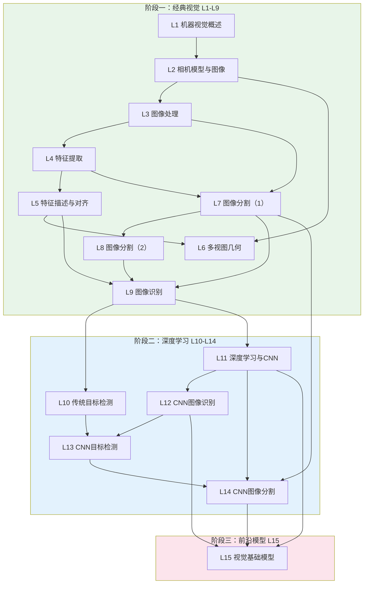

# 计算机视觉课程总思维导图（Lecture 1-15）

> [!info] 笔记定位
> 覆盖 [[Lecture 1 - 机器视觉概述]] 至 [[Lecture 15 - 视觉基础模型]] 全部 15 讲的**课程总思维导图 + 代码映射总表**。目标：快速回顾全课程知识递进关系，把理论点与工程实现对应起来。

> [!tip] 使用方式
> - **全局复习**：先看 Mermaid 总体递进图
> - **查漏补缺**：定位薄弱环节看对应 Lecture 分支
> - **考前速查**：直接看公式总表和最小复习路径

---

## 1. 课程总体递进关系（三阶段）



> [!note] 三阶段主线
> **经典视觉（特征工程）→ 深度学习（CNN 端到端）→ 基础模型（Transformer + 自监督 + 大模型）**

---

## 2. 精简版树状思维导图（全 15 讲）

- **计算机视觉课程**
  - **🔵 经典视觉阶段（L1-L9）**
    - **L1 机器视觉概述**：定义、系统流程、应用场景
    - **L2 相机模型与图像**：针孔模型 $x=\frac{fX}{Z}$、内参 $K$、外参 $[R|T]$、颜色空间
    - **L3 图像处理**：点处理 $I'=t(I)$、滤波/卷积、频率分析 $\mathcal{F}[g*h]$
    - **L4 特征提取**：Harris $C=\det(M)-\alpha(\text{trace}M)^2$、Canny、Hough
    - **L5 特征描述与对齐**：SIFT 128D、RANSAC、仿射/投影对齐
    - **L6 多视图几何**：极线约束 $x_2^T F x_1=0$、$E/F$ 矩阵、三角测量
    - **L7 图像分割（1）**：阈值/Otsu、分水岭、K-means、Snake/Level Set
    - **L8 图像分割（2）**：Graph Cut、Intelligent Scissors、形态学
    - **L9 图像识别**：监督学习、Bag-of-Features、Spatial Pyramid、Acc/Prec/Recall/F1
  - **🟢 深度学习阶段（L10-L14）**
    - **L10 传统目标检测**：检测流程、IoU/NMS、HOG(3780维)+SVM、Viola-Jones(积分图+Haar+AdaBoost+Cascade)
    - **L11 深度学习与CNN**：感知机→ANN→BP、CNN卷积/池化/激活函数、Softmax+交叉熵
    - **L12 CNN图像识别**：AlexNet→VGG→GoogLeNet→ResNet→MobileNet、分类网络演进
    - **L13 CNN目标检测**：R-CNN→Fast R-CNN→Faster R-CNN(RPN+Anchor)→YOLO/SSD 单阶段
    - **L14 CNN图像分割**：FCN→U-Net(skip connection)→DeepLab(ASPP)→Mask R-CNN、迁移学习
  - **🔴 前沿模型阶段（L15）**
    - **L15 视觉基础模型**：ViT(MHSA)、自监督(Rotation/Jigsaw/MAE)、对比学习(SimCLR/InfoNCE)、CLIP、SAM、LMM

---

## 3. 关键公式总表

| Lecture | 公式 | 含义 |
|---------|------|------|
| L2 | $\mathbf{x}=K[R|T]\mathbf{X}$ | 完整投影模型 |
| L3 | $\mathcal{F}[g*h]=\mathcal{F}[g]\mathcal{F}[h]$ | 卷积定理 |
| L4 | $C=\det(M)-\alpha(\operatorname{trace}M)^2$ | Harris 角点响应 |
| L5 | SIFT: 16×16/4×4/8bins → 128D | SIFT 描述子维度 |
| L6 | $x_2^T F x_1 = 0$ | 极线约束 |
| L7 | Otsu: 类间方差最大 | 自动阈值 |
| L9 | $Precision = TP/(TP+FP), Recall = TP/(TP+FN)$ | 分类指标 |
| L10 | HOG: $7\times15\times9\times4=3780$ | HOG 特征维度 |
| L10 | IoU = 交集/并集 | 检测框重叠度 |
| L11 | $W'=\frac{W-F+2P}{S}+1$ | 卷积输出尺寸 |
| L11 | $L_i=-\sum_j y_j\log p_j$ | 交叉熵损失 |
| L12 | ResNet: $H(x)=F(x)+x$ | 残差连接 |
| L12 | Softmax: $p_k=e^{s_k}/\sum_j e^{s_j}$ | 概率归一化 |
| L13 | YOLO: $S\times S\times(5B+C)$ | YOLO 输出维度 |
| L13 | $\text{Attention}(Q,K,V)=\text{softmax}(\frac{QK^T}{\sqrt{d_k}})V$ | 自注意力 |
| L15 | InfoNCE: 正样本近/负样本远 | 对比学习损失 |

---

## 4. 方法对比速查

| 任务 | 经典方法 | CNN方法 | 关键区别 |
|------|----------|---------|----------|
| 图像识别 | BoF+SVM | ResNet/VGG | 手工特征 → 自动特征 |
| 目标检测 | HOG+SVM, V-J | Faster R-CNN, YOLO | 滑窗 → RPN/单阶段 |
| 图像分割 | 阈值/分水岭/GraphCut | U-Net/DeepLab/Mask R-CNN | 像素规则 → 端到端学习 |
| 特征提取 | SIFT/HOG | CNN backbone | 手工设计 → 自动学习 |
| 预训练 | — | ImageNet 有监督 | → 自监督/基础模型 |

---

## 5. 代码实现速查

| 模块 | 关键函数 | 用途 |
|------|----------|------|
| 图像处理 | `cv2.GaussianBlur`, `cv2.Canny`, `cv2.threshold` | 滤波/边缘/二值化 |
| 特征提取 | `cv2.SIFT_create()`, `cv2.goodFeaturesToTrack` | 关键点/描述子 |
| 几何 | `cv2.findHomography`, `cv2.findEssentialMat` | 对齐/极线几何 |
| 分割 | `cv2.watershed`, `cv2.grabCut` | 分水岭/图割 |
| CNN | `nn.Conv2d`, `nn.MaxPool2d`, `F.cross_entropy` | 卷积/池化/损失 |
| 检测 | `torchvision.models.detection` | Faster R-CNN 等 |
| 基础模型 | `transformers.ViTModel`, `segment_anything` | ViT/SAM |

---

## 6. 最小复习路径（考前速查）

```
第一层：系统总览
├── L1 机器视觉系统 = 采集 → 预处理 → 特征 → 决策
└── L2 成像几何 x = K[R|T]X

第二层：经典处理与特征
├── L3 滤波/卷积/频率
├── L4 Harris/Canny/Hough
└── L5 SIFT/RANSAC/对齐

第三层：经典视觉任务
├── L6 极线约束 E/F
├── L7-L8 分割：阈值→分水岭→GraphCut→形态学
└── L9 识别：BoF + 评价指标

第四层：深度学习基础
├── L10 传统检测：HOG+SVM、Viola-Jones
├── L11 CNN基础：卷积/池化/Softmax/交叉熵
└── L12 网络演进：AlexNet→VGG→ResNet

第五层：CNN 视觉任务
├── L13 CNN检测：R-CNN→Faster R-CNN→YOLO
└── L14 CNN分割：FCN→U-Net→DeepLab→Mask R-CNN

第六层：前沿模型
└── L15 ViT/MAE/CLIP/SAM/基础模型
```

---

> [!summary] 一句话总总结
> **全课程从"图像如何形成"出发，经历经典特征工程 → CNN 端到端学习 → Transformer 自监督基础模型三个时代，覆盖分类、检测、分割三大核心视觉任务的完整演化路径。**

---

*本笔记由 Claudian 整理 | [[Lecture 1 - 机器视觉概述]] → [[Lecture 15 - 视觉基础模型]]*
