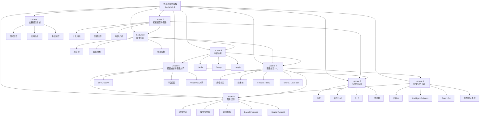

# 计算机视觉课程总思维导图（Lecture 1-9）

> [!info] 笔记定位
> 这是一份面向 [[Lecture 1 - 机器视觉概述]]、[[Lecture 2 - 相机模型与图像]]、[[Lecture 3 - 图像处理]]、[[Lecture 4 - 特征提取]]、[[计算机视觉/笔记/Lecture 5 - 特征描述与图像对齐]]、[[Lecture 6 - 多视图几何]]、[[Lecture 7 - 图像分割（1）]]、[[Lecture 8 -.md|Lecture 8 - 图像分割（2）]]、[[Lecture 9 -.md|Lecture 9 - 图像识别]] 的**课程总思维导图 + 代码映射总表**。
>
> 目标有三个：
> 1. 帮你从课程全局理解 Lecture 1-9 的知识递进关系；
> 2. 帮你把理论点和 OpenCV / Python 实现对应起来；
> 3. 把课程主线从“系统与成像”一直串到“分割与识别”。

> [!tip] 使用方式
> - **复习理论**：先看“总体递进图”和各 Lecture 的树状结构
> - **看主线关系**：重点关注跨讲连接：处理 → 分割 → 识别
> - **做代码实验**：直接看每个知识点下的“实现映射”
> - **准备考试**：优先关注公式、意义、方法对比和课程定位

---

## 1. 课程总体递进关系

> [!note] 主线总结
> 课程的总递进关系现在完整扩展为：
> **系统 → 成像 → 处理 → 特征 → 描述/匹配/对齐 → 多视图/三维 → 分割 → 识别**。

---

## 2. 总体树状思维导图（Lecture 1-9）

- **计算机视觉课程（Lecture 1-9）**
  - **Lecture 1：机器视觉概述**
    - 机器视觉的定义、定位与应用场景
    - 系统流程：采集 → 预处理 → 特征提取 → 分析与决策
  - **Lecture 2：相机模型与图像**
    - 针孔模型、透视投影、内参/外参、图像表示
  - **Lecture 3：图像处理**
    - 点处理、滤波、卷积、模板匹配、频率分析
  - **Lecture 4：特征检测**
    - Harris 角点、Canny 边缘、Hough 直线
  - **Lecture 5：特征描述与图像对齐**
    - 描述子、匹配、RANSAC、仿射/投影对齐
  - **Lecture 6：多视图几何**
    - 标定、极线几何、本征矩阵/基础矩阵、三角测量
  - **Lecture 7：图像分割（1）**
    - 阈值分割
    - 分水岭
    - K-means / SLIC
    - Snake / Level Set / Chan-Vese 过渡
  - **Lecture 8：图像分割（2）**
    - 图表示
    - Intelligent Scissors
    - Graph Cut
    - 腐蚀 / 膨胀 / 开 / 闭
  - **Lecture 9：图像识别**
    - 监督学习
    - 线性分类器
    - Accuracy / Precision / Recall / F1 / ROC-AUC
    - Bag-of-Features
    - Spatial Pyramid
  - **课程知识递进关系**
    - Lecture 3 → Lecture 7：图像处理进入分割
    - Lecture 4 → Lecture 7：边缘/轮廓进入分割模型
    - Lecture 7 → Lecture 8：分割基础进入图模型与后处理
    - Lecture 5 → Lecture 9：局部特征进入视觉词袋与识别
    - Lecture 7 / 8 → Lecture 9：前景区域与 mask 成为识别输入

---

## 3. Lecture 7：图像分割（1）

### 3.1 思维导图

- **Lecture 7：图像分割（1）**
  - **知识点 1：阈值分割**
    - 全局阈值
    - 局部阈值
    - Otsu
    - 意义：从灰度差异直接得到前景/背景
    - 与前后知识联系：承接 [[Lecture 3 - 图像处理]]
  - **知识点 2：分水岭**
    - 地形图视角
    - 灌水与筑坝
    - 过分割问题
    - 距离变换 + 分水岭
    - 典型场景：粘连目标分离
  - **知识点 3：聚类分割**
    - K-means
    - SLIC 超像素
    - 特征可包含灰度、颜色、纹理、位置
  - **知识点 4：活动轮廓**
    - Snake：显式轮廓
    - Level Set：隐式轮廓
    - Chan-Vese：区域统计过渡
    - 与前后知识联系：承接 [[Lecture 4 - 特征提取]] 的边缘与轮廓思想
  - **知识点 5：课程定位**
    - 从“像素处理”进入“区域组织”
    - 为 Lecture 8 的图模型与 Lecture 9 的识别做铺垫

### 3.2 代码实现映射

| 项目 | 常用函数 | 作用 |
|---|---|---|
| 全局阈值 | `cv2.threshold()` | 二值化前景与背景 |
| 局部阈值 | `cv2.adaptiveThreshold()` | 适应光照不均 |
| 距离变换 | `cv2.distanceTransform()` | 为分水岭提供峰值结构 |
| 分水岭 | `cv2.watershed()` | 分离粘连目标 |
| 聚类分割 | `cv2.kmeans()` | 基于特征聚类 |

---

## 4. Lecture 8：图像分割（2）

### 4.1 思维导图

- **Lecture 8：图像分割（2）**
  - **知识点 1：图表示**
    - 像素 / 区域 = 节点
    - 相邻关系 / 代价 = 边
    - 作用：把分割写成图优化问题
  - **知识点 2：Intelligent Scissors**
    - 种子点到目标点的最短路径
    - Dijkstra 最短路
    - 更偏交互式边界跟踪
  - **知识点 3：Graph Cut**
    - 源点 / 汇点
    - n-link / t-link
    - 最小割 / 最大流
    - 作用：全局前景/背景划分
  - **知识点 4：形态学后处理**
    - 结构元素
    - 腐蚀 / 膨胀
    - 开 / 闭运算
    - 作用：去噪、填洞、修边界
  - **知识点 5：课程定位**
    - 把初始分割推进为“图优化 + mask 修整”的完整流程
    - 让结果更适合作为识别输入

### 4.2 代码实现映射

| 项目 | 常用函数 | 作用 |
|---|---|---|
| Graph Cut | `cv2.grabCut()` | 前景/背景交互式分割 |
| 腐蚀 | `cv2.erode()` | 去小噪声、断细桥 |
| 膨胀 | `cv2.dilate()` | 填洞、连断裂 |
| 开 / 闭运算 | `cv2.morphologyEx()` | 统一进行形态学组合操作 |
| 结构元素 | `cv2.getStructuringElement()` | 控制形状与尺度 |

---

## 5. Lecture 9：图像识别

### 5.1 思维导图

- **Lecture 9：图像识别**
  - **知识点 1：监督学习**
    - 样本 $(x_i, y_i)$
    - 训练集 / 验证集 / 测试集
    - 目标：学习可泛化的分类器
  - **知识点 2：线性分类器**
    - 决策边界
    - 欠拟合 / 过拟合
    - 泛化能力
  - **知识点 3：评价指标**
    - 混淆矩阵
    - Accuracy
    - Precision / Recall / F1
    - ROC / AUC
  - **知识点 4：Bag-of-Features**
    - 局部特征提取
    - 视觉词典
    - 特征量化
    - 词频直方图
  - **知识点 5：Spatial Pyramid 与图像检索**
    - 多层网格统计
    - 粗空间信息
    - 图像检索场景
  - **知识点 6：课程定位**
    - 从“图像/区域表示”进入“类别判断”
    - 形成经典计算机视觉管线闭环

### 5.2 代码实现映射

| 项目 | 常用函数 / 模块 | 作用 |
|---|---|---|
| 传统分类器 | `cv2.ml.SVM_create()` | 在 OpenCV 中训练 SVM |
| Python 分类器 | `sklearn.svm.SVC` | 常见实验接口 |
| 评价指标 | `sklearn.metrics` | 计算 Precision / Recall / F1 / ROC 等 |
| 视觉词典 | `cv2.BOWKMeansTrainer()` | 聚类生成视觉单词 |
| 视觉词袋表示 | `cv2.BOWImgDescriptorExtractor()` | 构造 BoF 特征向量 |

---

## 6. Lecture 1-9 的关键公式总表

| Lecture | 公式 | 含义 |
|---|---|---|
| L2 | $\mathbf{x}=K[R|T]\mathbf{X}$ | 完整投影模型 |
| L3 | $I'=t(I)$ | 点处理 |
| L3 | $\mathcal{F}[g*h]=\mathcal{F}[g]\mathcal{F}[h]$ | 卷积定理 |
| L4 | $C=\det(M)-\alpha(\operatorname{trace}(M))^2$ | Harris 响应 |
| L5 | $A\theta = b$ | 仿射参数估计线性系统 |
| L6 | $x_2^TE x_1 = 0$ | 本征矩阵约束 |
| L6 | $x_2^TF x_1 = 0$ | 基础矩阵约束 |
| L7 | $T_i = \frac{\mu_b + \mu_f}{2}$ | 迭代阈值更新 |
| L7 | 类内方差最小 / 类间方差最大 | Otsu 基本思想 |
| L9 | $y=f(x,w)$ | 分类预测函数 |
| L9 | $w^* = \arg\min_w \sum_i L(y_i,f(x_i,w))$ | 监督学习训练目标 |
| L9 | $Acc = \frac{TP+TN}{TP+FP+TN+FN}$ | 准确率 |
| L9 | $Precision = \frac{TP}{TP+FP}$ | 查准率 |
| L9 | $Recall = \frac{TP}{TP+FN}$ | 查全率 |

---

## 7. 课程知识的前后衔接图（补到 Lecture 9）

### 7.1 Lecture 6 → Lecture 7

- Lecture 6 偏几何与三维关系
- Lecture 7 转向中层视觉任务：如何把图像切成区域和目标

### 7.2 Lecture 3 / 4 → Lecture 7

- Lecture 3 提供阈值、滤波、距离变换等低层工具
- Lecture 4 提供边缘、轮廓等结构信息
- Lecture 7 把这些工具组织成真正的分割方法

### 7.3 Lecture 7 → Lecture 8

- Lecture 7 先给出分割基础方法
- Lecture 8 再通过图模型和形态学，让分割结果更完整、更稳定

### 7.4 Lecture 5 → Lecture 9

- Lecture 5 提供局部特征与描述子
- Lecture 9 将这些表示进一步组织成视觉词袋与分类输入

### 7.5 Lecture 7 / 8 → Lecture 9

- 分割和后处理可以提供更干净的前景区域、mask 与局部区域表示
- 这些结果能作为识别前处理，减少背景干扰

> [!note] 最终课程主线
> **系统 → 成像 → 处理 → 特征 → 描述/匹配/对齐 → 多视图/三维 → 分割 → 识别**

---

## 8. 最小复习路径（考前速查）

- **第一层：系统视角**
  - 机器视觉系统 = 采集 → 预处理 → 特征提取 → 决策
- **第二层：成像几何**
  - 投影模型 = $\mathbf{x}=K[R|T]\mathbf{X}$
- **第三层：处理基础**
  - 点处理、滤波、卷积、频率分析
- **第四层：结构特征**
  - Harris / Canny / Hough
- **第五层：描述、匹配与对齐**
  - SIFT / GLOH / RANSAC / 仿射 / 投影
- **第六层：多视图几何**
  - 标定 / 极线几何 / $E/F$ / 三角测量
- **第七层：图像分割**
  - 阈值 / 分水岭 / K-means / Snake / Level Set / Graph Cut / 形态学
- **第八层：图像识别**
  - 监督学习 / 分类器 / 指标 / BoF / Spatial Pyramid

---

## 9. 一句话总总结

> [!summary] 总结
> **Lecture 1 到 Lecture 9 的核心逻辑，就是从“机器视觉系统是什么”出发，先理解图像如何形成，再掌握图像如何处理与提取结构，继而完成描述、匹配与几何恢复，最后进入图像分割与经典图像识别。**

---

*本笔记由 Claudian 整理 | 对应 [[Lecture 1 - 机器视觉概述]]、[[Lecture 2 - 相机模型与图像]]、[[Lecture 3 - 图像处理]]、[[Lecture 4 - 特征提取]]、[[计算机视觉/笔记/Lecture 5 - 特征描述与图像对齐]]、[[Lecture 6 - 多视图几何]]、[[Lecture 7 - 图像分割（1）]]、[[Lecture 8 -.md|Lecture 8 - 图像分割（2）]]、[[Lecture 9 -.md|Lecture 9 - 图像识别]]*