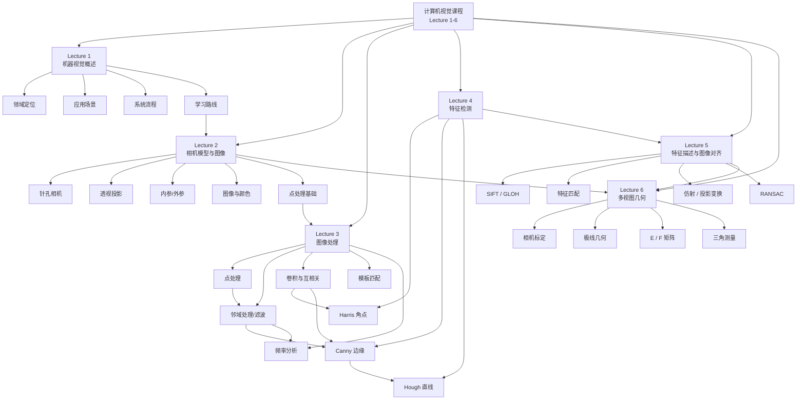

# 计算机视觉课程总思维导图（Lecture 1-6）

> [!info] 笔记定位
> 这是一份面向 [[Lecture 1 - 机器视觉概述]]、[[Lecture 2 - 相机模型与图像]]、[[Lecture 3 - 图像处理]]、[[Lecture 4 - 特征提取]]、[[计算机视觉/笔记/Lecture 5 - 特征描述与图像对齐]]、[[Lecture 6 - 多视图几何]] 的**课程总思维导图 + 代码映射总表**。
>
> 目标有三个：
> 1. 帮你从课程全局理解知识递进关系；
> 2. 帮你把理论点和 OpenCV / Python 实现对应起来；
> 3. 把 Lecture 1-6 串成一条从二维图像到三维几何的完整主线。

> [!tip] 使用方式
> - **复习理论**：先看“总体递进图”和各 Lecture 的树状结构
> - **做代码实验**：直接看每个知识点下的“实现映射”
> - **准备考试**：重点关注公式、意义、联系、典型场景

---

## 1. 课程总体递进关系



> [!note] 主线总结
> 课程的递进关系是：
> **先知道“机器视觉在做什么” → 再理解“图像是怎样形成和表示的” → 再掌握“怎样处理图像” → 再学习“怎样提取和匹配稳定特征” → 最后进入“怎样通过多视图关系恢复三维结构”。**

---

## 2. 总体树状思维导图（细化版）

- **计算机视觉课程（Lecture 1-6）**
  - **Lecture 1：机器视觉概述**
    - 机器视觉的定义与定位
      - 机器视觉 = 用机器获取图像并进行分析、理解、决策
      - 与图像处理、计算机视觉的关系
      - 课程意义：建立全局视角
    - 机器视觉的应用领域
      - 工业检测
      - 医疗影像
      - 自动驾驶
      - 智能零售
      - 农业与移动应用
    - 机器视觉系统流程
      - 图像采集
      - 图像预处理
      - 特征提取
      - 分析与决策
      - 结果输出
    - 学习路线
      - 数学与编程基础
      - 图像处理与特征提取
      - 深度学习
      - 工程部署与高级视觉任务
  - **Lecture 2：相机模型与图像**
    - 相机模型
      - 透视投影
      - 针孔相机模型
      - 焦距、主点、skew
      - 齐次坐标
      - 投影公式 $\mathbf{x}=K[R|T]\mathbf{X}$
    - 图像表示
      - 采样与量化
      - 灰度图与彩色图
      - RGB / HSV / YCbCr
    - 真实相机问题
      - 光圈
      - 快门
      - 对焦
      - 畸变
    - 图像处理基础
      - 点处理
      - 负片变换
      - Gamma 校正
      - 直方图
  - **Lecture 3：图像处理**
    - 点处理
      - 直方图
      - 对比度拉伸
      - 直方图均衡化
      - 窗宽窗位
    - 邻域处理 / 滤波
      - 均值滤波
      - 高斯滤波
      - Sobel 滤波
      - 锐化滤波
      - 中值滤波
    - 核心运算
      - 互相关
      - 卷积
      - 卷积性质
      - 高斯导数 / 先平滑后求导
    - 模板匹配
      - 滑窗相关
      - NCC
    - 频率分析
      - 高频 / 低频
      - 傅里叶表示
      - 幅值与相位
      - 卷积定理
      - 低通 / 高通 / 混合图像
  - **Lecture 4：特征检测**
    - 角点检测
      - 自相关函数
      - 泰勒展开
      - 二阶矩阵 $M$
      - 特征值解释
      - Harris 响应函数
    - 边缘检测
      - 边缘定义
      - 一阶导数思想
      - 高斯平滑与求导
      - Canny 四步法
    - 直线检测
      - 直线参数表示
      - 霍夫变换
      - 参数空间投票
      - 累加器峰值
      - 广义霍夫思想
  - **Lecture 5：特征描述与图像对齐**
    - 局部特征流程
      - Detection / Description / Matching / Alignment
      - 局部直方图 vs 全局直方图
    - 描述子
      - SIFT
      - GLOH
      - 梯度方向直方图
      - 128 维 / 272 维
    - 几何变换与对齐
      - 平移 / 旋转 / 缩放
      - 仿射变换
      - 投影变换
      - Warping / Blending
    - 稳健估计
      - 最小二乘
      - outliers / inliers
      - RANSAC
  - **Lecture 6：多视图几何**
    - 相机几何基础
      - 内参矩阵 $K$
      - 外参 $R,T$
      - 投影矩阵 $P = K[R|T]$
      - 相机标定
    - 极线几何
      - 极平面
      - 极线
      - 极点
      - 对应点约束
    - 矩阵模型
      - 本征矩阵 $E$
      - 基础矩阵 $F$
      - $x_2^TEx_1=0$
      - $x_2^TFx_1=0$
    - 三维恢复
      - 8 点算法
      - 位姿恢复
      - 三角测量
      - SfM / AR / 运动估计
  - **课程知识递进关系**
    - Lecture 1 提供问题背景和系统框架
    - Lecture 2 提供图像形成与表示基础
    - Lecture 3 提供图像增强、滤波、频域分析工具
    - Lecture 4 基于梯度、滤波、局部结构进入特征提取
    - Lecture 5 从“检测哪里”进入“怎样表示、匹配和对齐”
    - Lecture 6 从二维匹配进一步进入相机关系与三维结构恢复

---

## 3. Lecture 1：机器视觉概述

### 3.1 思维导图

- **Lecture 1：机器视觉概述**
  - **知识点 1：机器视觉是什么**
    - 定义
      - 机器视觉是用计算机和成像设备模拟视觉系统的科学
      - 输入通常是图像，输出通常是信息、判断或控制指令
    - 原理
      - 通过采集、预处理、特征提取、分析决策完成“看”和“理解”
    - 图像处理意义
      - 明确后续每一讲都在服务整个视觉系统
    - 应用场景
      - 工业检测、定位引导、医疗影像、自动驾驶
    - 与前后知识联系
      - 本讲是课程总入口
      - 后续 Lecture 2 解决“图像如何形成”
      - Lecture 3 解决“图像如何处理”
      - Lecture 4 解决“如何提取结构特征”
  - **知识点 2：机器视觉 vs 图像处理 vs 计算机视觉**
    - 定义区分
      - 图像处理：输入图像，输出图像
      - 计算机视觉：输入图像/视频，输出语义理解
      - 机器视觉：输入图像，输出控制/决策
    - 原理
      - 三者并不是割裂关系，而是层层递进
    - 图像处理意义
      - 图像处理是基础层；机器视觉更偏工程系统落地
    - 应用场景
      - 图像处理：去噪、增强
      - 计算机视觉：识别、检测
      - 机器视觉：缺陷检测、装配引导
    - 与前后知识联系
      - Lecture 3 偏“图像处理”
      - Lecture 4 偏“计算机视觉基础特征”
      - 工程落地又回到 Lecture 1 的系统视角
  - **知识点 3：机器视觉系统流程**
    - 图像采集
    - 预处理
    - 特征提取
    - 分析与决策
    - 结果输出
    - 与前后知识联系
      - Lecture 2 对应采集与成像
      - Lecture 3 对应预处理
      - Lecture 4 对应特征提取

### 3.2 代码实现映射

#### 3.2.1 机器视觉系统流程：没有单一函数，通常是流程组合

| 环节 | 常用函数 | 所属模块 | 作用 |
|------|----------|----------|------|
| 图像采集 | `cv2.imread` / `cv2.VideoCapture` | `imgcodecs` / `videoio` | 读取图片或视频流 |
| 预处理 | `cv2.cvtColor` / `cv2.GaussianBlur` | `imgproc` | 灰度化、去噪 |
| 特征提取 | `cv2.Canny` / `cv2.cornerHarris` / `cv2.HoughLinesP` | `imgproc` | 提取边缘、角点、直线 |
| 输出展示 | `cv2.imshow` / `cv2.putText` | `highgui` / `imgproc` | 可视化结果 |

**典型组合实现：**

```python
import cv2

img = cv2.imread("test.png")
gray = cv2.cvtColor(img, cv2.COLOR_BGR2GRAY)
blur = cv2.GaussianBlur(gray, (5, 5), 1.0)
edges = cv2.Canny(blur, 80, 160)
lines = cv2.HoughLinesP(edges, 1, 3.14159/180, threshold=80,
                        minLineLength=50, maxLineGap=10)
```

> [!tip] 理论到代码的映射
> Lecture 1 本身偏“课程导论”，因此更多是**系统级流程映射**，不是某个单独公式对应某个函数。

#### 3.2.2 图像采集与结果输出

| 项目 | 内容 |
|------|------|
| 对应函数 | `cv2.imread()`、`cv2.VideoCapture()`、`cv2.imshow()` |
| 所属模块 | `imgcodecs`、`videoio`、`highgui` |
| 作用 | 采集视觉输入并显示结果 |
| 关键参数 | 文件路径、摄像头编号、窗口名 |
| 输入输出 | 输入：文件路径或设备编号；输出：图像数组或视频帧 |
| 典型使用场景 | 工业相机采图、视频监控、实验演示 |

---

## 4. Lecture 2：相机模型与图像

### 4.1 思维导图

- **Lecture 2：相机模型与图像**
  - **知识点 1：透视投影与针孔相机模型**
    - 定义
      - 三维点通过成像系统映射到二维图像平面
    - 原理
      - 近大远小，本质来自除以深度 $Z$
    - 公式
      - $x=\frac{fX}{Z},\;y=\frac{fY}{Z}$
      - 考虑非均匀尺度和主点偏移：
      - $x=\frac{f_xX}{Z}+c_x,\;y=\frac{f_yY}{Z}+c_y$
    - 图像处理意义
      - 是三维场景到二维图像的一切视觉任务基础
    - 应用场景
      - 三维重建、相机标定、位姿估计
    - 与前后知识联系
      - 承接 Lecture 1 的“图像采集”模块
      - 为后续几何校正、特征匹配、三维理解打基础
  - **知识点 2：内参矩阵与外参**
    - 定义
      - 内参 $K$：相机自身成像属性
      - 外参 $[R|T]$：相机相对世界坐标系的位置和姿态
    - 公式
      - $K=\begin{bmatrix}f_x&\gamma&c_x\\0&f_y&c_y\\0&0&1\end{bmatrix}$
      - $\mathbf{x}=K[R|T]\mathbf{X}$
    - 图像处理意义
      - 把几何世界和图像像素坐标联系起来
    - 应用场景
      - 标定、AR、PnP、机器人视觉
    - 与前后知识联系
      - 是 Lecture 3 中几何处理和 Lecture 4 中结构理解的几何前提
  - **知识点 3：齐次坐标**
    - 定义
      - 用额外维度统一表示点和投影变换
    - 原理
      - 便于把平移、投影写成矩阵乘法
    - 图像处理意义
      - 让视觉中的几何变换更统一
    - 与前后知识联系
      - 后续单应矩阵、重投影误差、PnP 都会用到
  - **知识点 4：图像表示、采样、量化、颜色空间**
    - 采样
      - 连续图像变成离散像素，决定空间分辨率
    - 量化
      - 连续灰度变成有限等级，决定灰度精度
    - 颜色空间
      - RGB：设备相关
      - HSV：更接近人类感知
      - YCbCr：亮度与色差分离
    - 图像处理意义
      - 不同任务需要不同表示方式
    - 应用场景
      - 颜色分割、视频压缩、图像显示
    - 与前后知识联系
      - 为 Lecture 3 的灰度变换、直方图、滤波提供数据表示基础
  - **知识点 5：真实相机问题**
    - 光圈、快门、对焦、畸变
    - 图像处理意义
      - 真实视觉系统并不理想，需要标定和校正
    - 应用场景
      - 畸变校正、曝光控制、成像质量分析

### 4.2 代码实现映射

#### 4.2.1 透视投影 / 相机模型 / 三维点到二维点

| 项目 | 内容 |
|------|------|
| 对应函数 | `cv2.projectPoints()` |
| 所属模块 | `calib3d` |
| 作用 | 把三维点通过相机参数投影到二维图像平面 |
| 关键参数 | `objectPoints`, `rvec`, `tvec`, `cameraMatrix`, `distCoeffs` |
| 输入 | 三维点、旋转向量、平移向量、内参矩阵、畸变参数 |
| 输出 | 二维图像点 |
| 典型使用场景 | 重投影、标定验证、AR 点投影 |

```python
import cv2
import numpy as np

obj_pts = np.array([[0, 0, 5], [1, 0, 5], [0, 1, 5]], dtype=np.float32)
K = np.array([[800, 0, 320],
              [0, 800, 240],
              [0,   0,   1]], dtype=np.float32)
rvec = np.zeros((3, 1), dtype=np.float32)
tvec = np.zeros((3, 1), dtype=np.float32)
dist = np.zeros((5, 1), dtype=np.float32)
img_pts, _ = cv2.projectPoints(obj_pts, rvec, tvec, K, dist)
```

#### 4.2.2 相机标定：从理论公式到实际参数估计

| 项目 | 内容 |
|------|------|
| 对应函数 | `cv2.calibrateCamera()` |
| 所属模块 | `calib3d` |
| 作用 | 估计相机内参、外参和畸变参数 |
| 关键参数 | `objectPoints`, `imagePoints`, `imageSize` |
| 输入输出 | 输入：标定板三维点与图像点；输出：`K`、畸变、外参 |
| 典型场景 | 工业相机标定、去畸变、测量系统建立 |

```python
ret, K, dist, rvecs, tvecs = cv2.calibrateCamera(
    objectPoints, imagePoints, imageSize, None, None
)
```

#### 4.2.3 位姿估计：内参 + 外参在工程中的落地

| 项目 | 内容 |
|------|------|
| 对应函数 | `cv2.solvePnP()`、`cv2.Rodrigues()` |
| 所属模块 | `calib3d` |
| 作用 | 由 3D-2D 对应关系求相机姿态 |
| 关键参数 | `objectPoints`, `imagePoints`, `cameraMatrix`, `distCoeffs` |
| 输入输出 | 输入：三维点、二维点；输出：`rvec`, `tvec` |
| 典型场景 | 姿态估计、AR、机器人抓取定位 |

#### 4.2.4 畸变校正

| 项目 | 内容 |
|------|------|
| 对应函数 | `cv2.undistort()` |
| 所属模块 | `calib3d` |
| 作用 | 去除镜头畸变 |
| 关键参数 | 原图、`cameraMatrix`、`distCoeffs` |
| 输入输出 | 输入：畸变图像；输出：校正图像 |
| 典型场景 | 工业检测、视觉测量、广角相机校正 |

```python
undist = cv2.undistort(img, K, dist)
```

#### 4.2.5 颜色空间转换

| 项目 | 内容 |
|------|------|
| 对应函数 | `cv2.cvtColor()` |
| 所属模块 | `imgproc` |
| 作用 | 在 RGB/BGR、灰度、HSV、YCbCr 等颜色空间间转换 |
| 关键参数 | `code`，如 `cv2.COLOR_BGR2GRAY`、`cv2.COLOR_BGR2HSV` |
| 输入输出 | 输入：图像；输出：新颜色空间图像 |
| 典型场景 | 灰度预处理、颜色分割、视频压缩前处理 |

```python
gray = cv2.cvtColor(img, cv2.COLOR_BGR2GRAY)
hsv = cv2.cvtColor(img, cv2.COLOR_BGR2HSV)
ycrcb = cv2.cvtColor(img, cv2.COLOR_BGR2YCrCb)
```

#### 4.2.6 采样与量化：通常通过多个步骤组合实现

| 理论点 | 常见实现方式 |
|--------|--------------|
| 采样 | `cv2.resize()` 改变空间分辨率 |
| 量化 | `np.round()` + `astype(np.uint8)` 或位运算降低灰度级 |

```python
small = cv2.resize(img, (img.shape[1] // 2, img.shape[0] // 2))
quant4bit = (gray // 16) * 16
```

#### 4.2.7 负片变换 / Gamma 校正 / 图像直方图

| 理论点 | 实现方式 | 说明 |
|--------|----------|------|
| 负片变换 | `255 - img` | 没有必须使用的单一 OpenCV 函数 |
| Gamma 校正 | `np.power()` + 归一化 | 常用 NumPy 实现 |
| 直方图 | `cv2.calcHist()` | 为 Lecture 3 做铺垫 |

```python
negative = 255 - gray

gamma = 0.5
norm = gray / 255.0
gamma_img = np.uint8(np.power(norm, gamma) * 255)

hist = cv2.calcHist([gray], [0], None, [256], [0, 256])
```

---

## 5. Lecture 3：图像处理

### 5.1 思维导图

- **Lecture 3：图像处理**
  - **知识点 1：点处理（Point Processing）**
    - 定义
      - 每个像素单独变换，不考虑邻域
    - 公式
      - $I'=t(I)$
    - 图像处理意义
      - 调亮度、对比度、灰度映射最直接
    - 应用场景
      - 对比度增强、医学图像显示、预处理
    - 与前后知识联系
      - 承接 Lecture 2 的图像表示
      - 为 Lecture 4 的特征检测提供更合适的输入图像
    - 具体内容
      - 直方图
      - 对比度拉伸
      - 直方图均衡化
      - 窗宽窗位
  - **知识点 2：邻域处理 / 滤波**
    - 定义
      - 输出像素由局部窗口共同决定
    - 原理
      - 对局部区域做加权求和或排序统计
    - 图像处理意义
      - 去噪、平滑、增强边缘、改善后续特征提取稳定性
    - 应用场景
      - 预处理、边缘检测前平滑、细节增强
    - 与前后知识联系
      - 为 Lecture 4 中 Harris / Canny 提供梯度计算基础
    - 具体内容
      - 均值滤波
      - 高斯滤波
      - Sobel 滤波
      - 锐化滤波
      - 中值滤波
  - **知识点 3：互相关与卷积**
    - 互相关
      - 核不翻转
      - 公式：$h[m,n]=\sum f[k,l]I[m+k,n+l]$
    - 卷积
      - 核翻转
      - 公式：$h[m,n]=\sum f[-k,-l]I[m+k,n+l]$
    - 图像处理意义
      - 几乎所有线性滤波都能统一到卷积框架
    - 与前后知识联系
      - Lecture 4 中高斯导数、二阶矩阵、边缘检测都离不开卷积思想
  - **知识点 4：模板匹配与 NCC**
    - 定义
      - 小模板在大图上滑动并计算相似度
    - 原理
      - 相关图峰值对应最相似位置
    - 图像处理意义
      - 是最基础的目标定位方法之一
    - 应用场景
      - 简单定位、字符模板查找、工业件对位
  - **知识点 5：频率分析**
    - 高频 / 低频
      - 高频：边缘、纹理、细节
      - 低频：轮廓、平滑区域、整体明暗趋势
    - 傅里叶思想
      - 复杂图像可以拆分成不同频率分量
    - 卷积定理
      - $\mathcal{F}[g*h]=\mathcal{F}[g]\mathcal{F}[h]$
    - 图像处理意义
      - 既能解释滤波效果，又能支持频域实现
    - 应用场景
      - 低通去噪、高通增强、混合图像
    - 与前后知识联系
      - Lecture 4 中“边缘 = 高频信息”“先平滑后求导”都可从频率角度理解

### 5.2 代码实现映射：点处理

#### 5.2.1 直方图

| 项目 | 内容 |
|------|------|
| 对应函数 | `cv2.calcHist()` |
| 所属模块 | `imgproc` |
| 作用 | 统计灰度分布 |
| 关键参数 | 图像列表、通道、mask、bin 数、范围 |
| 输入输出 | 输入：图像；输出：直方图数组 |
| 典型场景 | 亮度分析、对比度判断、均衡化前分析 |

```python
hist = cv2.calcHist([gray], [0], None, [256], [0, 256])
```

#### 5.2.2 对比度拉伸

| 项目 | 内容 |
|------|------|
| 对应实现 | `cv2.normalize()` 或线性变换 |
| 所属模块 | `core` |
| 作用 | 把灰度范围拉伸到更宽区间 |
| 关键参数 | `alpha`, `beta`, `norm_type` |
| 输入输出 | 输入：图像；输出：增强后图像 |
| 典型场景 | 灰蒙图像增强、后续边缘检测预处理 |

```python
stretch = cv2.normalize(gray, None, 0, 255, cv2.NORM_MINMAX)
```

#### 5.2.3 直方图均衡化

| 项目 | 内容 |
|------|------|
| 对应函数 | `cv2.equalizeHist()`、`cv2.createCLAHE()` |
| 所属模块 | `imgproc` |
| 作用 | 提升整体或局部对比度 |
| 关键参数 | `clipLimit`, `tileGridSize`（CLAHE） |
| 输入输出 | 输入：单通道图像；输出：增强图像 |
| 典型场景 | 低对比度图像增强、医学图像预处理 |

```python
eq = cv2.equalizeHist(gray)
clahe = cv2.createCLAHE(clipLimit=2.0, tileGridSize=(8, 8))
local_eq = clahe.apply(gray)
```

#### 5.2.4 窗宽窗位：通常通过裁剪 + 线性映射实现

| 项目 | 内容 |
|------|------|
| 对应函数 | 无单一固定函数，通常 `np.clip()` + 线性归一化 |
| 作用 | 选取灰度区间并映射到显示范围 |
| 输入输出 | 输入：原始灰度图；输出：显示图像 |
| 典型场景 | CT / MRI 显示 |

```python
import numpy as np

level = 40
window = 80
low = level - window / 2
high = level + window / 2
wl = np.clip(img_float, low, high)
wl = ((wl - low) / (high - low) * 255).astype(np.uint8)
```

### 5.3 代码实现映射：邻域处理 / 滤波

#### 5.3.1 均值滤波

| 项目 | 内容 |
|------|------|
| 对应函数 | `cv2.blur()` / `cv2.boxFilter()` |
| 所属模块 | `imgproc` |
| 作用 | 邻域平均，平滑图像 |
| 关键参数 | `ksize` |
| 输入输出 | 输入：图像；输出：平滑结果 |
| 典型场景 | 简单去噪、实验对比 |

```python
mean_blur = cv2.blur(gray, (5, 5))
```

#### 5.3.2 高斯滤波

| 项目 | 内容 |
|------|------|
| 对应函数 | `cv2.GaussianBlur()` |
| 所属模块 | `imgproc` |
| 作用 | 按高斯权重平滑图像 |
| 关键参数 | `ksize`, `sigmaX`, `sigmaY` |
| 输入输出 | 输入：图像；输出：平滑图像 |
| 典型场景 | 去噪、Canny 前预处理、尺度空间处理 |

```python
gb = cv2.GaussianBlur(gray, (5, 5), 1.2)
```

#### 5.3.3 互相关 / 卷积

| 项目 | 内容 |
|------|------|
| 对应函数 | `cv2.filter2D()` |
| 所属模块 | `imgproc` |
| 作用 | 用自定义核做滤波 |
| 关键参数 | `ddepth`, `kernel` |
| 输入输出 | 输入：图像和核；输出：滤波结果 |
| 典型场景 | 自定义平滑、锐化、边缘检测 |

> [!warning] 理论与 OpenCV 的细节
> `cv2.filter2D()` 在工程上常拿来做“卷积型滤波”，但它的核使用方式更接近**相关**。如果你要严格实现数学上的卷积，应先将核翻转后再传入，或使用 `scipy.signal.convolve2d`。

```python
kernel = np.array([[0, -1, 0],
                   [-1, 5, -1],
                   [0, -1, 0]], dtype=np.float32)
sharp = cv2.filter2D(gray, -1, kernel)
```

#### 5.3.4 Sobel 滤波

| 项目 | 内容 |
|------|------|
| 对应函数 | `cv2.Sobel()` |
| 所属模块 | `imgproc` |
| 作用 | 计算图像在 x / y 方向上的梯度 |
| 关键参数 | `dx`, `dy`, `ksize`, `ddepth` |
| 输入输出 | 输入：灰度图；输出：梯度图 |
| 典型场景 | 边缘检测、梯度分析、Harris / Canny 前基础实验 |

```python
gx = cv2.Sobel(gray, cv2.CV_64F, 1, 0, ksize=3)
gy = cv2.Sobel(gray, cv2.CV_64F, 0, 1, ksize=3)
mag = cv2.magnitude(gx, gy)
```

#### 5.3.5 锐化滤波

| 项目 | 内容 |
|------|------|
| 对应实现 | `cv2.filter2D()` + 锐化核 |
| 所属模块 | `imgproc` |
| 作用 | 强化局部差异与边缘 |
| 典型场景 | 细节增强、实验对比 |

#### 5.3.6 中值滤波

| 项目 | 内容 |
|------|------|
| 对应函数 | `cv2.medianBlur()` |
| 所属模块 | `imgproc` |
| 作用 | 用中位数替代中心像素，特别适合椒盐噪声 |
| 关键参数 | `ksize`（通常为奇数） |
| 输入输出 | 输入：图像；输出：滤波图 |
| 典型场景 | 去椒盐噪声，同时尽量保边缘 |

```python
median = cv2.medianBlur(gray, 5)
```

### 5.4 代码实现映射：模板匹配与 NCC

#### 5.4.1 模板匹配

| 项目 | 内容 |
|------|------|
| 对应函数 | `cv2.matchTemplate()` |
| 所属模块 | `imgproc` |
| 作用 | 在大图上滑动模板并计算匹配得分 |
| 关键参数 | 图像、模板、匹配方法 |
| 输入输出 | 输入：原图与模板；输出：得分图 |
| 典型场景 | 简单目标定位、重复图案查找 |

```python
res = cv2.matchTemplate(gray, templ, cv2.TM_CCOEFF_NORMED)
_, max_val, _, max_loc = cv2.minMaxLoc(res)
```

> [!tip] 与理论对应
> `cv2.TM_CCOEFF_NORMED` 可看作与课程中 **NCC / 归一化相关** 最接近的一类工程实现。

### 5.5 代码实现映射：频率分析

#### 5.5.1 频域变换

| 项目 | 内容 |
|------|------|
| 对应函数 | `np.fft.fft2()` / `np.fft.fftshift()` / `np.fft.ifft2()` |
| 所属模块 | NumPy FFT |
| 作用 | 在空间域和频率域之间转换 |
| 输入输出 | 输入：图像；输出：频谱或重建图像 |
| 典型场景 | 频谱分析、低通/高通滤波、混合图像 |

```python
F = np.fft.fft2(gray)
F_shift = np.fft.fftshift(F)
mag = np.log(np.abs(F_shift) + 1)
```

#### 5.5.2 低通 / 高通滤波：通常通过频域掩膜组合实现

```python
rows, cols = gray.shape
crow, ccol = rows // 2, cols // 2
mask = np.zeros((rows, cols), dtype=np.float32)
mask[crow-30:crow+30, ccol-30:ccol+30] = 1  # 低通掩膜

F_low = F_shift * mask
img_low = np.fft.ifft2(np.fft.ifftshift(F_low))
img_low = np.abs(img_low)
```

| 理论点 | 组合步骤 |
|--------|----------|
| 低通滤波 | FFT → 保留中心低频 → IFFT |
| 高通滤波 | FFT → 去掉中心低频 → IFFT |
| 混合图像 | 图 A 取低频 + 图 B 取高频，再相加 |

#### 5.5.3 高斯导数 / DoG / 先平滑后求导

> [!note] 课程与工程实现的对应
> 这类理论点往往**没有唯一的单一函数**，而是通过多个步骤组合实现：
>
> - 方式 1：`GaussianBlur` 后再 `Sobel`
> - 方式 2：直接用导数核卷积
> - 方式 3：用不同尺度高斯模糊后相减，近似 DoG

```python
blur = cv2.GaussianBlur(gray, (5, 5), 1.0)
gx = cv2.Sobel(blur, cv2.CV_64F, 1, 0, ksize=3)

g1 = cv2.GaussianBlur(gray, (0, 0), 1.0)
g2 = cv2.GaussianBlur(gray, (0, 0), 2.0)
dog = cv2.subtract(g1, g2)
```

---

## 6. Lecture 4：特征检测

### 6.1 思维导图

- **Lecture 4：特征检测**
  - **知识点 1：角点检测（Harris）**
    - 定义
      - 角点是局部窗口沿任意方向微小移动都会引起明显灰度变化的点
    - 原理
      - 用位移误差函数刻画窗口平移后的变化程度
      - 再通过泰勒展开把问题转为分析矩阵 $M$
    - 公式
      - $E(u,v)=\sum w(x,y)(I(x+u,y+v)-I(x,y))^2$
      - $E(u,v)\approx [u\;v]M[u\;v]^T$
      - $M=\sum w(x,y)\begin{bmatrix}I_x^2&I_xI_y\\I_xI_y&I_y^2\end{bmatrix}$
      - $C=\det(M)-\alpha(\operatorname{trace}(M))^2$
    - 图像处理意义
      - 提供稳定、可重复的局部特征点
    - 应用场景
      - 图像匹配、拼接、跟踪、三维重建
    - 与前后知识联系
      - 本质依赖 Lecture 3 的梯度、卷积、高斯平滑
      - 是后续特征描述子与匹配的基础
  - **知识点 2：边缘检测（Canny）**
    - 定义
      - 边缘是灰度快速变化的位置
    - 原理
      - 先平滑抑噪，再求梯度，再细化边缘，再做连通性保留
    - 公式
      - 梯度幅值：$\sqrt{G_x^2+G_y^2}$
    - 图像处理意义
      - 提取轮廓、边界和结构变化信息
    - 应用场景
      - 分割预处理、轮廓分析、霍夫检测输入
    - 与前后知识联系
      - 依赖 Lecture 3 的高斯滤波和 Sobel 梯度
      - 为 Hough 直线检测提供边缘点集合
  - **知识点 3：直线检测（Hough）**
    - 定义
      - 将图像空间中的边缘点映射到参数空间投票，寻找峰值
    - 原理
      - 点在参数空间对应曲线，多点共线时曲线交于一点
    - 公式
      - 普通形式：$y=mx+b$
      - 极坐标形式：$d=x\cos\theta+y\sin\theta$
      - 累加器初始化：$H[d,\theta]=0$
    - 图像处理意义
      - 从局部边缘中提取更高层几何结构
    - 应用场景
      - 车道线检测、文档线条检测、工业几何检测
    - 与前后知识联系
      - 以 Canny 边缘点为输入
      - 体现“从像素变化到几何结构”的课程递进

### 6.2 代码实现映射：Harris 角点

| 项目 | 内容 |
|------|------|
| 对应函数 | `cv2.cornerHarris()` |
| 所属模块 | `imgproc` |
| 作用 | 计算 Harris 角点响应图 |
| 关键参数 | `blockSize`, `ksize`, `k` |
| 输入输出 | 输入：`float32` 灰度图；输出：响应值图 |
| 典型场景 | 角点提取、拼接前特征检测 |

```python
gray32 = np.float32(gray)
dst = cv2.cornerHarris(gray32, blockSize=2, ksize=3, k=0.04)
img_mark = img.copy()
img_mark[dst > 0.01 * dst.max()] = [0, 0, 255]
```

> [!tip] 理论到代码的映射
> - `blockSize`：局部窗口大小，对应理论中的局部统计区域
> - `ksize`：Sobel 核大小，对应梯度计算
> - `k`：Harris 响应函数中的 $\alpha$

#### 6.2.1 Harris 通常需要的工程后处理

课程里强调了**阈值筛选**和**非极大值抑制**。OpenCV 中如果你要完整复现课堂流程，通常是：

1. `cornerHarris()` 计算响应图
2. 阈值保留强响应点
3. 结合膨胀或局部极值判断做非极大值抑制

如果你更偏“直接拿稳定角点”，工程中也常用：

- `cv2.goodFeaturesToTrack()`：内部可选 Harris 或 Shi-Tomasi 思想

### 6.3 代码实现映射：Canny 边缘检测

| 项目 | 内容 |
|------|------|
| 对应函数 | `cv2.Canny()` |
| 所属模块 | `imgproc` |
| 作用 | 进行边缘检测 |
| 关键参数 | `threshold1`, `threshold2`, `apertureSize`, `L2gradient` |
| 输入输出 | 输入：灰度图；输出：二值边缘图 |
| 典型场景 | 轮廓提取、霍夫变换输入、目标边界分析 |

```python
blur = cv2.GaussianBlur(gray, (5, 5), 1.0)
edges = cv2.Canny(blur, 80, 160, apertureSize=3)
```

> [!tip] 代码与理论步骤的对应
> - 高斯平滑：通常手动先 `GaussianBlur`
> - 梯度计算：`Canny` 内部完成
> - 非最大值抑制：`Canny` 内部完成
> - 双阈值滞后连接：`Canny` 内部完成

### 6.4 代码实现映射：Hough 直线检测

#### 6.4.1 标准霍夫直线

| 项目 | 内容 |
|------|------|
| 对应函数 | `cv2.HoughLines()` |
| 所属模块 | `imgproc` |
| 作用 | 在参数空间中检测直线 |
| 关键参数 | `rho`, `theta`, `threshold` |
| 输入输出 | 输入：边缘图；输出：$(\rho,\theta)$ 参数 |
| 典型场景 | 标准直线检测、数学演示 |

```python
lines = cv2.HoughLines(edges, 1, np.pi/180, 120)
```

#### 6.4.2 概率霍夫直线

| 项目 | 内容 |
|------|------|
| 对应函数 | `cv2.HoughLinesP()` |
| 所属模块 | `imgproc` |
| 作用 | 直接输出线段端点 |
| 关键参数 | `rho`, `theta`, `threshold`, `minLineLength`, `maxLineGap` |
| 输入输出 | 输入：边缘图；输出：线段端点 `(x1,y1,x2,y2)` |
| 典型场景 | 车道线检测、文档边缘线提取、工程项目可视化 |

```python
lines_p = cv2.HoughLinesP(edges, 1, np.pi/180, threshold=80,
                          minLineLength=50, maxLineGap=10)
```

> [!tip] 为什么通常先做 Canny 再做 Hough
> Hough 的输入不是原图，而通常是**较干净的边缘点集合**。因此工程流程一般是：
>
> `灰度化 → 高斯平滑 → Canny → HoughLines / HoughLinesP`

### 6.5 广义霍夫：理论与工程实现的连接

| 理论点 | 工程实现 |
|--------|----------|
| 检测圆 | `cv2.HoughCircles()` |
| 检测任意模板形状 | 版本支持时可了解 `cv2.createGeneralizedHoughBallard()` / `cv2.createGeneralizedHoughGuil()` |
| 检测复杂形状 | 往往结合边缘、模板、轮廓或学习方法实现 |

```python
circles = cv2.HoughCircles(gray, cv2.HOUGH_GRADIENT, dp=1.2,
                           minDist=30, param1=100, param2=30,
                           minRadius=10, maxRadius=100)
```

---

## 7. Lecture 5：特征描述与图像对齐

### 7.1 思维导图

- **Lecture 5：特征描述与图像对齐**
  - **知识点 1：局部特征流程**
    - Detection：找稳定关键点
    - Description：把关键点邻域编码成向量
    - Matching：比较描述子并建立候选对应点
    - Alignment：估计几何变换并完成图像对齐
    - 与前后知识联系
      - 承接 Lecture 4 的特征检测
      - 为 Lecture 6 的多视图几何提供匹配点基础
  - **知识点 2：局部直方图与描述子**
    - 全局直方图 vs 局部直方图
    - SIFT：梯度方向直方图 + 高斯加权 + 主方向对齐
    - GLOH：log-polar 划分
    - 维度记忆
      - SIFT：128 维
      - GLOH：272 维
  - **知识点 3：特征匹配**
    - 欧氏距离
    - 余弦相似度
    - 最近邻匹配
    - putative matches 与错配点
  - **知识点 4：几何变换与对齐**
    - 平移 / 旋转 / 缩放 / 错切
    - 仿射变换
    - 投影变换
    - Warping / Blending
  - **知识点 5：鲁棒估计**
    - 最小二乘
    - inliers / outliers
    - RANSAC 四字诀：抽样 → 拟合 → 验证 → 重估

### 7.2 代码实现映射：关键点与描述子

| 项目 | 内容 |
|------|------|
| 对应函数 | `cv2.SIFT_create()`、`detectAndCompute()` |
| 所属模块 | `features2d` |
| 作用 | 检测关键点并计算描述子 |
| 关键参数 | `nfeatures`, `contrastThreshold`, `edgeThreshold`, `sigma` |
| 输入输出 | 输入：灰度图；输出：`keypoints`, `descriptors` |
| 典型场景 | 图像拼接、匹配、检索、配准 |

```python
sift = cv2.SIFT_create()
keypoints, descriptors = sift.detectAndCompute(gray, None)
```

### 7.3 代码实现映射：特征匹配

| 项目 | 内容 |
|------|------|
| 对应函数 | `cv2.BFMatcher()`、`cv2.FlannBasedMatcher()`、`match()`、`knnMatch()` |
| 所属模块 | `features2d` |
| 作用 | 比较两组描述子并建立候选匹配 |
| 关键参数 | `normType`, `crossCheck`, `k` |
| 输入输出 | 输入：两组描述子；输出：`matches` |
| 典型场景 | 图像配准、目标识别、拼接前匹配 |

```python
bf = cv2.BFMatcher(cv2.NORM_L2, crossCheck=True)
matches = bf.match(des1, des2)
matches = sorted(matches, key=lambda m: m.distance)
```

### 7.4 代码实现映射：几何变换估计与图像对齐

#### 7.4.1 仿射 / 投影模型估计

| 项目 | 内容 |
|------|------|
| 对应函数 | `cv2.getAffineTransform()`、`cv2.estimateAffine2D()`、`cv2.findHomography()` |
| 所属模块 | `imgproc` / `calib3d` |
| 作用 | 从点对估计仿射或投影变换 |
| 关键参数 | 点集、`method`、`ransacReprojThreshold` |
| 输入输出 | 输入：匹配点对；输出：变换矩阵、内点掩码 |
| 典型场景 | 配准、全景拼接、鲁棒对齐 |

```python
H, mask = cv2.findHomography(src_pts, dst_pts, cv2.RANSAC, 3.0)
A, inliers = cv2.estimateAffine2D(src_pts, dst_pts, method=cv2.RANSAC)
```

#### 7.4.2 Warping 与融合

| 项目 | 内容 |
|------|------|
| 对应函数 | `cv2.warpAffine()`、`cv2.warpPerspective()`、`cv2.addWeighted()` |
| 所属模块 | `imgproc` / `core` |
| 作用 | 按估计矩阵对图像重采样并融合 |
| 关键参数 | `M/H`, `dsize`, `alpha`, `beta` |
| 输入输出 | 输入：原图、变换矩阵；输出：对齐图、融合图 |
| 典型场景 | 配准结果输出、全景拼接可视化 |

> [!tip] 理论到代码的映射
> Lecture 5 的工程主线通常是：
> `关键点检测 → 描述子计算 → 描述子匹配 → RANSAC 估计变换 → warp / blend`。

---

## 8. Lecture 6：多视图几何

### 8.1 思维导图

- **Lecture 6：多视图几何**
  - **知识点 1：相机模型与标定**
    - 内参矩阵 $K$
    - 外参 $R,T$
    - 投影矩阵 $P = K[R|T]$
    - 归一化相机
    - 相机标定
  - **知识点 2：极线几何**
    - 极平面
    - 极线
    - 极点
    - 对应点搜索从二维降到一维
  - **知识点 3：本征矩阵与基础矩阵**
    - 本征矩阵 $E$
    - 基础矩阵 $F$
    - 极线约束
    - $E$ 与 $F$ 的关系
  - **知识点 4：由二维对应到三维恢复**
    - 8 点算法
    - 由 $E$ 恢复相机姿态
    - 三角测量
  - **知识点 5：应用**
    - Structure from Motion（SfM）
    - 稠密重建
    - 刚体运动估计
    - 增强现实（AR）

### 8.2 代码实现映射：相机标定与几何关系

#### 8.2.1 相机标定

| 项目 | 内容 |
|------|------|
| 对应函数 | `cv2.calibrateCamera()`、`cv2.undistort()` |
| 所属模块 | `calib3d` |
| 作用 | 估计内参、畸变参数并完成去畸变 |
| 关键参数 | `objectPoints`, `imagePoints`, `imageSize`, `cameraMatrix`, `distCoeffs` |
| 输入输出 | 输入：标定板 3D-2D 对应；输出：`K`, `dist`, 外参 |
| 典型场景 | 相机标定、视觉测量、立体系统预处理 |

```python
ret, K, dist, rvecs, tvecs = cv2.calibrateCamera(
    objectPoints, imagePoints, imageSize, None, None
)
```

#### 8.2.2 本征矩阵 / 基础矩阵估计

| 项目 | 内容 |
|------|------|
| 对应函数 | `cv2.findEssentialMat()`、`cv2.findFundamentalMat()` |
| 所属模块 | `calib3d` |
| 作用 | 从匹配点估计相机间几何关系 |
| 关键参数 | 点集、`cameraMatrix`、`method`、`prob`、`threshold` |
| 输入输出 | 输入：两幅图中的匹配点；输出：`E` 或 `F`、内点掩码 |
| 典型场景 | 双目几何估计、SfM 初始化、立体视觉 |

```python
E, mask = cv2.findEssentialMat(pts1, pts2, K, method=cv2.RANSAC,
                               prob=0.999, threshold=1.0)
F, maskF = cv2.findFundamentalMat(pts1, pts2, cv2.FM_RANSAC)
```

#### 8.2.3 位姿恢复

| 项目 | 内容 |
|------|------|
| 对应函数 | `cv2.recoverPose()` |
| 所属模块 | `calib3d` |
| 作用 | 由本征矩阵恢复相机相对旋转和平移方向 |
| 关键参数 | `E`, `points1`, `points2`, `cameraMatrix` |
| 输入输出 | 输入：`E` 与匹配点；输出：`R`, `t`, 内点数量 |
| 典型场景 | 双目位姿恢复、SfM 前两帧初始化 |

```python
_, R, t, pose_mask = cv2.recoverPose(E, pts1, pts2, K)
```

#### 8.2.4 三角测量

| 项目 | 内容 |
|------|------|
| 对应函数 | `cv2.triangulatePoints()` |
| 所属模块 | `calib3d` |
| 作用 | 由两台相机和匹配点恢复三维点 |
| 关键参数 | `projMatr1`, `projMatr2`, `projPoints1`, `projPoints2` |
| 输入输出 | 输入：投影矩阵和匹配点；输出：齐次三维点 |
| 典型场景 | 稀疏三维重建、双目深度恢复 |

```python
pts4d = cv2.triangulatePoints(P1, P2, pts1_norm, pts2_norm)
pts3d = (pts4d[:3] / pts4d[3]).T
```

> [!info] 与前面课程的关系
> Lecture 6 把 [[Lecture 2 - 相机模型与图像]] 的成像几何、[[计算机视觉/笔记/Lecture 5 - 特征描述与图像对齐]] 的匹配点和稳健估计真正结合起来，开始进入“三维恢复”。

---

## 9. Lecture 1-6 的关键公式总表

| Lecture | 公式 | 含义 |
|--------|------|------|
| L2 | $x=\frac{fX}{Z},\;y=\frac{fY}{Z}$ | 透视投影 |
| L2 | $x=\frac{f_xX}{Z}+c_x,\;y=\frac{f_yY}{Z}+c_y$ | 非均匀尺度 + 主点偏移 |
| L2 | $\mathbf{x}=K[R|T]\mathbf{X}$ | 完整投影模型 |
| L3 | $I'=t(I)$ | 点处理 |
| L3 | $p_i=\frac{n_i}{n}$ | 直方图概率 |
| L3 | $h[m,n]=\sum f[k,l]I[m+k,n+l]$ | 互相关 |
| L3 | $h[m,n]=\sum f[-k,-l]I[m+k,n+l]$ | 卷积 |
| L3 | $\frac{d}{dx}(f*g)=f*\frac{dg}{dx}$ | 先平滑后求导 |
| L3 | $\mathcal{F}[g*h]=\mathcal{F}[g]\mathcal{F}[h]$ | 卷积定理 |
| L4 | $E(u,v)=\sum w(x,y)(I(x+u,y+v)-I(x,y))^2$ | 自相关函数 |
| L4 | $E(u,v)\approx [u\;v]M[u\;v]^T$ | Harris 近似形式 |
| L4 | $M=\sum w(x,y)\begin{bmatrix}I_x^2&I_xI_y\\I_xI_y&I_y^2\end{bmatrix}$ | 二阶矩矩阵 |
| L4 | $C=\det(M)-\alpha(\operatorname{trace}(M))^2$ | Harris 响应 |
| L4 | $\sqrt{G_x^2+G_y^2}$ | 梯度幅值 |
| L4 | $d=x\cos\theta+y\sin\theta$ | 霍夫极坐标直线 |
| L5 | $4 \times 4 \times 8 = 128$ | SIFT 描述子维度 |
| L5 | $A\theta = b$ | 仿射参数估计线性系统 |
| L5 | $x_i' = m_1x_i + m_2y_i + t_1,\; y_i' = m_3x_i + m_4y_i + t_2$ | 仿射点映射 |
| L6 | $P = K[R|T]$ | 投影矩阵 |
| L6 | $\tilde x = K^{-1}x$ | 归一化坐标 |
| L6 | $x_2^T E x_1 = 0$ | 本征矩阵约束 |
| L6 | $x_2^T F x_1 = 0$ | 基础矩阵约束 |
| L6 | $E = [T]_\times R$ | 本征矩阵与相对位姿关系 |
| L6 | $F = K^{-T} E K^{-1}$ | $E$ 与 $F$ 的关系 |

---

## 10. 课程知识的前后衔接图

### 10.1 Lecture 1 → Lecture 2

- Lecture 1 提出：机器如何“看见”世界？
- Lecture 2 回答：世界中的三维点如何变成图像中的二维像素？

### 10.2 Lecture 2 → Lecture 3

- Lecture 2 提供：图像的形成、表示、颜色与灰度基础
- Lecture 3 回答：拿到图像后如何增强、平滑、滤波、分析频率？

### 10.3 Lecture 3 → Lecture 4

- Lecture 3 提供：梯度、卷积、高斯平滑、边缘基础、频率理解
- Lecture 4 回答：如何从这些基础中抽出稳定结构特征（角点、边缘、直线）？

### 10.4 Lecture 4 → Lecture 5

- Lecture 4 解决：哪里存在稳定、可重复检测的结构特征？
- Lecture 5 进一步回答：如何把这些特征表示出来，并在不同图像中建立可靠对应？

### 10.5 Lecture 5 → Lecture 6

- Lecture 5 提供：稳定匹配点、几何模型、RANSAC 过滤能力
- Lecture 6 回答：如何利用这些匹配点恢复相机之间的关系，并进一步恢复三维结构？

### 10.6 Lecture 6 → 后续高级视觉任务

- 多视图几何可扩展到 SfM、SLAM、双目深度估计、AR
- 从这里可以继续进入三维重建、视觉定位、机器人感知等方向

> [!question] 继续扩展时建议新增哪些主干？
> 如果后面继续扩展，可以沿着以下主线继续补：
> 1. **形态学与轮廓分析**
> 2. **特征描述与匹配（SIFT / ORB / HOG）**
> 3. **几何变换、配准与拼接**
> 4. **多视图几何、SfM、SLAM**
> 5. **分割、检测、识别与三维视觉系统**

---

## 11. 最小复习路径（考前速查）

- **第一层：系统视角**
  - 机器视觉系统 = 采集 → 预处理 → 特征提取 → 决策
- **第二层：成像几何**
  - 投影模型 = $\mathbf{x}=K[R|T]\mathbf{X}$
- **第三层：处理基础**
  - 点处理、滤波、卷积、频率分析
- **第四层：结构特征**
  - Harris：角点
  - Canny：边缘
  - Hough：直线
- **第五层：描述、匹配与对齐**
  - SIFT / GLOH
  - 匹配距离
  - 仿射 / 投影
  - RANSAC
- **第六层：多视图几何**
  - 标定
  - 极线几何
  - $E / F$ 矩阵
  - 三角测量与三维恢复

---

## 12. 一句话总总结

> [!note] 总结
> **Lecture 1 到 Lecture 6 的核心逻辑，就是从“机器视觉是什么”出发，先理解图像如何形成，再掌握图像如何处理，接着学会提取、描述和匹配稳定特征，最终进入多视图几何与三维结构恢复。**

---

*本笔记由 Claudian 整理 | 对应 [[Lecture 1 - 机器视觉概述]]、[[Lecture 2 - 相机模型与图像]]、[[Lecture 3 - 图像处理]]、[[Lecture 4 - 特征提取]]、[[计算机视觉/笔记/Lecture 5 - 特征描述与图像对齐]]、[[Lecture 6 - 多视图几何]]*